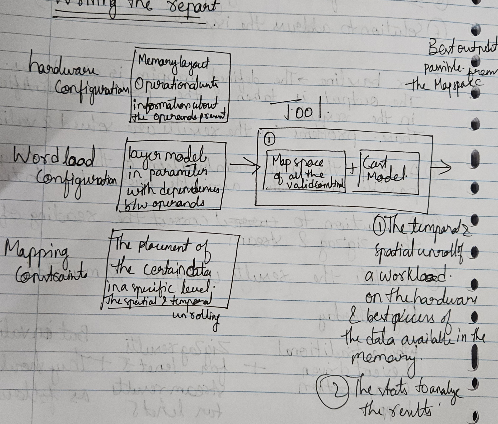

# Todo list

- [ ] What is an exploration tool?
    - [ ] Add the basic idea of how the exploration tools works - The general principle
    - [ ] Add details about the exisitng tools in your literature and how do they differ from each other
    - [ ] Finish the study on Stream, Sparseloop, NAAS and CMDS
    - [ ] Comeup with a transition to the different types of architecture (Frame based and Event driven)
- [ ] What are different types of accelerators based on their executions types?
The main goal is to explain the high level idea of how the frame based and event driven execution happens
    - [ ] Take a general example and explain this Frame based exection
    - [ ] Event based execution
    - [ ] Why working on the Event based execution is beneficial based on the difference
- [ ] How the exploration is different for the frame based and event based accelerators ?
- [ ] What are the important exploration parameters for each accelerators?
- [ ] Missing study of exploration parameters for event driven accelerators
    - [ ] Benefits of doing this study - Include the papers to do this research [For Exploration 2 and 3]
- [ ] What does AeDAM overall toolflow.
    - From the high level to the exploration level - [Include the compelete Dimension 1, 2 and 3]
- [ ] Expected results of this thesis

---------------------------------------------------------------------------------------------------------------------------------------------------------------

# Question 1: What is an exploration tool?

Due to the varied nature of the every accelerator presnnt in the market, the nature of executing a workiload on them varies and fiding the best order of execution of the workload for the architecture configuration is done with a lot of guesswork and it takes a lot of time. 

An Exploration tool, makes this process of choosing the best order of execution analytical and Science based rather that an art [Timeloop] and gives the best execution of the workload possible for the given accelerator with seconds by exploring millions of possible combinations [Zigzag], along with provising the best execution of the workload based on the optimisation criteria provided, there could also be used to explore new architectural and execution pardigms which could prove useful in the future but not currently possible with the exisitng hardware.

## The basic idea of the exploration tool is as follows

Every tools takes hardware configuration of the accelerator, Workload configurations, Mapping constraints of the workload on the acceleraions and Each tools has its exploration done by using a cost model and evalautes the mappings found in its map space basedon the optimisastion criteria mentioed by the user.

The high level flow of any exploration tool is as follows

There are multiple exploration tools exisitng in this domain developed by various academic institues as shown below

#### Convfusion

\subsection*{1. Analytical Model Formulas}

ConvFusion introduces a platform-agnostic mathematical model to evaluate the cost of executing convolutional neural networks (CNNs) with various scheduling strategies, including loop tiling, loop reordering, explicit data transfer scheduling, recomputation, and layer fusion. The model focuses on three primary metrics: external memory accesses, internal memory footprint, and computational load.

\paragraph{External Memory Accesses:}

The model calculates the number of external memory accesses required for a given schedule by analyzing data reuse patterns and the order of operations. It considers how different scheduling techniques affect the frequency of data transfers between external memory and on-chip buffers.

\paragraph{Internal Memory Footprint:}

By examining the tiling factors and loop ordering, the model estimates the internal buffer sizes needed to store intermediate data and weights during computation. This estimation helps in understanding the on-chip memory requirements for different scheduling strategies.

\paragraph{Computational Load:}

The model assesses the total number of operations, such as multiply-accumulates (MACs), required for a given schedule. It accounts for potential recomputation introduced by certain scheduling techniques, like layer fusion, which may trade increased computation for reduced memory access.

\subsection*{2. Mapping Generator Strategy}

ConvFusion employs a systematic approach to explore the vast scheduling space of CNNs:

\begin{itemize}
    \item \textbf{Loop Tiling and Reordering:} The tool evaluates various combinations of loop tiling sizes and orders to identify configurations that optimize data reuse and minimize memory access.

    \item \textbf{Layer Fusion:} ConvFusion explores the fusion of consecutive layers to reduce the need for storing intermediate results in external memory. This strategy can significantly decrease external memory accesses by computing intermediate results on-the-fly.

    \item \textbf{Recomputation:} The tool considers schedules that allow for recomputation of certain intermediate results instead of storing them, balancing the trade-off between computation and memory usage.

    \item \textbf{Explicit Data Transfer Scheduling:} ConvFusion analyzes the scheduling of data transfers between different memory hierarchies to optimize bandwidth utilization and reduce latency.
\end{itemize}

\subsection*{3. Additional Features}

\begin{itemize}
    \item \textbf{Open-Source Tool:} An accompanying open-source tool is provided to perform exhaustive design space exploration for selected CNNs using the proposed model. This tool integrates with Keras/TensorFlow as a front-end and Halide as a back-end, facilitating code generation and validation of the modeled costs. 

    \item \textbf{Energy Evaluation:} The model includes a high-level energy analysis based on the estimated costs, offering insights into the energy efficiency of different scheduling strategies. This feature helps in understanding the impact of layer fusion and other techniques on the overall energy consumption of CNN execution.

    \item \textbf{Platform Agnosticism:} The mathematical model is designed to be independent of specific hardware platforms, making it applicable across various architectures. This flexibility allows users to adapt the tool to different hardware configurations by appropriately bounding the schedule space based on specific architectural properties.

    \item \textbf{Validation and Analysis:} The tool has been validated on six real-world networks, demonstrating its capability to accurately model the costs associated with different scheduling strategies. The analysis shows that layer fusion can reduce external memory accesses by more than two orders of magnitude compared to the best non-fused schedules. 
\end{itemize} 

#### Zigzag
\section*{ZigZag}

\subsection*{1. Analytical Model Formulas}

ZigZag is a dataflow-based cost analysis framework designed to optimize the mapping of deep neural network (DNN) workloads on hardware accelerators. It focuses on energy efficiency by modeling both computation and data movement across the memory hierarchy.

\paragraph{Performance Estimation:}

\begin{itemize}
    \item \textbf{Loop Modeling:} ZigZag represents DNN computations using a nested loop structure over various dimensions like batches ($N$), channels ($C$), height ($H$), width ($W$), and kernels ($K$).
    \item \textbf{Operation Count:} Calculates the total number of operations (e.g., multiply-accumulate or MAC operations) required for each layer.
    \item \textbf{Execution Time:}
    \begin{equation}
        \text{Total Execution Time} = \frac{\text{Total Operations}}{\text{Effective Throughput}}
    \end{equation}
    where the \textit{Effective Throughput} depends on the hardware parallelism and data dependencies.
\end{itemize}

\paragraph{Energy Consumption:}

\begin{itemize}
    \item \textbf{Data Movement Energy:} ZigZag emphasizes modeling the energy cost of data movement between different levels of the memory hierarchy, as data movement often dominates energy consumption in DNN accelerators.
    \item \textbf{Total Energy Consumption:}
    \begin{equation}
        \text{Total Energy} = \sum_{l=1}^{L} \left( \sum_{i=1}^{N_l} \left( \text{Access Count}_{l,i} \times \text{Energy per Access}_{l,i} \right) \right) + \left( \text{Total MACs} \times \text{Energy per MAC} \right)
    \end{equation}
    where $L$ is the number of memory levels, and $N_l$ is the number of accesses at level $l$.
\end{itemize}

\paragraph{Resource Utilization:}

\begin{itemize}
    \item \textbf{Buffer Sizing:} Determines the required buffer sizes at each memory level based on tiling factors and data reuse opportunities.
    \item \textbf{Bandwidth Requirements:} Analyzes the bandwidth needed between memory levels to sustain the computational throughput without stalls.
\end{itemize}

\subsection*{2. Mapping Generator Strategy}

ZigZag uses a hierarchical and flexible strategy to explore the mapping space:

\begin{itemize}
    \item \textbf{Hierarchical Mapping Exploration:}
    \begin{itemize}
        \item \textit{Tile-Level Optimization:} Explores different tiling strategies to maximize data reuse and minimize data movement.
        \item \textit{Loop Ordering:} Evaluates various loop ordering configurations to find the most efficient execution sequence.
    \end{itemize}
    \item \textbf{Dataflow Customization:}
    \begin{itemize}
        \item \textit{Flexible Dataflows:} Supports the exploration of custom dataflows tailored to specific hardware and application requirements.
    \end{itemize}
    \item \textbf{Heuristic Pruning:}
    \begin{itemize}
        \item \textit{Cost-Based Pruning:} Uses energy and performance estimations to eliminate suboptimal mappings early in the exploration process.
    \end{itemize}
\end{itemize}

\subsection*{3. Additional Features}

\begin{itemize}
    \item \textbf{Modularity and Extensibility:}
    \begin{itemize}
        \item \textit{Plugin Architecture:} Allows users to add custom hardware models, dataflows, and cost metrics to the framework.
    \end{itemize}
    \item \textbf{Multi-Objective Optimization:}
    \begin{itemize}
        \item \textit{Energy-Performance Trade-offs:} Enables the exploration of mappings that balance energy consumption and execution time.
    \end{itemize}
    \item \textbf{Visualization Tools:}
    \begin{itemize}
        \item \textit{Dataflow Visualization:} Provides graphical representations of data movement and computation patterns for better insight.
    \end{itemize}
    \item \textbf{Support for Various Hardware Architectures:}
    \begin{itemize}
        \item \textit{Hardware Abstraction:} Can model a range of accelerator architectures by abstracting hardware specifics into configurable parameters.
    \end{itemize}
    \item \textbf{Integration Capabilities:}
    \begin{itemize}
        \item \textit{Compatibility with Design Tools:} Can be integrated with other hardware design and simulation tools for a comprehensive analysis workflow.
    \end{itemize}
\end{itemize}

Certainly! Below is the analysis of **Interstellar** formatted in \LaTeX{} for your Overleaf document.

---
#### Interstellar
\section*{Interstellar}

\subsection*{1. Analytical Model Formulas}

Interstellar is a DNN accelerator design framework that focuses on optimizing the mapping of neural network workloads onto custom hardware architectures. It emphasizes minimizing data movement and maximizing resource utilization to achieve high energy efficiency and performance.

\paragraph{Performance Estimation:}

\begin{itemize}
    \item \textbf{Loop Nest Representation:} Interstellar models computations using nested loops over dimensions such as batch size ($N$), input/output channels ($C$, $K$), spatial dimensions ($H$, $W$), and kernel sizes ($R$, $S$).
    \item \textbf{Computation Modeling:} Calculates the total number of operations based on convolutional layer parameters.
    \item \textbf{Execution Cycles:}
    \begin{equation}
        \text{Total Cycles} = \frac{\text{Total Operations}}{\text{Computational Parallelism}} + \text{Stall Cycles}
    \end{equation}
    where \textit{Stall Cycles} account for delays due to data dependencies or resource contention.
\end{itemize}

\paragraph{Energy Consumption:}

\begin{itemize}
    \item \textbf{Data Movement Energy:} Interstellar places significant emphasis on modeling the energy cost associated with data transfers between different memory hierarchy levels.
    \item \textbf{Energy Modeling:}
    \begin{equation}
        \text{Total Energy} = \sum_{\text{all data movements}} \left( \text{Data Volume} \times \text{Energy per Bit Transfer} \right) + \left( \text{Total Operations} \times \text{Energy per Operation} \right)
    \end{equation}
    \item \textbf{Memory Access Patterns:} Analyzes how different mapping strategies affect memory access frequency and patterns, influencing overall energy consumption.
\end{itemize}

\paragraph{Resource Utilization:}

\begin{itemize}
    \item \textbf{PE Utilization:} Evaluates the utilization rate of processing elements (PEs) to ensure efficient computation.
    \item \textbf{Buffer Requirements:} Determines on-chip buffer sizes needed to hold data tiles, considering reuse and lifetime.
    \item \textbf{Bandwidth Analysis:} Assesses the required bandwidth between memory levels to prevent bottlenecks.
\end{itemize}

\subsection*{2. Mapping Generator Strategy}

Interstellar employs an optimization-based mapping generation strategy:

\begin{itemize}
    \item \textbf{Constraint-Based Optimization:}
    \begin{itemize}
        \item \textit{Mathematical Programming:} Formulates the mapping problem as an optimization model with objectives and constraints.
        \item \textit{Objectives:} Typically aims to minimize total energy consumption or execution time.
        \item \textit{Constraints:} Includes hardware resource limits, data dependency requirements, and memory capacity.
    \end{itemize}
    \item \textbf{Heuristic Algorithms:}
    \begin{itemize}
        \item \textit{Greedy Approaches:} Uses heuristic methods to find near-optimal solutions more efficiently than exhaustive search.
        \item \textit{Iterative Refinement:} Continuously refines mappings based on cost evaluations.
    \end{itemize}
    \item \textbf{Dataflow Exploration:}
    \begin{itemize}
        \item \textit{Custom Dataflows:} Allows the exploration of various dataflow strategies to optimize data reuse and minimize movement.
    \end{itemize}
\end{itemize}

\subsection*{3. Additional Features}

\begin{itemize}
    \item \textbf{Flexible Hardware Modeling:}
    \begin{itemize}
        \item \textit{Parametric Architecture Description:} Supports a wide range of hardware configurations through parameterization.
        \item \textit{Custom Accelerator Design:} Facilitates co-design of hardware and mappings for specialized applications.
    \end{itemize}
    \item \textbf{Multi-DNN Support:}
    \begin{itemize}
        \item \textit{Workload Diversity:} Capable of optimizing mappings for various DNN models, including CNNs, RNNs, and transformers.
    \end{itemize}
    \item \textbf{Visualization and Analysis Tools:}
    \begin{itemize}
        \item \textit{Mapping Visualization:} Provides visual tools to inspect and analyze the generated mappings.
        \item \textit{Performance Metrics Reporting:} Generates detailed reports on energy consumption, latency, and resource utilization.
    \end{itemize}
    \item \textbf{Integration with Design Flows:}
    \begin{itemize}
        \item \textit{Hardware Synthesis Compatibility:} Outputs can be used to guide hardware synthesis and implementation tools.
        \item \textit{Simulation Support:} Allows for cycle-accurate simulation of the mappings on the modeled hardware.
    \end{itemize}
    \item \textbf{User Customization:}
    \begin{itemize}
        \item \textit{Configurable Objectives:} Users can set different optimization goals, such as minimizing energy, latency, or area.
        \item \textit{Scripting and Automation:} Supports automation scripts for batch experiments and large-scale mapping explorations.
    \end{itemize}
\end{itemize}

Certainly! Below is the analysis of **Maestro** formatted in \LaTeX{} for your Overleaf document.

---
#### Maestro
\section*{Maestro}

\subsection*{1. Analytical Model Formulas}

Maestro is a quantitative modeling tool that evaluates the performance and energy efficiency of DNN accelerator designs. It focuses on modeling the dataflows and mappings of DNN layers onto hardware accelerators to optimize for metrics such as latency and energy consumption.

\paragraph{Performance Estimation:}

\begin{itemize}
    \item \textbf{Loop Nest Representation:} Maestro models the computations of DNNs using a hierarchical loop nest structure over dimensions like batch size ($N$), input/output channels ($C$, $K$), spatial dimensions ($H$, $W$), and kernel sizes ($R$, $S$).
    \item \textbf{Operation Count:} Calculates the total number of operations (e.g., MACs) required for each layer.
    \item \textbf{Latency Modeling:}
    \begin{equation}
        \text{Total Latency} = \max_{\forall \text{PEs}} \left( \text{Computation Time}_{\text{PE}} + \text{Communication Time}_{\text{PE}} \right)
    \end{equation}
    where the computation and communication times are derived from the mapping and dataflow.
\end{itemize}

\paragraph{Energy Consumption:}

\begin{itemize}
    \item \textbf{Data Movement Energy:} Maestro places significant emphasis on modeling the energy cost of data movement across different levels of the memory hierarchy, including on-chip buffers and interconnects.
    \item \textbf{Energy Modeling:}
    \begin{equation}
        \text{Total Energy} = \sum_{\text{all data accesses}} \left( \text{Number of Accesses} \times \text{Energy per Access} \right) + \left( \text{Total Operations} \times \text{Energy per Operation} \right)
    \end{equation}
    \item \textbf{Spatial and Temporal Reuse:} Models data reuse opportunities to minimize redundant data movements, thus saving energy.
\end{itemize}

\paragraph{Resource Utilization:}

\begin{itemize}
    \item \textbf{PE Utilization:} Evaluates the utilization rate of processing elements to ensure efficient use of computational resources.
    \item \textbf{Buffer and Scratchpad Requirements:} Determines the required sizes for on-chip storage to hold intermediate data and weights.
    \item \textbf{Interconnect Modeling:} Analyzes the communication patterns and bandwidth requirements of the network-on-chip (NoC) interconnect.
\end{itemize}

\subsection*{2. Mapping Generator Strategy}

Maestro employs a systematic and scalable approach to mapping generation:

\begin{itemize}
    \item \textbf{Data-Centric Cost Model:}
    \begin{itemize}
        \item \textit{Analytical Modeling:} Uses an analytical model to estimate costs associated with different mappings and dataflows without exhaustive simulation.
        \item \textit{Cost Metrics:} Focuses on latency, energy consumption, and resource utilization.
    \end{itemize}
    \item \textbf{Hierarchical Mapping Exploration:}
    \begin{itemize}
        \item \textit{Temporal Mapping:} Determines the scheduling of operations over time within each PE.
        \item \textit{Spatial Mapping:} Allocates computations across multiple PEs to exploit parallelism.
    \end{itemize}
    \item \textbf{Pruning Strategies:}
    \begin{itemize}
        \item \textit{Feasibility Pruning:} Eliminates mappings that violate hardware constraints such as buffer sizes and bandwidth limitations.
        \item \textit{Dominance Pruning:} Discards mappings that are suboptimal in all cost metrics compared to others.
    \end{itemize}
\end{itemize}

\subsection*{3. Additional Features}

\begin{itemize}
    \item \textbf{Domain-Specific Language (DSL):}
    \begin{itemize}
        \item \textit{MAESTRO DSL:} Provides a high-level language for users to specify hardware architectures and mapping directives succinctly.
    \end{itemize}
    \item \textbf{Scalability:}
    \begin{itemize}
        \item \textit{Hierarchical Modeling:} Efficiently models large-scale accelerators with thousands of PEs.
        \item \textit{Fast Analysis:} Offers rapid estimation without time-consuming simulations.
    \end{itemize}
    \item \textbf{Extensibility:}
    \begin{itemize}
        \item \textit{Customizable Architectures:} Supports a wide range of hardware configurations through parameterization in the DSL.
        \item \textit{Support for Various Dataflows:} Allows users to define and evaluate custom dataflow strategies.
    \end{itemize}
    \item \textbf{Integration with Design Tools:}
    \begin{itemize}
        \item \textit{Interoperability:} Can be integrated with other design and simulation tools for end-to-end accelerator design workflows.
    \end{itemize}
    \item \textbf{Visualization and Reporting:}
    \begin{itemize}
        \item \textit{Detailed Reports:} Generates comprehensive reports on performance metrics, energy consumption, and resource utilization.
        \item \textit{Graphical Visualization:} Provides visual tools to understand dataflow and mapping strategies.
    \end{itemize}
    \item \textbf{User Customization:}
    \begin{itemize}
        \item \textit{Optimization Objectives:} Users can prioritize different cost metrics based on design goals.
        \item \textit{Scripting and Automation:} Supports batch processing and automation through scripting interfaces.
    \end{itemize}
\end{itemize}

---

#### Stream

#### Sparseloop

#### NAAS

#### CMDS

There are different types of the architecture existing the main classification of interst for this study is the nature of the execution of the worklaod by these workloads

There are two broad classifications of the accelerator architecture i.e
1. Frame based execution
2. Event based execution

Each type of accelerator has it's own advantage and disdavantage of the execution

