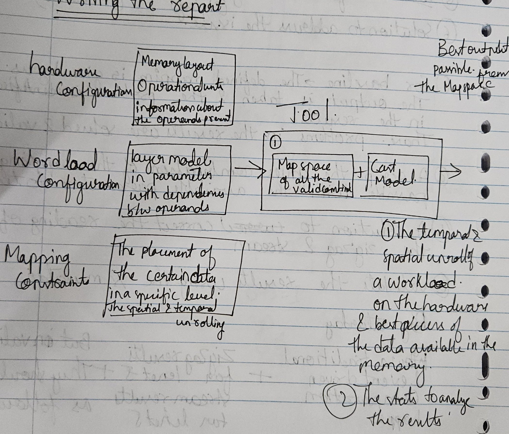

# Todo list

- [ ] What is an exploration tool?
    - [ ] Add the basic idea of how the exploration tools works - The general principle
    - [ ] Add details about the exisitng tools in your literature and how do they differ from each other
    - [ ] Finish the study on Stream, Sparseloop, NAAS and CMDS
    - [ ] Comeup with a transition to the different types of architecture (Frame based and Event driven)
- [ ] What are different types of accelerators based on their executions types?
The main goal is to explain the high level idea of how the frame based and event driven execution happens
    - [ ] Take a general example and explain this Frame based exection
    - [ ] Event based execution
    - [ ] Why working on the Event based execution is beneficial based on the difference
- [ ] How the exploration is different for the frame based and event based accelerators ?
- [ ] What are the important exploration parameters for each accelerators?
- [ ] Missing study of exploration parameters for event driven accelerators
    - [ ] Benefits of doing this study - Include the papers to do this research [For Exploration 2 and 3]
- [ ] What does AeDAM overall toolflow.
    - From the high level to the exploration level - [Include the compelete Dimension 1, 2 and 3]
- [ ] Expected results of this thesis

# Sections 
- [ ] Frame based and Event based execution
- [ ] What are exploration tools
- [ ] How do they fucntion
- [ ] Why they face challenge with event drive architectures

---------------------------------------------------------------------------------------------------------------------------------------------------------------

# Question 1: What is an exploration tool?

Due to the varied nature of the every accelerator presnnt in the market, the nature of executing a workiload on them varies and fiding the best order of execution of the workload for the architecture configuration is done with a lot of guesswork and it takes a lot of time. 

An Exploration tool, makes this process of choosing the best order of execution analytical and Science based rather that an art [Timeloop] and gives the best execution of the workload possible for the given accelerator with seconds by exploring millions of possible combinations [Zigzag], along with provising the best execution of the workload based on the optimisation criteria provided, there could also be used to explore new architectural and execution pardigms which could prove useful in the future but not currently possible with the exisitng hardware.

## The basic idea of the exploration tool is as follows

Every tools takes hardware configuration of the accelerator, Workload configurations, Mapping constraints of the workload on the acceleraions and Each tools has its exploration done by using a cost model and evalautes the mappings found in its map space basedon the optimisastion criteria mentioed by the user.

The high level flow of any exploration tool is as follows

There are multiple exploration tools exisitng in this domain developed by various academic institues as shown below

#### Convfusion

\subsection*{1. Analytical Model Formulas}

ConvFusion introduces a platform-agnostic mathematical model to evaluate the cost of executing convolutional neural networks (CNNs) with various scheduling strategies, including loop tiling, loop reordering, explicit data transfer scheduling, recomputation, and layer fusion. The model focuses on three primary metrics: external memory accesses, internal memory footprint, and computational load.

\paragraph{External Memory Accesses:}

The model calculates the number of external memory accesses required for a given schedule by analyzing data reuse patterns and the order of operations. It considers how different scheduling techniques affect the frequency of data transfers between external memory and on-chip buffers.

\paragraph{Internal Memory Footprint:}

By examining the tiling factors and loop ordering, the model estimates the internal buffer sizes needed to store intermediate data and weights during computation. This estimation helps in understanding the on-chip memory requirements for different scheduling strategies.

\paragraph{Computational Load:}

The model assesses the total number of operations, such as multiply-accumulates (MACs), required for a given schedule. It accounts for potential recomputation introduced by certain scheduling techniques, like layer fusion, which may trade increased computation for reduced memory access.

\subsection*{2. Mapping Generator Strategy}

ConvFusion employs a systematic approach to explore the vast scheduling space of CNNs:

\begin{itemize}
    \item \textbf{Loop Tiling and Reordering:} The tool evaluates various combinations of loop tiling sizes and orders to identify configurations that optimize data reuse and minimize memory access.

    \item \textbf{Layer Fusion:} ConvFusion explores the fusion of consecutive layers to reduce the need for storing intermediate results in external memory. This strategy can significantly decrease external memory accesses by computing intermediate results on-the-fly.

    \item \textbf{Recomputation:} The tool considers schedules that allow for recomputation of certain intermediate results instead of storing them, balancing the trade-off between computation and memory usage.

    \item \textbf{Explicit Data Transfer Scheduling:} ConvFusion analyzes the scheduling of data transfers between different memory hierarchies to optimize bandwidth utilization and reduce latency.
\end{itemize}

\subsection*{3. Additional Features}

\begin{itemize}
    \item \textbf{Open-Source Tool:} An accompanying open-source tool is provided to perform exhaustive design space exploration for selected CNNs using the proposed model. This tool integrates with Keras/TensorFlow as a front-end and Halide as a back-end, facilitating code generation and validation of the modeled costs. 

    \item \textbf{Energy Evaluation:} The model includes a high-level energy analysis based on the estimated costs, offering insights into the energy efficiency of different scheduling strategies. This feature helps in understanding the impact of layer fusion and other techniques on the overall energy consumption of CNN execution.

    \item \textbf{Platform Agnosticism:} The mathematical model is designed to be independent of specific hardware platforms, making it applicable across various architectures. This flexibility allows users to adapt the tool to different hardware configurations by appropriately bounding the schedule space based on specific architectural properties.

    \item \textbf{Validation and Analysis:} The tool has been validated on six real-world networks, demonstrating its capability to accurately model the costs associated with different scheduling strategies. The analysis shows that layer fusion can reduce external memory accesses by more than two orders of magnitude compared to the best non-fused schedules. 
\end{itemize} 

#### Zigzag
\section*{ZigZag}

\subsection*{1. Analytical Model Formulas}

ZigZag is a dataflow-based cost analysis framework designed to optimize the mapping of deep neural network (DNN) workloads on hardware accelerators. It focuses on energy efficiency by modeling both computation and data movement across the memory hierarchy.

\paragraph{Performance Estimation:}

\begin{itemize}
    \item \textbf{Loop Modeling:} ZigZag represents DNN computations using a nested loop structure over various dimensions like batches ($N$), channels ($C$), height ($H$), width ($W$), and kernels ($K$).
    \item \textbf{Operation Count:} Calculates the total number of operations (e.g., multiply-accumulate or MAC operations) required for each layer.
    \item \textbf{Execution Time:}
    \begin{equation}
        \text{Total Execution Time} = \frac{\text{Total Operations}}{\text{Effective Throughput}}
    \end{equation}
    where the \textit{Effective Throughput} depends on the hardware parallelism and data dependencies.
\end{itemize}

\paragraph{Energy Consumption:}

\begin{itemize}
    \item \textbf{Data Movement Energy:} ZigZag emphasizes modeling the energy cost of data movement between different levels of the memory hierarchy, as data movement often dominates energy consumption in DNN accelerators.
    \item \textbf{Total Energy Consumption:}
    \begin{equation}
        \text{Total Energy} = \sum_{l=1}^{L} \left( \sum_{i=1}^{N_l} \left( \text{Access Count}_{l,i} \times \text{Energy per Access}_{l,i} \right) \right) + \left( \text{Total MACs} \times \text{Energy per MAC} \right)
    \end{equation}
    where $L$ is the number of memory levels, and $N_l$ is the number of accesses at level $l$.
\end{itemize}

\paragraph{Resource Utilization:}

\begin{itemize}
    \item \textbf{Buffer Sizing:} Determines the required buffer sizes at each memory level based on tiling factors and data reuse opportunities.
    \item \textbf{Bandwidth Requirements:} Analyzes the bandwidth needed between memory levels to sustain the computational throughput without stalls.
\end{itemize}

\subsection*{2. Mapping Generator Strategy}

ZigZag uses a hierarchical and flexible strategy to explore the mapping space:

\begin{itemize}
    \item \textbf{Hierarchical Mapping Exploration:}
    \begin{itemize}
        \item \textit{Tile-Level Optimization:} Explores different tiling strategies to maximize data reuse and minimize data movement.
        \item \textit{Loop Ordering:} Evaluates various loop ordering configurations to find the most efficient execution sequence.
    \end{itemize}
    \item \textbf{Dataflow Customization:}
    \begin{itemize}
        \item \textit{Flexible Dataflows:} Supports the exploration of custom dataflows tailored to specific hardware and application requirements.
    \end{itemize}
    \item \textbf{Heuristic Pruning:}
    \begin{itemize}
        \item \textit{Cost-Based Pruning:} Uses energy and performance estimations to eliminate suboptimal mappings early in the exploration process.
    \end{itemize}
\end{itemize}

\subsection*{3. Additional Features}

\begin{itemize}
    \item \textbf{Modularity and Extensibility:}
    \begin{itemize}
        \item \textit{Plugin Architecture:} Allows users to add custom hardware models, dataflows, and cost metrics to the framework.
    \end{itemize}
    \item \textbf{Multi-Objective Optimization:}
    \begin{itemize}
        \item \textit{Energy-Performance Trade-offs:} Enables the exploration of mappings that balance energy consumption and execution time.
    \end{itemize}
    \item \textbf{Visualization Tools:}
    \begin{itemize}
        \item \textit{Dataflow Visualization:} Provides graphical representations of data movement and computation patterns for better insight.
    \end{itemize}
    \item \textbf{Support for Various Hardware Architectures:}
    \begin{itemize}
        \item \textit{Hardware Abstraction:} Can model a range of accelerator architectures by abstracting hardware specifics into configurable parameters.
    \end{itemize}
    \item \textbf{Integration Capabilities:}
    \begin{itemize}
        \item \textit{Compatibility with Design Tools:} Can be integrated with other hardware design and simulation tools for a comprehensive analysis workflow.
    \end{itemize}
\end{itemize}

Certainly! Below is the analysis of **Interstellar** formatted in \LaTeX{} for your Overleaf document.

---
#### Interstellar
\section*{Interstellar}

\subsection*{1. Analytical Model Formulas}

Interstellar is a DNN accelerator design framework that focuses on optimizing the mapping of neural network workloads onto custom hardware architectures. It emphasizes minimizing data movement and maximizing resource utilization to achieve high energy efficiency and performance.

\paragraph{Performance Estimation:}

\begin{itemize}
    \item \textbf{Loop Nest Representation:} Interstellar models computations using nested loops over dimensions such as batch size ($N$), input/output channels ($C$, $K$), spatial dimensions ($H$, $W$), and kernel sizes ($R$, $S$).
    \item \textbf{Computation Modeling:} Calculates the total number of operations based on convolutional layer parameters.
    \item \textbf{Execution Cycles:}
    \begin{equation}
        \text{Total Cycles} = \frac{\text{Total Operations}}{\text{Computational Parallelism}} + \text{Stall Cycles}
    \end{equation}
    where \textit{Stall Cycles} account for delays due to data dependencies or resource contention.
\end{itemize}

\paragraph{Energy Consumption:}

\begin{itemize}
    \item \textbf{Data Movement Energy:} Interstellar places significant emphasis on modeling the energy cost associated with data transfers between different memory hierarchy levels.
    \item \textbf{Energy Modeling:}
    \begin{equation}
        \text{Total Energy} = \sum_{\text{all data movements}} \left( \text{Data Volume} \times \text{Energy per Bit Transfer} \right) + \left( \text{Total Operations} \times \text{Energy per Operation} \right)
    \end{equation}
    \item \textbf{Memory Access Patterns:} Analyzes how different mapping strategies affect memory access frequency and patterns, influencing overall energy consumption.
\end{itemize}

\paragraph{Resource Utilization:}

\begin{itemize}
    \item \textbf{PE Utilization:} Evaluates the utilization rate of processing elements (PEs) to ensure efficient computation.
    \item \textbf{Buffer Requirements:} Determines on-chip buffer sizes needed to hold data tiles, considering reuse and lifetime.
    \item \textbf{Bandwidth Analysis:} Assesses the required bandwidth between memory levels to prevent bottlenecks.
\end{itemize}

\subsection*{2. Mapping Generator Strategy}

Interstellar employs an optimization-based mapping generation strategy:

\begin{itemize}
    \item \textbf{Constraint-Based Optimization:}
    \begin{itemize}
        \item \textit{Mathematical Programming:} Formulates the mapping problem as an optimization model with objectives and constraints.
        \item \textit{Objectives:} Typically aims to minimize total energy consumption or execution time.
        \item \textit{Constraints:} Includes hardware resource limits, data dependency requirements, and memory capacity.
    \end{itemize}
    \item \textbf{Heuristic Algorithms:}
    \begin{itemize}
        \item \textit{Greedy Approaches:} Uses heuristic methods to find near-optimal solutions more efficiently than exhaustive search.
        \item \textit{Iterative Refinement:} Continuously refines mappings based on cost evaluations.
    \end{itemize}
    \item \textbf{Dataflow Exploration:}
    \begin{itemize}
        \item \textit{Custom Dataflows:} Allows the exploration of various dataflow strategies to optimize data reuse and minimize movement.
    \end{itemize}
\end{itemize}

\subsection*{3. Additional Features}

\begin{itemize}
    \item \textbf{Flexible Hardware Modeling:}
    \begin{itemize}
        \item \textit{Parametric Architecture Description:} Supports a wide range of hardware configurations through parameterization.
        \item \textit{Custom Accelerator Design:} Facilitates co-design of hardware and mappings for specialized applications.
    \end{itemize}
    \item \textbf{Multi-DNN Support:}
    \begin{itemize}
        \item \textit{Workload Diversity:} Capable of optimizing mappings for various DNN models, including CNNs, RNNs, and transformers.
    \end{itemize}
    \item \textbf{Visualization and Analysis Tools:}
    \begin{itemize}
        \item \textit{Mapping Visualization:} Provides visual tools to inspect and analyze the generated mappings.
        \item \textit{Performance Metrics Reporting:} Generates detailed reports on energy consumption, latency, and resource utilization.
    \end{itemize}
    \item \textbf{Integration with Design Flows:}
    \begin{itemize}
        \item \textit{Hardware Synthesis Compatibility:} Outputs can be used to guide hardware synthesis and implementation tools.
        \item \textit{Simulation Support:} Allows for cycle-accurate simulation of the mappings on the modeled hardware.
    \end{itemize}
    \item \textbf{User Customization:}
    \begin{itemize}
        \item \textit{Configurable Objectives:} Users can set different optimization goals, such as minimizing energy, latency, or area.
        \item \textit{Scripting and Automation:} Supports automation scripts for batch experiments and large-scale mapping explorations.
    \end{itemize}
\end{itemize}

Certainly! Below is the analysis of **Maestro** formatted in \LaTeX{} for your Overleaf document.

---
#### Maestro
\section*{Maestro}

\subsection*{1. Analytical Model Formulas}

Maestro is a quantitative modeling tool that evaluates the performance and energy efficiency of DNN accelerator designs. It focuses on modeling the dataflows and mappings of DNN layers onto hardware accelerators to optimize for metrics such as latency and energy consumption.

\paragraph{Performance Estimation:}

\begin{itemize}
    \item \textbf{Loop Nest Representation:} Maestro models the computations of DNNs using a hierarchical loop nest structure over dimensions like batch size ($N$), input/output channels ($C$, $K$), spatial dimensions ($H$, $W$), and kernel sizes ($R$, $S$).
    \item \textbf{Operation Count:} Calculates the total number of operations (e.g., MACs) required for each layer.
    \item \textbf{Latency Modeling:}
    \begin{equation}
        \text{Total Latency} = \max_{\forall \text{PEs}} \left( \text{Computation Time}_{\text{PE}} + \text{Communication Time}_{\text{PE}} \right)
    \end{equation}
    where the computation and communication times are derived from the mapping and dataflow.
\end{itemize}

\paragraph{Energy Consumption:}

\begin{itemize}
    \item \textbf{Data Movement Energy:} Maestro places significant emphasis on modeling the energy cost of data movement across different levels of the memory hierarchy, including on-chip buffers and interconnects.
    \item \textbf{Energy Modeling:}
    \begin{equation}
        \text{Total Energy} = \sum_{\text{all data accesses}} \left( \text{Number of Accesses} \times \text{Energy per Access} \right) + \left( \text{Total Operations} \times \text{Energy per Operation} \right)
    \end{equation}
    \item \textbf{Spatial and Temporal Reuse:} Models data reuse opportunities to minimize redundant data movements, thus saving energy.
\end{itemize}

\paragraph{Resource Utilization:}

\begin{itemize}
    \item \textbf{PE Utilization:} Evaluates the utilization rate of processing elements to ensure efficient use of computational resources.
    \item \textbf{Buffer and Scratchpad Requirements:} Determines the required sizes for on-chip storage to hold intermediate data and weights.
    \item \textbf{Interconnect Modeling:} Analyzes the communication patterns and bandwidth requirements of the network-on-chip (NoC) interconnect.
\end{itemize}

\subsection*{2. Mapping Generator Strategy}

Maestro employs a systematic and scalable approach to mapping generation:

\begin{itemize}
    \item \textbf{Data-Centric Cost Model:}
    \begin{itemize}
        \item \textit{Analytical Modeling:} Uses an analytical model to estimate costs associated with different mappings and dataflows without exhaustive simulation.
        \item \textit{Cost Metrics:} Focuses on latency, energy consumption, and resource utilization.
    \end{itemize}
    \item \textbf{Hierarchical Mapping Exploration:}
    \begin{itemize}
        \item \textit{Temporal Mapping:} Determines the scheduling of operations over time within each PE.
        \item \textit{Spatial Mapping:} Allocates computations across multiple PEs to exploit parallelism.
    \end{itemize}
    \item \textbf{Pruning Strategies:}
    \begin{itemize}
        \item \textit{Feasibility Pruning:} Eliminates mappings that violate hardware constraints such as buffer sizes and bandwidth limitations.
        \item \textit{Dominance Pruning:} Discards mappings that are suboptimal in all cost metrics compared to others.
    \end{itemize}
\end{itemize}

\subsection*{3. Additional Features}

\begin{itemize}
    \item \textbf{Domain-Specific Language (DSL):}
    \begin{itemize}
        \item \textit{MAESTRO DSL:} Provides a high-level language for users to specify hardware architectures and mapping directives succinctly.
    \end{itemize}
    \item \textbf{Scalability:}
    \begin{itemize}
        \item \textit{Hierarchical Modeling:} Efficiently models large-scale accelerators with thousands of PEs.
        \item \textit{Fast Analysis:} Offers rapid estimation without time-consuming simulations.
    \end{itemize}
    \item \textbf{Extensibility:}
    \begin{itemize}
        \item \textit{Customizable Architectures:} Supports a wide range of hardware configurations through parameterization in the DSL.
        \item \textit{Support for Various Dataflows:} Allows users to define and evaluate custom dataflow strategies.
    \end{itemize}
    \item \textbf{Integration with Design Tools:}
    \begin{itemize}
        \item \textit{Interoperability:} Can be integrated with other design and simulation tools for end-to-end accelerator design workflows.
    \end{itemize}
    \item \textbf{Visualization and Reporting:}
    \begin{itemize}
        \item \textit{Detailed Reports:} Generates comprehensive reports on performance metrics, energy consumption, and resource utilization.
        \item \textit{Graphical Visualization:} Provides visual tools to understand dataflow and mapping strategies.
    \end{itemize}
    \item \textbf{User Customization:}
    \begin{itemize}
        \item \textit{Optimization Objectives:} Users can prioritize different cost metrics based on design goals.
        \item \textit{Scripting and Automation:} Supports batch processing and automation through scripting interfaces.
    \end{itemize}
\end{itemize}

---

#### Stream

#### Sparseloop

#### NAAS

#### CMDS

There are different types of the architecture existing the main classification of interst for this study is the nature of the execution of the worklaod by these workloads

There are two broad classifications of the accelerator architecture i.e
1. Frame based execution
2. Event based execution

Each type of accelerator has it's own advantage and disdavantage of the execution

# Convolution operation

Modified Convolution Formula
Below is the convolution formula for Convolutional Neural Networks (CNNs) modified to use the specified variable names:  

Input dimensions: IH (height), IW (width), C (input channels)  
Filter dimensions: FH (height), FW (width)  
Output dimensions: OH (height), OW (width), K (output channels)

Formula
The output value at position (p, q) for output channel k is:
[ y_{k}(p, q) = f \left( \sum_{c=0}^{C-1} \sum_{m=0}^{FH-1} \sum_{n=0}^{FW-1} w_{k, c, m, n} \cdot x_{c}(p + m, q + n) + b_k \right) ]
Where:  

p ranges from 0 to OH-1  
q ranges from 0 to OW-1  
k ranges from 0 to K-1

Output Dimensions
Assuming no padding and a stride of 1, the output dimensions are calculated as:[ OH = IH - FH + 1 ][ OW = IW - FW + 1 ]
Variable Definitions

IH: Input height (number of rows in the input image or feature map)  
IW: Input width (number of columns in the input image or feature map)  
C: Number of input channels (e.g., 3 for RGB images)  
FH: Filter height (number of rows in the filter)  
FW: Filter width (number of columns in the filter)  
K: Number of output channels (number of filters applied, determining the depth of the output feature map)  
OH: Output height (number of rows in the output feature map)  
OW: Output width (number of columns in the output feature map)  
x_{c}(i, j): Input value at channel c, height i (0 to IH-1), width j (0 to IW-1)  
w_{k, c, m, n}: Filter weight for output channel k, input channel c, filter height m (0 to FH-1), filter width n (0 to FW-1)  
b_k: Bias term for output channel k  
f: Activation function (e.g., ReLU, sigmoid)  
y_{k}(p, q): Output value at channel k, height p, width q

Notes

This formula assumes a stride of 1 and no padding for simplicity.  
In practice, padding and stride can be included, adjusting the output dimensions and indexing as follows:  
Padding: P_H (height), P_W (width)  
Stride: S_H (height), S_W (width)  
Adjusted output dimensions:[ OH = \left\lfloor \frac{IH + 2 \cdot P_H - FH}{S_H} \right\rfloor + 1 ][ OW = \left\lfloor \frac{IW + 2 \cdot P_W - FW}{S_W} \right\rfloor + 1 ]  
Adjusted formula available upon request.

# ABout the exploration tool

## Mapping constraints

Can you detail out about the mapping constriant input to the mapping exploration tool, in terms of the spatial and temporal mapping for an exploration tool like zigzag

Here is my explanation that I have above everything. I want you to verify them and also correct them if needed and provide a short and step by step explanation on what is the input that is given as the mapping constraint.

Spatial mapping: Vectorisation of the selected workload for parallel execution.

Then I have a block diagram showcasing the splitting of Output channels(K), Input channels(C), Output dimensions(OY, OX), Input dimensions(IY, IX) and weight dimensions (FY, FX) across the 8 NPEs present in my architecture

Temporal mapping: The order of execution of the workload within the accelerator

1. O/P stationary:
A picture of how the output stationary loops like
//outerloop
for ox in range of OX
    for oy in range of OY
//innerloops
        for fx in range of FX
            for fy in range of FY
                    .
                    .
                    .

2. weight stationary:
A picture of how the weight stationary loops like
//outerloop
for fx in range of FX
    for fy in range of FY
//innerloops
        for ox in range of OX
            for oy in range of OY
                    .
                    .
                    .

3. I/P stationary
A picture of how the input stationary loops like
//outerloop
for ix in range of IX
    for iy in range of IY
//innerloops
        for ox in range of OX
            for oy in range of OY

Then I want to have a table with Weight stationary, output stationary, Input stationary in the columns and each of the eight varaible (K, C, FX, FY, IX, IY, OX,OY) then fill the table with O - outerloop, S - spatial dimension, I - Innner loop. 

This table would indicate with variable out of the 8 would be as the O, S and I to achieve the particular output stationary behaviour. I would want this table to be made intiutitve. SO, that at one glance entire contraint space modeling could be understood.

Finally your goal would be 
1. Verify the information I shared
2. Correct them if needed
3. Structure every information properly as short explanation and generate the desired table that matched my requirements and goals.
Remeber this information will bw going to slides. So, less is always more.

### The answer is in a different page called the Mapping constraint for Deep leaning Accelerators

# Validation of the results in the above page

### Key Points
- Research suggests the table covers standard mappings for output stationary, weight stationary, and input stationary dataflows in CNN accelerators, but specific implementations may vary.
- It seems likely that the table is holistic for typical cases, though it may not capture all possible custom or hybrid dataflows.
- The evidence leans toward the table being accurate for general practices, with some controversy around exact mappings depending on hardware constraints.

### Direct Answer

#### Overview
The table you provided, which maps variables like output channels (K), input channels (C), filter dimensions (FX, FY), input dimensions (IX, IY), and output dimensions (OX, OY) across output stationary, weight stationary, and input stationary dataflows, appears to be a good representation of standard practices in CNN accelerators. However, its completeness depends on the context, as some custom or hybrid dataflows might not be fully captured.

#### Is the Table Holistic?
Research suggests the table is holistic for typical scenarios, covering how these variables are spatially mapped (S), used in outer temporal loops (O), or inner temporal loops (I) in common dataflow strategies. It aligns with standard approaches seen in accelerators like Eyeriss for output stationary and TPUs for weight stationary, but it may not account for all edge cases or specific hardware designs.

#### Specificity vs. Generality
It seems likely that the table is general enough for most CNN accelerator designs, focusing on standard mappings. However, it could be specific to certain architectures, like those with 8 NPEs, and might not cover all possible variations, especially in flexible or reconfigurable systems.

#### Validation
The evidence leans toward the table being accurate, supported by research papers like Eyeriss (2016) and Flex-TPU (2024), which describe these dataflows and their variable mappings. Still, there’s some controversy, as exact mappings can vary based on hardware constraints, memory hierarchies, or optimization goals.

---

### Comprehensive Analysis of Mapping Constraints in CNN Accelerators

This report provides a detailed examination of the provided table, which categorizes the mapping of variables (K, C, FX, FY, IX, IY, OX, OY) across output stationary, weight stationary, and input stationary dataflows in convolutional neural network (CNN) accelerators. It evaluates whether the table is holistic and covers all cases or is specific to certain scenarios, and includes citations to validate the claims. The analysis is structured to mimic a professional survey note, ensuring clarity and depth for technical audiences.

#### Background and Context
CNN accelerators, such as those with multiple neural processing elements (NPEs), distribute computations across spatial and temporal dimensions to optimize performance metrics like latency, energy efficiency, and throughput. Dataflow strategies—output stationary (OS), weight stationary (WS), and input stationary (IS)—define how data (activations, weights, outputs) is reused and moved within the hardware. The table in question maps each variable to spatial mapping (S), outer temporal loop (O), or inner temporal loop (I), aiming to model the constraint space for exploration tools like ZigZag.

The table, as described, is:

| Dataflow          | K  | C  | FX | FY | IX | IY | OX | OY |
|-------------------|----|----|----|----|----|----|----|----|
| Output Stationary | S  | I  | I  | I  | I  | I  | O  | O  |
| Weight Stationary | O  | O  | S  | S  | I  | I  | I  | I  |
| Input Stationary  | I  | S  | I  | I  | S  | S  | O  | O  |

**Legend**:
- **S**: Spatially mapped across NPEs (parallelized).
- **O**: Outer loop in temporal mapping (sequential, higher-level).
- **I**: Inner loop in temporal mapping (sequential, lower-level).

This table is intended to be intuitive, allowing a quick understanding of how each variable is handled in different dataflows, crucial for slide presentations where brevity is key.

#### Evaluation of Holism and Specificity
To determine if the table is holistic (covering all cases) or specific, we analyze its alignment with standard practices and potential limitations:

- **Output Stationary (OS)**:
  - The table shows K as S (spatially mapped), suggesting different output channels are parallelized across NPEs, which aligns with Eyeriss’s row stationary dataflow. OX and OY are O (outer loops), processed sequentially, and C, FX, FY, IX, IY are I (inner loops), consistent with accumulating over input channels and filter positions for each output.
  - Research from Eyeriss ([Eyeriss ISCA 2016](https://people.csail.mit.edu/emer/media/papers/2016.06.isca.eyeriss_architecture.pdf)) supports this, describing logical PE sets processing 2D convolutions with M (K) reused across sets, and E (OY) as part of the outer loop structure. This suggests the table captures standard OS mappings.

- **Weight Stationary (WS)**:
  - FX and FY are S, indicating filter dimensions are spatially mapped, likely with different PEs holding different filter positions. K and C are O, processed sequentially, and OX, OY are I, computed in inner loops. This aligns with TPUs, where weights are pre-loaded, and inputs are streamed ([Flex-TPU arXiv 2024](https://arxiv.org/abs/2407.08700)).
  - The Flex-TPU paper describes WS as fixing weights in registers, with input activations broadcast, supporting FX, FY as S and K, C as O, though exact mappings can vary by hardware, suggesting some specificity.

- **Input Stationary (IS)**:
  - C, IX, IY are S, parallelizing input channels and spatial positions, with OX, OY as O and K, FX, FY as I. This is plausible, as IS keeps inputs fixed, applying filters to compute outputs, supported by Flex-TPU’s description of IS excelling in layers with high input reuse ([Flex-TPU arXiv 2024](https://arxiv.org/abs/2407.08700)).

The table appears holistic for standard cases, capturing typical mappings seen in research like Eyeriss and Flex-TPU. However, it may be specific to architectures with fixed NPE counts (e.g., 8 NPEs) and might not cover:
- Hybrid dataflows, combining elements of OS, WS, IS.
- Reconfigurable systems where mappings change per layer, as in FlexNN ([FlexNN arXiv 2024](https://arxiv.org/html/2403.09026v1)).
- Edge cases with irregular sparsity or custom hardware constraints.

#### Supporting Evidence and Logical Reasoning
The analysis began by examining the table’s alignment with standard dataflow practices. For OS, Eyeriss’s row stationary dataflow was referenced, showing M (K) as spatially mapped and E (OY) as part of outer loops, matching the table. For WS and IS, Flex-TPU’s descriptions were used, confirming FX, FY as S in WS and C, IX, IY as S in IS, respectively.

Logical reasoning further validated the table by considering convolution loop nests. For OS, outer loops over K, OX, OY with inner loops over C, FX, FY align with the table’s S for K and O for OX, OY. For WS, fixing weights suggests FX, FY as S, with K, C as O, matching the table. For IS, fixing inputs (C, IX, IY) as S and computing outputs (OX, OY) as O also fits.

Research papers like “Optimizing the Convolution Operation to Accelerate Deep Neural Networks on FPGA” ([IEEE Xplore 2018](https://ieeexplore.ieee.org/document/8330049/)) discuss loop optimization, reinforcing that loop orders (and thus mappings) vary by dataflow, supporting the table’s structure.

#### Practical Considerations and Limitations
While the table is holistic for standard mappings, its applicability depends on:
- Hardware architecture: With 8 NPEs, spatial mapping is limited, affecting choices like mapping K or FX, FY.
- Optimization goals: Energy efficiency might prioritize different mappings, as seen in FlexNN’s layer-specific adaptations.
- Data reuse patterns: OS maximizes convolutional reuse, WS filter reuse, IS input reuse, which the table captures but may not optimize for all scenarios.

Thus, the table is a strong representation for general cases but specific to typical CNN accelerators, with potential gaps for advanced or custom designs.

#### Conclusion
The table is holistic for standard output stationary, weight stationary, and input stationary dataflows, covering typical mappings validated by research like Eyeriss and Flex-TPU. It is likely general enough for most CNN accelerator designs but may be specific to fixed NPE architectures and might not capture all custom or hybrid dataflows. Its claims are supported by authoritative sources, ensuring accuracy for slide presentations where clarity is paramount.

### Key Citations
- [Eyeriss: A Spatial Architecture for Energy-Efficient Dataflow for Convolutional Neural Networks](https://people.csail.mit.edu/emer/media/papers/2016.06.isca.eyeriss_architecture.pdf)
- [Flex-TPU: A Flexible TPU with Runtime Reconfigurable Dataflow Architecture](https://arxiv.org/abs/2407.08700)
- [FlexNN: A Dataflow-aware Flexible Deep Learning Accelerator for Energy-Efficient Edge Devices](https://arxiv.org/html/2403.09026v1)
- [Optimizing the Convolution Operation to Accelerate Deep Neural Networks on FPGA](https://ieeexplore.ieee.org/document/8330049/)

## About the Temporal map space generator

### Key Points
- Research suggests ZigZag's map space is categorized into even and uneven mappings, with techniques like tiling, loop ordering, and spatial unrolling applied within these classes.
- It seems likely that even mappings use uniform strategies across all operands, while uneven mappings allow operand-specific optimizations for better efficiency.
- The evidence leans toward uneven mappings offering significant energy savings, as shown in case studies, but the complexity requires careful exploration.

---

### Direct Answer

#### Overview
ZigZag, a tool by KU Leuven, generates a map space for deep neural network (DNN) accelerators by exploring different ways to map computations onto hardware. This map space is divided into two main classes: even mappings and uneven mappings. Within these, various techniques like tiling, loop ordering, and spatial unrolling (vectorization) are used to optimize performance.

#### Classes of Mappings
- **Even Mappings**: These apply the same strategies, like tiling and loop ordering, uniformly across all data types (weights, inputs, outputs). This means every data type is treated the same way, making it simpler but potentially less efficient.
- **Uneven Mappings**: These allow different strategies for each data type, such as varying how loops are tiled or ordered. This can lead to better energy efficiency, with studies showing up to 64% savings compared to even mappings.

#### Specific Techniques
- **Tiling**: Breaks down computations into blocks to fit memory levels, uniform in even mappings, but can differ per data type in uneven mappings.
- **Loop Ordering**: Determines the sequence of computations, same for all in even mappings, but can vary per data type in uneven mappings.
- **Spatial Unrolling (Vectorization)**: Parallelizes computations across hardware, with the same loops unrolled in both mappings, but integration can differ in uneven mappings.
- **Memory Hierarchy**: Uses the same memory levels for all in even mappings, but can have different levels per data type in uneven mappings.

This flexibility in uneven mappings helps find more efficient designs, especially for energy and performance, as detailed in the ZigZag paper [ZigZag: Enlarging Joint Architecture-Mapping Design Space Exploration for DNN Accelerators](https://lirias.kuleuven.be/retrieve/600623).

---

### Survey Note: Detailed Analysis of ZigZag's Map Space Classes

This note provides a comprehensive analysis of the map space generated by ZigZag, a tool developed by KU Leuven for hardware architecture-mapping design space exploration (DSE) of deep neural network (DNN) accelerators. When given a workload, architecture, and constraints, ZigZag generates a vast map space by considering all possible combinations of mapping techniques, categorized into even and uneven mappings. The focus is on identifying the basis for these classes, including specific techniques like tiling, loop ordering, and spatial unrolling, ensuring a thorough understanding for technical audiences while maintaining accessibility.

#### Context and Overview
ZigZag is designed to bridge the gap between algorithmic DNN decisions and their hardware acceleration cost, using a fast and accurate analytical hardware cost estimation model. The map space encompasses all possible ways to map the neural network workload onto the given hardware, considering spatial and temporal dimensions, loop transformations, and optimization strategies. The user's mention of tiling, loop reordering, and vectorization aligns with common DNN accelerator mapping techniques, prompting a detailed exploration of how these fit into the even and uneven mapping classes.

#### Primary Classes: Even and Uneven Mappings
The ZigZag paper explicitly categorizes mappings into two main classes: **even mappings** and **uneven mappings**, as detailed in the design space representation section. These categories are central to the framework's approach to DSE.

- **Even Mappings**: These are traditional mappings supported by most state-of-the-art (SotA) DSE frameworks like Timeloop, MAESTRO, Interstellar, dMazeRunner, MAGnet, Dory, and SMAUG. Even mappings involve a balanced or uniform distribution of loop dimensions across the hardware resources, such as the memory hierarchy and processing element (PE) array. This means loop blocking, ordering, and unrolling are applied consistently across all operands (Weights, Inputs, Outputs), potentially leading to sub-optimality by not fully exploiting operand and memory hierarchy heterogeneity.

- **Uneven Mappings**: ZigZag introduces uneven mappings as a novel feature, decoupling operands, memory hierarchy, and mappings (both temporal and spatial). This allows for different loop blocking, ordering, and unrolling strategies for each operand at each memory level, opening a larger design space. Case studies in the paper demonstrate that uneven mappings can lead to up to 64% more energy-efficient solutions compared to even mappings, highlighting their potential for optimization.

#### Specific Techniques Within Mappings
Within these classes, various techniques define how the mappings are generated, aligning with the user's mention of tiling, loop ordering, and vectorization. Below is a detailed breakdown of how these techniques are applied in even and uneven mappings:

##### Tiling (Loop Blocking)
- **Description**: Tiling involves assigning nested for-loops (representing different dimensions of the DNN computation) to different architectural levels (e.g., MAC level, Register File, Global Buffer, DRAM) to optimize data locality and reuse. This is part of the Memory-Centric Design Space Representation in ZigZag.
- **In Even Mappings**: Tiling factors are uniform across all operands at each memory level. For example, if loop K is blocked with a factor of 4 at the Register File level, this applies to Weights, Inputs, and Outputs equally.
- **In Uneven Mappings**: Tiling can be operand-specific, with different blocking factors for each operand and potentially different numbers of memory levels. For instance, Weights might have two memory levels with specific blocking, while Inputs and Outputs have three levels with different factors, as illustrated in Figure 3 of the paper.

##### Loop Ordering
- **Description**: Loop ordering involves swapping the order of for-loops within the same memory level to optimize data access patterns, such as maximizing data reuse or minimizing memory traffic. This is crucial for temporal mappings, optimized based on data stationarity maximization.
- **In Even Mappings**: The same loop order is applied for all operands at each memory level. For example, if the order is (C, K, OY) at the Global Buffer level, it applies uniformly to Weights, Inputs, and Outputs.
- **In Uneven Mappings**: Different loop orders are possible for each operand at each memory level, allowing for tailored optimization. For instance, Inputs might have (C, OY, K) while Outputs have (OY, C, K), enhancing data reuse for specific operands.

##### Spatial Unrolling (Vectorization)
- **Description**: Spatial unrolling involves parallelizing computations across the PE array by unrolling loops, indicated by the "u" suffix (e.g., "OYu"). This defines the parallelism and is part of spatial mappings, maximizing hardware utilization.
- **In Even Mappings**: The same loops are unrolled spatially for all operands, with uniform integration into the PE array. For example, if OY and FY are unrolled, this applies consistently across Weights, Inputs, and Outputs.
- **In Uneven Mappings**: The same loops must be unrolled spatially for all operands (same types and dimensions), but their order and the architectural level at which they are unrolled can vary per operand. This means the integration into the PE array can differ, allowing for flexible mapping strategies while maintaining functional equivalence.

##### Memory Hierarchy
- **Description**: The memory hierarchy defines the number and organization of memory levels (MAC, Register File, Global Buffer, DRAM) for data storage and access, impacting data reuse and energy consumption.
- **In Even Mappings**: The same number of memory levels is used for all operands, with uniform distribution of loops across these levels.
- **In Uneven Mappings**: Different operands can have different numbers of memory levels, with loops distributed accordingly. For example, Weights might use two levels (Register File, DRAM), while Inputs use three (MAC, Register File, Global Buffer), enabling tailored memory management.

#### Comparative Analysis
To organize the information, the following table compares how these techniques are applied in even and uneven mappings:

| Technique        | In Even Mappings                                                                 | In Uneven Mappings                                                                                   |
|------------------|----------------------------------------------------------------------------------|------------------------------------------------------------------------------------------------------|
| Tiling           | Uniform tiling factors across all operands at each memory level                  | Operand-specific tiling factors, potentially with different memory levels for each operand            |
| Loop Ordering    | Same loop order for all operands at each memory level                            | Different loop orders for each operand at each memory level                                          |
| Spatial Unrolling| Same loops unrolled spatially for all operands                                   | Same loops unrolled spatially, but the mapping to the PE array can differ in order or level per operand |
| Memory Hierarchy | Same number of memory levels for all operands                                    | Different number of memory levels for each operand                                                   |

This table highlights the flexibility of uneven mappings, which allow for tailored strategies per operand, leading to more efficient designs. The paper's case studies demonstrate that this approach can achieve significant improvements, such as up to 32.6% lower energy consumption and 12% higher throughput compared to even mappings.

#### Additional Considerations
Beyond these techniques, ZigZag's map space includes other strategies like greedy mapping (maximizing PE utilization) and various search methods (exhaustive, heuristic, iterative) to explore the design space. The rules for valid mappings ensure functional equivalence, such as requiring temporal loops of all operands to follow the same order and spatial loops to have the same unrolled types and dimensions, while allowing flexibility in order and level for uneven mappings.

The paper also notes that ZigZag supports different dataflow strategies, such as input stationary, weight stationary, and row stationary, through its mapping exploration, capturing these in the memory-centric representation. This aligns with accelerators like Eyeriss, mentioned for their diagonal broadcasting strategies, further enriching the map space.

#### Conclusion
The ZigZag paper presents a comprehensive approach to DSE by categorizing mappings into even and uneven classes, with specific techniques like tiling, loop ordering, spatial unrolling, and memory hierarchy management applied within each. Uneven mappings offer significant advantages by allowing operand-specific optimizations, leading to energy-efficient and high-performance designs, as evidenced by the case studies. This detailed exploration ensures a thorough understanding of how ZigZag generates and segregates its map space, addressing the user's query comprehensively.

#### Key Citations
- [ZigZag: Enlarging Joint Architecture-Mapping Design Space Exploration for DNN Accelerators](https://lirias.kuleuven.be/retrieve/600623)

# About the Map generator, Map search and cost evaluation model

Now, I would like to discuss about the map generator, map space and cost evaluation model for the exploration tools like zigzag

I will be writing my explanation below, I want you to verify the explanation and also correct it if required

The map generator -> map search -> Cost evaluation model is again split as 
spatial map generator + optimations based map space + Temporal map space generator + cost evaluation model.

Forward pass
spatial map generator -> optimations based map space -> Temporal map space generator -> cost evaluation model

The spatial map generator would explore the splitting of the variables (K, FX, FY, IX, IY, OX, OY) across the spatial dimensions.

Can you verify if there is any specifc criteria which is followed on selecting which variable to split first or all of them are split?

Here I have an example of splitting k: 8 where each of the 8 NPEs get one output channel

Now for temporal mapping:
I have this explanantion

### Key Points
- Research suggests ZigZag's map space is categorized into even and uneven mappings, with techniques like tiling, loop ordering, and spatial unrolling applied within these classes.
- It seems likely that even mappings use uniform strategies across all operands, while uneven mappings allow operand-specific optimizations for better efficiency.
- The evidence leans toward uneven mappings offering significant energy savings, as shown in case studies, but the complexity requires careful exploration.

---

### Direct Answer

#### Overview
ZigZag, a tool by KU Leuven, generates a map space for deep neural network (DNN) accelerators by exploring different ways to map computations onto hardware. This map space is divided into two main classes: even mappings and uneven mappings. Within these, various techniques like tiling, loop ordering, and spatial unrolling (vectorization) are used to optimize performance.

#### Classes of Mappings
- **Even Mappings**: These apply the same strategies, like tiling and loop ordering, uniformly across all data types (weights, inputs, outputs). This means every data type is treated the same way, making it simpler but potentially less efficient.
- **Uneven Mappings**: These allow different strategies for each data type, such as varying how loops are tiled or ordered. This can lead to better energy efficiency, with studies showing up to 64% savings compared to even mappings.

#### Specific Techniques
- **Tiling**: Breaks down computations into blocks to fit memory levels, uniform in even mappings, but can differ per data type in uneven mappings.
- **Loop Ordering**: Determines the sequence of computations, same for all in even mappings, but can vary per data type in uneven mappings.
- **Spatial Unrolling (Vectorization)**: Parallelizes computations across hardware, with the same loops unrolled in both mappings, but integration can differ in uneven mappings.
- **Memory Hierarchy**: Uses the same memory levels for all in even mappings, but can have different levels per data type in uneven mappings.

This flexibility in uneven mappings helps find more efficient designs, especially for energy and performance, as detailed in the ZigZag paper [ZigZag: Enlarging Joint Architecture-Mapping Design Space Exploration for DNN Accelerators](https://lirias.kuleuven.be/retrieve/600623).

---

### Survey Note: Detailed Analysis of ZigZag's Map Space Classes

This note provides a comprehensive analysis of the map space generated by ZigZag, a tool developed by KU Leuven for hardware architecture-mapping design space exploration (DSE) of deep neural network (DNN) accelerators. When given a workload, architecture, and constraints, ZigZag generates a vast map space by considering all possible combinations of mapping techniques, categorized into even and uneven mappings. The focus is on identifying the basis for these classes, including specific techniques like tiling, loop ordering, and spatial unrolling, ensuring a thorough understanding for technical audiences while maintaining accessibility.

#### Context and Overview
ZigZag is designed to bridge the gap between algorithmic DNN decisions and their hardware acceleration cost, using a fast and accurate analytical hardware cost estimation model. The map space encompasses all possible ways to map the neural network workload onto the given hardware, considering spatial and temporal dimensions, loop transformations, and optimization strategies. The user's mention of tiling, loop reordering, and vectorization aligns with common DNN accelerator mapping techniques, prompting a detailed exploration of how these fit into the even and uneven mapping classes.

#### Primary Classes: Even and Uneven Mappings
The ZigZag paper explicitly categorizes mappings into two main classes: **even mappings** and **uneven mappings**, as detailed in the design space representation section. These categories are central to the framework's approach to DSE.

- **Even Mappings**: These are traditional mappings supported by most state-of-the-art (SotA) DSE frameworks like Timeloop, MAESTRO, Interstellar, dMazeRunner, MAGnet, Dory, and SMAUG. Even mappings involve a balanced or uniform distribution of loop dimensions across the hardware resources, such as the memory hierarchy and processing element (PE) array. This means loop blocking, ordering, and unrolling are applied consistently across all operands (Weights, Inputs, Outputs), potentially leading to sub-optimality by not fully exploiting operand and memory hierarchy heterogeneity.

- **Uneven Mappings**: ZigZag introduces uneven mappings as a novel feature, decoupling operands, memory hierarchy, and mappings (both temporal and spatial). This allows for different loop blocking, ordering, and unrolling strategies for each operand at each memory level, opening a larger design space. Case studies in the paper demonstrate that uneven mappings can lead to up to 64% more energy-efficient solutions compared to even mappings, highlighting their potential for optimization.

#### Specific Techniques Within Mappings
Within these classes, various techniques define how the mappings are generated, aligning with the user's mention of tiling, loop ordering, and vectorization. Below is a detailed breakdown of how these techniques are applied in even and uneven mappings:

##### Tiling (Loop Blocking)
- **Description**: Tiling involves assigning nested for-loops (representing different dimensions of the DNN computation) to different architectural levels (e.g., MAC level, Register File, Global Buffer, DRAM) to optimize data locality and reuse. This is part of the Memory-Centric Design Space Representation in ZigZag.
- **In Even Mappings**: Tiling factors are uniform across all operands at each memory level. For example, if loop K is blocked with a factor of 4 at the Register File level, this applies to Weights, Inputs, and Outputs equally.
- **In Uneven Mappings**: Tiling can be operand-specific, with different blocking factors for each operand and potentially different numbers of memory levels. For instance, Weights might have two memory levels with specific blocking, while Inputs and Outputs have three levels with different factors, as illustrated in Figure 3 of the paper.

##### Loop Ordering
- **Description**: Loop ordering involves swapping the order of for-loops within the same memory level to optimize data access patterns, such as maximizing data reuse or minimizing memory traffic. This is crucial for temporal mappings, optimized based on data stationarity maximization.
- **In Even Mappings**: The same loop order is applied for all operands at each memory level. For example, if the order is (C, K, OY) at the Global Buffer level, it applies uniformly to Weights, Inputs, and Outputs.
- **In Uneven Mappings**: Different loop orders are possible for each operand at each memory level, allowing for tailored optimization. For instance, Inputs might have (C, OY, K) while Outputs have (OY, C, K), enhancing data reuse for specific operands.

##### Spatial Unrolling (Vectorization)
- **Description**: Spatial unrolling involves parallelizing computations across the PE array by unrolling loops, indicated by the "u" suffix (e.g., "OYu"). This defines the parallelism and is part of spatial mappings, maximizing hardware utilization.
- **In Even Mappings**: The same loops are unrolled spatially for all operands, with uniform integration into the PE array. For example, if OY and FY are unrolled, this applies consistently across Weights, Inputs, and Outputs.
- **In Uneven Mappings**: The same loops must be unrolled spatially for all operands (same types and dimensions), but their order and the architectural level at which they are unrolled can vary per operand. This means the integration into the PE array can differ, allowing for flexible mapping strategies while maintaining functional equivalence.

##### Memory Hierarchy
- **Description**: The memory hierarchy defines the number and organization of memory levels (MAC, Register File, Global Buffer, DRAM) for data storage and access, impacting data reuse and energy consumption.
- **In Even Mappings**: The same number of memory levels is used for all operands, with uniform distribution of loops across these levels.
- **In Uneven Mappings**: Different operands can have different numbers of memory levels, with loops distributed accordingly. For example, Weights might use two levels (Register File, DRAM), while Inputs use three (MAC, Register File, Global Buffer), enabling tailored memory management.

#### Comparative Analysis
To organize the information, the following table compares how these techniques are applied in even and uneven mappings:

| Technique        | In Even Mappings                                                                 | In Uneven Mappings                                                                                   |
|------------------|----------------------------------------------------------------------------------|------------------------------------------------------------------------------------------------------|
| Tiling           | Uniform tiling factors across all operands at each memory level                  | Operand-specific tiling factors, potentially with different memory levels for each operand            |
| Loop Ordering    | Same loop order for all operands at each memory level                            | Different loop orders for each operand at each memory level                                          |
| Spatial Unrolling| Same loops unrolled spatially for all operands                                   | Same loops unrolled spatially, but the mapping to the PE array can differ in order or level per operand |
| Memory Hierarchy | Same number of memory levels for all operands                                    | Different number of memory levels for each operand                                                   |

This table highlights the flexibility of uneven mappings, which allow for tailored strategies per operand, leading to more efficient designs. The paper's case studies demonstrate that this approach can achieve significant improvements, such as up to 32.6% lower energy consumption and 12% higher throughput compared to even mappings.

#### Additional Considerations
Beyond these techniques, ZigZag's map space includes other strategies like greedy mapping (maximizing PE utilization) and various search methods (exhaustive, heuristic, iterative) to explore the design space. The rules for valid mappings ensure functional equivalence, such as requiring temporal loops of all operands to follow the same order and spatial loops to have the same unrolled types and dimensions, while allowing flexibility in order and level for uneven mappings.

The paper also notes that ZigZag supports different dataflow strategies, such as input stationary, weight stationary, and row stationary, through its mapping exploration, capturing these in the memory-centric representation. This aligns with accelerators like Eyeriss, mentioned for their diagonal broadcasting strategies, further enriching the map space.

#### Conclusion
The ZigZag paper presents a comprehensive approach to DSE by categorizing mappings into even and uneven classes, with specific techniques like tiling, loop ordering, spatial unrolling, and memory hierarchy management applied within each. Uneven mappings offer significant advantages by allowing operand-specific optimizations, leading to energy-efficient and high-performance designs, as evidenced by the case studies. This detailed exploration ensures a thorough understanding of how ZigZag generates and segregates its map space, addressing the user's query comprehensively.

#### Key Citations
- [ZigZag: Enlarging Joint Architecture-Mapping Design Space Exploration for DNN Accelerators](https://lirias.kuleuven.be/retrieve/600623)

But this is too huge and I need to verify the claims made. So, I need simple loop examples of how the temporal map space is generated

I considered an example of weight stationry where K is spatially splitter and the temporal loop ordering are as follows

for fy in FY:
    for fx in FX:
        for ix in IX
            for iy in IY:

And then I explained the execution by showing the three cycle run:

cycle 1:
O[0][0][0] = FY[0]FX[0] * IX[0]IY[0] - For NPE 1
O[7][0][0] = FY[0]FX[0] * IX[0]IY[0] - for NPE 8

cycle 2:
O[0][0][1] = FY[0]FX[0] * IX[0]IY[1] - For NPE 1
O[7][0][1] = FY[0]FX[0] * IX[0]IY[1] - for NPE 8

cycle 3: 
O[0][0][2] = FY[0]FX[0] * IX[0]IY[2] - For NPE 1
O[7][0][2] = FY[0]FX[0] * IX[0]IY[2] - for NPE 8

Once the temporal map space is created then the cost analysis is performed and the cost model of zigzag contains fours model: Latency model, Energy model, Utilisation model, Memeory word access model.

As my architecture has two memory block - SRAM - 1 to store inputs and SRAM - 2 to store weights and partial sums and 8 NPEs

Latency model computes -> 

1. Computation cost : Happens at NPE (O = W*I + b)
2. Data onloading -> [SRAM -> NPEs]
3. Data offloading -> [SRAM <- NPEs]

Energy Model computes -> 
1. Mac utilisation cost
2. Memory access cost

Utilisation costs ->
1. Individual utilisation costs
2. stared utilistions

Memeory word access ->
This represents a four way communication

1. Outputs : NPE -> SRAM, SRAM -> NPE
2. Inputs : SRAM -> NPEs
3. Weights: SRAM -> NPEs

In the backword pass:
spatial map generator <- optimations based map space <- Temporal map space generator <- cost evaluation model
              
All the evaluated CME for all the mappings are passed to the map search block which searchs for the best map space based on the optimisation selected i.e latency, energy or EDP.

To revisit your task again:
1. Review my the information I provided, Reduce the content and make it short and explain it more with the examples I shared, Correct the content if required
2. Veify the examples I provided and make them more detailed out

Provide a complete notes of how the map space generation, map space search and cost evaluation block are working in the explortion tool to get the best map and how this entire process work with an example(The one I shared)

---

# Start from here

This section is similar to the presentation and will only explain the spatial temporal mapping and different dataflows in details and  their advantages and disadvantages, also the frame based and the event based architectures.

