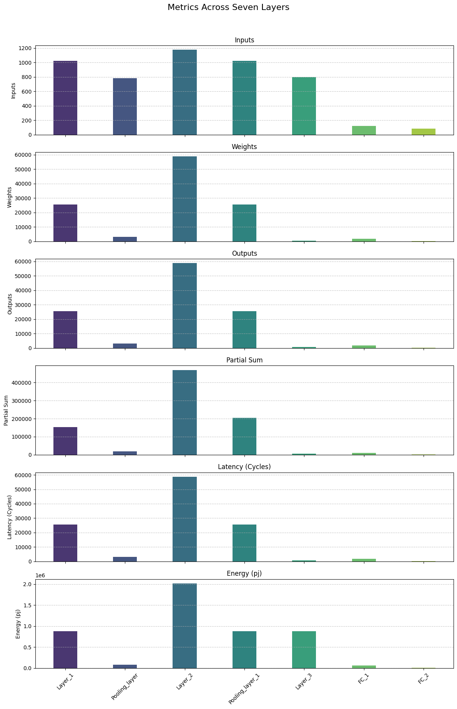
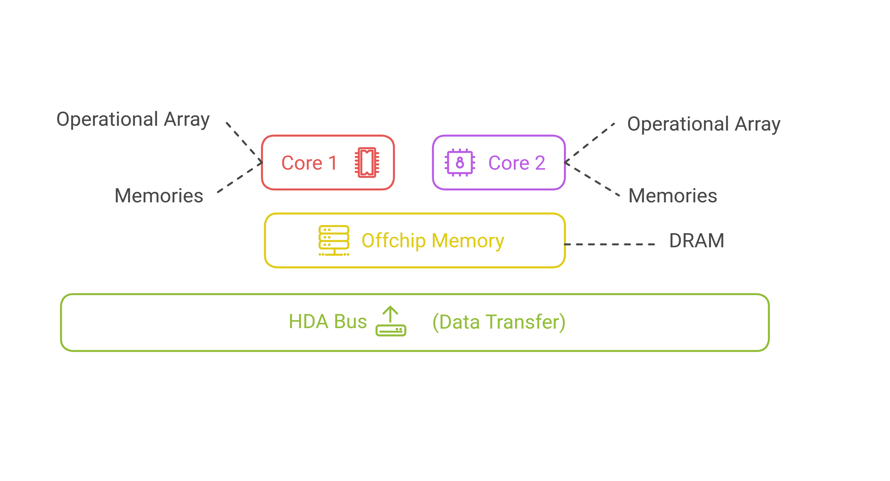
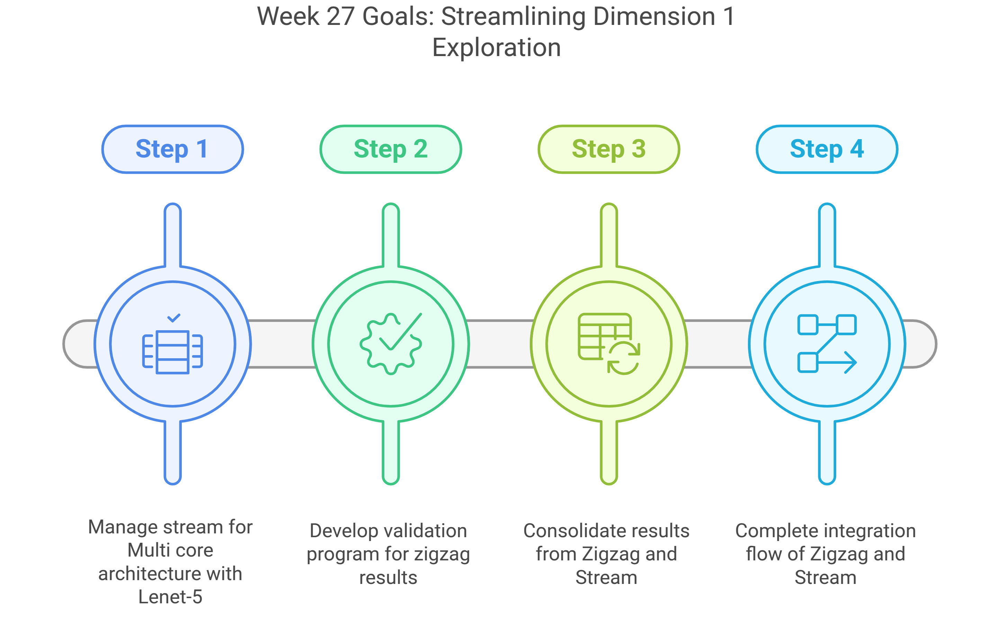

# Baseline Implementation Using Zigzag and Stream
  
## Validation Process
  
The validation process is the step where the results generated by Zigzag and Stream are verified with a program that mimics the architecture being modeled. This program executes the workload and provides the final word access count, partial sums generated, and finally the latency, energy, and energy delay product.
  
### Example of Validation Process
  
To illustrate the validation process, consider the following example:
  
#### Step 1: Selection of the Workload
  
The workload considered is as follows:
  
- **Input**: [1,1,5,5]
- **Weights (Kernels)**: [8,1,3,3]
- **Outputs**: [1,8,3,3]
  
#### Step 2: Frame-Based Execution of the Workload
  
For the mapping as follows:
  
```
==============================
Temporal Loops                
==============================
for FX in [0, 3):             
------------------------------
  for FY in [0, 3):           
------------------------------
    for OX in [0, 3):         
------------------------------
      for OY in [0, 3):       
------------------------------
==============================
Spatial Loops                 
==============================
        parfor K in [0, 8):   
------------------------------
```
  
The statistics are as follows:
  
<div align="center">
  
|                | Description                         |
|----------------|-------------------------------------|
| **Word Access**| Inputs: 81, Weights: 9, Outputs: 81 |
| **Partial Sum**| 8 * 81 = 648 (across 8 NPEs)        |
| **Latency**    | Off: 0, Comp: 81, On: 0             |
  
</div>
  
#### Step 3: Event-Based Execution of the Workload
  
The output given by Zigzag is as follows:
  
**Mapping:**
  
```
===============================
Temporal Loops                 
===============================
for IY in [0, 5):              
-------------------------------
  for IX in [0, 5):            
-------------------------------
    for FX in [0, 3):          
-------------------------------
      for FY in [0, 3):        
-------------------------------
===============================
Spatial Loops                  
===============================
        parfor K in [0, 8):    
-------------------------------
```
  
The statistics are as follows:
  
<div align="center">
  
|                | Description                           |
|----------------|---------------------------------------|
| **Word Access**| Inputs: 25, Weights: 225, Outputs: 225 |
| **Partial Sum**| 8 * 225 = 1800 (across 8 NPEs)        |
| **Latency**    | Off: 0, Comp: 225, On: 0              |
  
</div>
  
#### Step 4: Comparison and Implications
  
Upon validating the above mapping, the actual statistics are as follows:
  
<div align="center">
  
|                | Description                           |
|----------------|---------------------------------------|
| **Word Access**| Inputs: 25, Weights: 81, Outputs: 81  |
| **Partial Sum**| 8 * 81 = 648 (across 8 NPEs)          |
| **Latency**    | Off: 0, Comp: 81, On: 0               |
  
</div>
  
Here is a comparison of all the generated statistics:
  

  
There is a 94% difference between the expected event-driven latency value and the actual Zigzag stats value generated by the exploration. This overestimation can lead to issues when the same cost model is used for multi-core exploration, and this difference in latency needs to be accounted for.
  
This example demonstrates how the validation process will be applied to the Lenet-5 model to identify and address such discrepancies.
  
## Zigzag Exploration Results
  
### Workload Description
  
This is the 1st layer of the Lenet-5 model:
  
- **Input**: 32x32x1
- **C1**: 6 filters, 5x5 kernel, output 28x28x6
  
### Generation of Results
  
Here are the results from the Zigzag exploration:
  
#### Mapping 1
  
```
======================================================================================================================
Temporal Loops                 O                            W                            I                            
======================================================================================================================
for IY in [0, 32):             sram_256KB                   sram_256KB                   sram_buffer_inputs_256KB     
----------------------------------------------------------------------------------------------------------------------
  for IX in [0, 32):           sram_256KB                   sram_256KB                   sram_buffer_inputs_256KB     
----------------------------------------------------------------------------------------------------------------------
    for FY in [0, 5):          sram_256KB                   sram_256KB                   sram_buffer_inputs_256KB     
----------------------------------------------------------------------------------------------------------------------
      for FX in [0, 5):        sram_256KB                   sram_256KB                   sram_buffer_inputs_256KB     
----------------------------------------------------------------------------------------------------------------------
======================================================================================================================
Spatial Loops                                                                                                         
======================================================================================================================
        parfor K in [0, 6):                                                                                           
----------------------------------------------------------------------------------------------------------------------
```
  
The statistics are as follows:
  
<div align="center">
  
|                | Description                                   |
|----------------|-----------------------------------------------|
| **Word Access**| Inputs: 1024, Weights: 25600, Outputs: 25600  |
| **Partial Sum**| 6 * 25600 = 153600 (across 8 NPEs)            |
| **Latency**    | Off: 0, Comp: 25600, On: 0                    |
| **Energy**     | 882176.0 pj                                   |
  
</div>
  
#### Mapping 2
  
```
======================================================================================================================
Temporal Loops                 O                            W                            I                            
======================================================================================================================
for IY in [0, 32):             sram_256KB                   sram_256KB                   sram_buffer_inputs_256KB     
----------------------------------------------------------------------------------------------------------------------
  for IX in [0, 32):           sram_256KB                   sram_256KB                   sram_buffer_inputs_256KB     
----------------------------------------------------------------------------------------------------------------------
    for K in [0, 6):           sram_256KB                   sram_256KB                   sram_buffer_inputs_256KB     
----------------------------------------------------------------------------------------------------------------------
      for FY in [0, 5):        sram_256KB                   sram_256KB                   sram_buffer_inputs_256KB     
----------------------------------------------------------------------------------------------------------------------
======================================================================================================================
Spatial Loops                                                                                                         
======================================================================================================================
        parfor FX in [0, 5):                                                                                          
----------------------------------------------------------------------------------------------------------------------
```
  
The statistics are as follows:
  
<div align="center">
  
|                | Description                                   |
|----------------|-----------------------------------------------|
| **Word Access**| Inputs: 1024, Weights: 30720, Outputs: 30720  |
| **Partial Sum**| 5 * 30720 = 153600 (across 8 NPEs)            |
| **Latency**    | Off: 0, Comp: 30720, On: 0                    |
| **Energy**     | 1055232.0 pj                                  |
  
</div>
  
#### Mapping 3
  
```
======================================================================================================================
Temporal Loops                 O                            W                            I                            
======================================================================================================================
for IY in [0, 32):             sram_256KB                   sram_256KB                   sram_buffer_inputs_256KB     
----------------------------------------------------------------------------------------------------------------------
  for IX in [0, 32):           sram_256KB                   sram_256KB                   sram_buffer_inputs_256KB     
----------------------------------------------------------------------------------------------------------------------
    for FX in [0, 5):          sram_256KB                   sram_256KB                   sram_buffer_inputs_256KB     
----------------------------------------------------------------------------------------------------------------------
      for K in [0, 6):         sram_256KB                   sram_256KB                   sram_buffer_inputs_256KB     
----------------------------------------------------------------------------------------------------------------------
======================================================================================================================
Spatial Loops                                                                                                         
======================================================================================================================
        parfor FY in [0, 5):                                                                                          
----------------------------------------------------------------------------------------------------------------------
```
  
The statistics are as follows:
  
<div align="center">
  
|                | Description                                   |
|----------------|-----------------------------------------------|
| **Word Access**| Inputs: 1024, Weights: 30720, Outputs: 30720  |
| **Partial Sum**| 5 * 30720 = 153600 (across 8 NPEs)            |
| **Latency**    | Off: 0, Comp: 30720, On: 0                    |
| **Energy**     | 1055232.0 pj                                  |
  
</div>
  
### Lenet-5 Model Execution
  
#### Workload Description
  
The Lenet-5 Model:
  
- **Input**: 32x32x1
- **C1**: 6 filters, 5x5 kernel, output 28x28x6
- **S2**: 2x2 average pooling, stride=2, output 14x14x6
- **C3**: 16 filters, 5x5 kernel, output 10x10x16
- **S4**: 2x2 average pooling, stride=2, output 5x5x16
- **C5**: 120 filters, 5x5 kernel (or fully connected), output 120
- **F6**: Fully connected, output 84
- **Output**: Fully connected, output 10
  
The ONNX of the model is as follows:
  
A mapping generated by Zigzag when the model is run one layer at a time is as follows:
  
```
Loop ordering for layer_1
======================================================================================================================
Temporal Loops                 O                            W                            I                            
======================================================================================================================
for IY in [0, 32):             sram_256KB                   sram_256KB                   sram_buffer_inputs_256KB     
----------------------------------------------------------------------------------------------------------------------
  for IX in [0, 32):           sram_256KB                   sram_256KB                   sram_buffer_inputs_256KB     
----------------------------------------------------------------------------------------------------------------------
    for FY in [0, 5):          sram_256KB                   sram_256KB                   sram_buffer_inputs_256KB     
----------------------------------------------------------------------------------------------------------------------
      for FX in [0, 5):        sram_256KB                   sram_256KB                   sram_buffer_inputs_256KB     
----------------------------------------------------------------------------------------------------------------------
======================================================================================================================
Spatial Loops                                                                                                         
======================================================================================================================
        parfor K in [0, 6):                                                                                           
----------------------------------------------------------------------------------------------------------------------
  
Loop ordering for pooling_layer_1
======================================================================================================================
Temporal Loops                 O                            W                            I                            
======================================================================================================================
for IY in [0, 28):             sram_256KB                   sram_256KB                   sram_buffer_inputs_256KB     
----------------------------------------------------------------------------------------------------------------------
  for IX in [0, 28):           sram_256KB                   sram_256KB                   sram_buffer_inputs_256KB     
----------------------------------------------------------------------------------------------------------------------
    for FY in [0, 2):          sram_256KB                   sram_256KB                   sram_buffer_inputs_256KB     
----------------------------------------------------------------------------------------------------------------------
      for FX in [0, 2):        sram_256KB                   sram_256KB                   sram_buffer_inputs_256KB     
----------------------------------------------------------------------------------------------------------------------
======================================================================================================================
Spatial Loops                                                                                                         
======================================================================================================================
        parfor G in [0, 6):                                                                                           
----------------------------------------------------------------------------------------------------------------------
  
Loop ordering for layer_2
==========================================================================================================================
Temporal Loops                     O                            W                            I                            
==========================================================================================================================
for IY in [0, 14):                 sram_256KB                   sram_256KB                   sram_buffer_inputs_256KB     
--------------------------------------------------------------------------------------------------------------------------
  for IX in [0, 14):               sram_256KB                   sram_256KB                   sram_buffer_inputs_256KB     
--------------------------------------------------------------------------------------------------------------------------
    for C in [0, 6):               sram_256KB                   sram_256KB                   sram_buffer_inputs_256KB     
--------------------------------------------------------------------------------------------------------------------------
      for FY in [0, 5):            sram_256KB                   sram_256KB                   sram_buffer_inputs_256KB     
--------------------------------------------------------------------------------------------------------------------------
        for FX in [0, 5):          sram_256KB                   sram_256KB                   sram_buffer_inputs_256KB     
--------------------------------------------------------------------------------------------------------------------------
          for K in [0, 2):         sram_256KB                   sram_256KB                   sram_buffer_inputs_256KB     
--------------------------------------------------------------------------------------------------------------------------
==========================================================================================================================
Spatial Loops                                                                                                             
==========================================================================================================================
            parfor K in [0, 8):                                                                                           
--------------------------------------------------------------------------------------------------------------------------
  
Loop ordering for pooling_layer_2
========================================================================================================================
Temporal Loops                   O                            W                            I                            
========================================================================================================================
for IY in [0, 10):               sram_256KB                   sram_256KB                   sram_buffer_inputs_256KB     
------------------------------------------------------------------------------------------------------------------------
  for IX in [0, 10):             sram_256KB                   sram_256KB                   sram_buffer_inputs_256KB     
------------------------------------------------------------------------------------------------------------------------
    for FY in [0, 2):            sram_256KB                   sram_256KB                   sram_buffer_inputs_256KB     
------------------------------------------------------------------------------------------------------------------------
      for FX in [0, 2):          sram_256KB                   sram_256KB                   sram_buffer_inputs_256KB     
------------------------------------------------------------------------------------------------------------------------
        for G in [0, 2):         sram_256KB                   sram_256KB                   sram_buffer_inputs_256KB     
------------------------------------------------------------------------------------------------------------------------
========================================================================================================================
Spatial Loops                                                                                                           
========================================================================================================================
          parfor G in [0, 8):                                                                                           
------------------------------------------------------------------------------------------------------------------------
  
Loop ordering for layer_3
==========================================================================================================================
Temporal Loops                     O                            W                            I                            
==========================================================================================================================
for IY in [0, 5):                  sram_256KB                   sram_256KB                   sram_buffer_inputs_256KB     
--------------------------------------------------------------------------------------------------------------------------
  for IX in [0, 5):                sram_256KB                   sram_256KB                   sram_buffer_inputs_256KB     
--------------------------------------------------------------------------------------------------------------------------
    for C in [0, 16):              sram_256KB                   sram_256KB                   sram_buffer_inputs_256KB     
--------------------------------------------------------------------------------------------------------------------------
      for FY in [0, 5):            sram_256KB                   sram_256KB                   sram_buffer_inputs_256KB     
--------------------------------------------------------------------------------------------------------------------------
        for FX in [0, 5):          sram_256KB                   sram_256KB                   sram_buffer_inputs_256KB     
--------------------------------------------------------------------------------------------------------------------------
          for K in [0, 15):        sram_256KB                   sram_256KB                   sram_buffer_inputs_256KB     
--------------------------------------------------------------------------------------------------------------------------
==========================================================================================================================
Spatial Loops                                                                                                             
==========================================================================================================================
            parfor K in [0, 8):                                                                                           
--------------------------------------------------------------------------------------------------------------------------
  
Loop ordering for layer_4
=================================================================================================================
Temporal Loops            O                            W                            I                            
=================================================================================================================
for C in [0, 120):        sram_256KB                   sram_256KB                   sram_buffer_inputs_256KB     
-----------------------------------------------------------------------------------------------------------------
  for K in [0, 14):       sram_256KB                   sram_256KB                   sram_buffer_inputs_256KB     
-----------------------------------------------------------------------------------------------------------------
=================================================================================================================
Spatial Loops                                                                                                    
=================================================================================================================
    parfor K in [0, 6):                                                                                          
-----------------------------------------------------------------------------------------------------------------
  
Loop ordering for layer_5
=================================================================================================================
Temporal Loops            O                            W                            I                            
=================================================================================================================
for C in [0, 84):         sram_256KB                   sram_256KB                   sram_buffer_inputs_256KB     
-----------------------------------------------------------------------------------------------------------------
  for K in [0, 2):        sram_256KB                   sram_256KB                   sram_buffer_inputs_256KB     
-----------------------------------------------------------------------------------------------------------------
=================================================================================================================
Spatial Loops                                                                                                    
=================================================================================================================
    parfor K in [0, 5):                                                                                          
-----------------------------------------------------------------------------------------------------------------
```
  
The overall statistics are as follows:
  
<div align="center">
  
|                | Description                                   |
|----------------|-----------------------------------------------|
| **Latency**    | 240184.0                                      |
| **Energy**     | 8193170.64 pj                                 |
  
</div>
  
The statistics of the entire Lenet-5 model running on a single core are as follows:
  

  
**Note**: Upon validating these results, there will be a variation in latency between the Zigzag output and the actual event-driven accelerator. This variation is due to the excess computation of partial sums, which is explained through a simple example in the validation section. The same process will be repeated for this case.
  
### Expected Validation Results
  
*Planned for next week.*
  
## Stream Exploration Results
  
*Work in progress, results planned for next week.*
  
The following architecture and workload are executed on Stream.
  
### 2-Core Accelerator Architecture
  

  
The configuration of a single core of the above accelerator is as follows:
  
```
name: accelerator1
  
operational_array:
  unit_energy: 0.04 # pJ
  unit_area: 1 # unit
  dimensions: [D1]
  sizes: [8]
  
memories:
  sram_buffer_inputs_256KB: # define in bits (size: 16x1024x8)
    size: 2097152
    r_bw: 128
    w_bw: 128
    r_cost: 10.5
    w_cost: 12.8
    area: 0
    r_port: 1
    w_port: 0
    rw_port: 0
    latency: 1
    operands: [I1]
    ports:
      - tl: r_port_1
    served_dimensions: [D1]
  
# This is just used to store the input values from the DRAM to be read to the RF
  sram_256KB:
    size: 2097152
    r_bw: 128
    w_bw: 128
    r_cost: 10.5
    w_cost: 12.8
    area: 0
    r_port: 3
    w_port: 3
    rw_port: 0
    latency: 1
    operands: [I2, O]
    ports:
      - tl: r_port_1
        fl: w_port_1
      - fh: w_port_2
        tl: r_port_2
        fl: w_port_3
        th: r_port_3
    served_dimensions: [D1]
```
  
#### Offchip Memory Configuration
  
```
name: offchip
  
memories:
  dram:
    size: 4294967296
    r_bw: 64
    w_bw: 64
    r_cost: 100
    w_cost: 150
    area: 0
    r_port: 0
    w_port: 0
    rw_port: 1
    latency: 1
    operands: [I1, I2, O]
    ports:
      - fh: rw_port_1
        tl: rw_port_1
      - fh: rw_port_1
        tl: rw_port_1
      - fh: rw_port_1
        tl: rw_port_1
        fl: rw_port_1
        th: rw_port_1
    served_dimensions: [D1]
  
operational_array:
  unit_energy: 0
  unit_area: 0
  dimensions: [D1]
  sizes: [0]
```
  
#### HDA Bus
  
```
name: tpu_like_quad_core
  
# Define all cores in the HDA
cores:
  0: ./cores/accelerator1.yaml
  1: ./cores/accelerator2.yaml
offchip_core: ./cores/offchip.yaml
  
core_connectivity:
  # Single link connecting all cores
  - 0, 1
  # Links to offchip are automatically added
  
bandwidth: 32  # Bandwidth of the bus
unit_energy_cost: 0  # Link energy 
```
  
### Lenet-5 Model
  

  
## Observations on 1st Run of Stream
  
1. There is only an ONNX parser in Stream, and there is no YAML file parser, which means there is no possibility of passing a workload in the custom format as was done in Zigzag.
2. Stream results are mainly focused on providing inter-core results, and I couldn’t find the intra-core mapping results, which are primarily required for the validation of the results.
  
The multi-core exploration is still ongoing and addressing the problem currently.
  
## Plan for Next Week - 27
  

  
