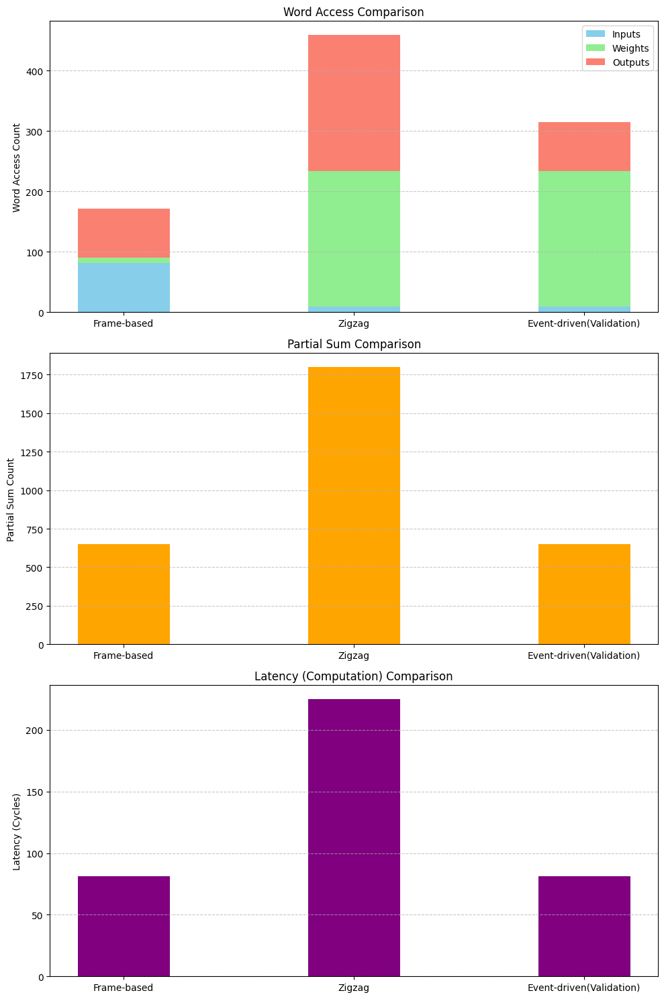

# Dimension 1 (Baseline implementation)
In this section the dense case implementation of the AeDAM tool is explained which is built on top of the two popular exploration tools - Zigzag and Stream
## Problem statement
[This needs to be derived from the imformation present in the Reson for this descripency section]

## Current results
The workload considered is as follows:
  
- **Input**: [1,1,5,5]
- **Weights (Kernels)**: [8,1,3,3]
- **Outputs**: [1,8,3,3]


#### Step 2: Frame-Based Execution of the Workload

For the mapping as follows:
  
```
==============================
Temporal Loops                
==============================
for FX in [0, 3):             
------------------------------
  for FY in [0, 3):           
------------------------------
    for OX in [0, 3):         
------------------------------
      for OY in [0, 3):       
------------------------------
==============================
Spatial Loops                 
==============================
        parfor K in [0, 8):   
------------------------------
```
  
The statistics are as follows:
  
<div align="center">
  
|                | Description                         |
|----------------|-------------------------------------|
| **Word Access**| Inputs: 81, Weights: 9, Outputs: 81 |
| **Partial Sum**| 8 * 81 = 648 (across 8 NPEs)        |
| **Latency**    | Off: 0, Comp: 81, On: 0             |
  
</div>
  
#### Event-Based Execution of the Workload
  
The output given by Zigzag is as follows:
  
**Mapping:**
  
```
===============================
Temporal Loops                 
===============================
for IY in [0, 5):              
-------------------------------
  for IX in [0, 5):            
-------------------------------
    for FX in [0, 3):          
-------------------------------
      for FY in [0, 3):        
-------------------------------
===============================
Spatial Loops                  
===============================
        parfor K in [0, 8):    
-------------------------------
```
  
The statistics are as follows:
  
<div align="center">
  
|                | Description                           |
|----------------|---------------------------------------|
| **Word Access**| Inputs: 25, Weights: 225, Outputs: 225 |
| **Partial Sum**| 8 * 225 = 1800 (across 8 NPEs)        |
| **Latency**    | Off: 0, Comp: 225, On: 0              |
  
</div>
  

## Expected results
  
Upon validating the above mapping, the actual statistics are as follows:
  
<div align="center">
  
|                | Description                           |
|----------------|---------------------------------------|
| **Word Access**| Inputs: 25, Weights: 81, Outputs: 81  |
| **Partial Sum**| 8 * 81 = 648 (across 8 NPEs)          |
| **Latency**    | Off: 0, Comp: 81, On: 0               |
  
</div>
  
Here is a comparison of all the generated statistics:
  

  
There is a 94% difference between the expected event-driven latency value and the actual Zigzag stats value generated by the exploration. This overestimation can lead to issues when the same cost model is used for multi-core exploration, and this difference in latency needs to be accounted for.


## Reason for this descripency (Supported by the literature)

Investigating ZigZag’s Input-Stationary Overestimation
## Problem Overview  
The user observed that ZigZag’s reported memory accesses and operations for an **input-stationary convolution** were much higher than expected. Specifically, for a 1×5×5 input convolved with an 8×1×3×3 kernel (no padding, so output should be 3×3×8), ZigZag counted **3×** more weight and output accesses and partial-sum operations than an “event-driven” (valid-output-only) model predicts. The expected counts (assuming only valid output positions) vs. ZigZag’s output were: 

- **Input accesses:** 25 (both expected and ZigZag)  
- **Weight accesses:** *Expected* ~81 vs. *ZigZag* 225  
- **Output updates:** *Expected* ~81 vs. *ZigZag* 225  
- **Partial sums (MAC ops):** *Expected* 648 vs. *ZigZag* 1800  
- **Latency (cycles):** *Expected* 81 vs. *ZigZag* 225  

These disparities indicate that ZigZag is counting many more weight and output transactions and MAC operations than should occur if the convolution only produces 3×3 valid outputs. The question is whether this overestimation stems from a **limitation in ZigZag’s modeling** (not pruning invalid outputs in an input-stationary dataflow) or from a **mapping/misconfiguration issue** in how the architecture and loops were specified.

## ZigZag’s Convolution Loop Modeling  
ZigZag models a convolution with a 7-dimensional loop nest (Batch $B$, Output Channels $K$, Input Channels $C$, Output Y $OY$, Output X $OX$, Filter Y $FY$, Filter X $FX$). Not all loops apply to each tensor operand: ZigZag classifies loops as *relevant (r)* or *irrelevant (ir)* to each operand’s data, with special *partially relevant (pr)* pairs for input reuse ([[2007.11360] ZigZag: A Memory-Centric Rapid DNN Accelerator Design Space Exploration Framework](https://ar5iv.labs.arxiv.org/html/2007.11360#:~:text=Input%2C%20however%2C%20also%20has%20%E2%80%98pr%E2%80%99,is%20looping%20through%20its%20space)). In a standard convolution loop nest (output-stationary form), the output loops ($OY,OX$) iterate only over valid output indices (e.g. 0–2 for a 3×3 output), naturally skipping any out-of-bounds positions.

However, ZigZag’s framework allows **uneven or alternative loop orderings**. In particular, an *input-stationary* schedule may loop over input coordinates ($IY, IX$) and filter offsets ($FY, FX$) – producing output indices on the fly via relations $oy = iy + fy$, $ox = ix + fx$. ZigZag’s formalism recognizes that in such a dataflow, the input tensor’s spatial loops don’t appear directly in the convolution equation; instead, input indices are “indirectly present” through output and filter loops (e.g. $IX$ and $FX$ together determine an output $OX$) ([[2007.11360] ZigZag: A Memory-Centric Rapid DNN Accelerator Design Space Exploration Framework](https://ar5iv.labs.arxiv.org/html/2007.11360#:~:text=Input%2C%20however%2C%20also%20has%20%E2%80%98pr%E2%80%99,is%20looping%20through%20its%20space)). It calls these coupled loops *partially relevant (pr)* for the input operand ([[2007.11360] ZigZag: A Memory-Centric Rapid DNN Accelerator Design Space Exploration Framework](https://ar5iv.labs.arxiv.org/html/2007.11360#:~:text=in%20the%20convolution%20formula%20directly%2C,is%20looping%20through%20its%20space)) because their combination affects input reuse patterns (e.g. holding an input pixel constant while $OX$ and $FX$ vary such that $OX+FX$ is constant can enable reusing that input ([[2007.11360] ZigZag: A Memory-Centric Rapid DNN Accelerator Design Space Exploration Framework](https://ar5iv.labs.arxiv.org/html/2007.11360#:~:text=in%20the%20convolution%20formula%20directly%2C,is%20looping%20through%20its%20space))). 

**Crucially, ZigZag’s cost model treats the nested loops literally** – it iterates over all combinations of loop indices unless told otherwise. In the user’s mapping, the temporal loop order was given as `[FY, FX, IX, IY]` (with $K$=8 mapped spatially across 8 MACs). This means ZigZag iterated $IY=0..4$ and $IX=0..4$ (the full 5×5 input grid) and $FY=0..2$, $FX=0..2$ (the 3×3 filter) – **a total of 5×5×3×3 = 225 iterations**. Each iteration corresponds to one MAC operation per output channel (8 in parallel). ZigZag thus tallied 225 cycles × 8 MACs = 1800 partial-sum ops, and it fetched weights/updated outputs 225 times (presumably as vectorized groups for the 8 channels, hence 225 weight and output access counts). These 225 iterations effectively treated every alignment of the 3×3 kernel over the 5×5 input as an “operation,” even those that slide partly outside the input’s valid overlap with the output (i.e. producing an out-of-range $oy,ox$). 

## Lack of Invalid-Output Pruning in the Model  
In an **ideal input-stationary execution**, when the filter kernel is centered near the input’s edges, some of its taps fall outside the input – those would either be skipped (in a *“event-driven” valid convolution* model) or treated as multiplying by zero (if we imagine zero-padding). The user’s *expected* counts (81 weight accesses, 648 MACs) assume that only the $3\times3$ output region is actually computed. ZigZag, on the other hand, appears to count as if the input were zero-padded and the convolution ran over a larger output feature map (in fact, 225 iterations corresponds to a 7×7 output if one were doing a full convolution). In other words, **ZigZag did not automatically filter out invalid output positions** – it counted all loop iterations generated by the provided schedule. 

This behavior is consistent with ZigZag’s design philosophy: it uses a **uniform nested-loop representation** and multiplies loop bounds to derive costs ([[2007.11360] ZigZag: A Memory-Centric Rapid DNN Accelerator Design Space Exploration Framework](https://ar5iv.labs.arxiv.org/html/2007.11360#:~:text=can%20always%20refer%20to%20the,case%20in%20Figure%C2%A06%20for%20validation)) ([[2007.11360] ZigZag: A Memory-Centric Rapid DNN Accelerator Design Space Exploration Framework](https://ar5iv.labs.arxiv.org/html/2007.11360#:~:text=3,up%20to%20the%20current%20level)). There is no evidence in the DAC 2021 paper or code that ZigZag applies conditional checks for output validity when using an input-index-based loop schedule. On the contrary, the framework relies on the *mapping definition* to reflect the actual computation. If the mapping doesn’t explicitly restrict the loops to valid regions, ZigZag’s cost model will faithfully count even those “extra” partial outputs. The paper notes that distinguishing **partial outputs vs. final outputs** is important for accuracy ([[2007.11360] ZigZag: A Memory-Centric Rapid DNN Accelerator Design Space Exploration Framework](https://ar5iv.labs.arxiv.org/html/2007.11360#:~:text=to%20be%20considered,L2%20and%20L3%20is%20unidirectional)), and ZigZag indeed tracks partial sums separately from final output writes. In our case, the 1800 partial sums vs. 225 output writes reflect that ZigZag sees most of those operations as accumulating into **partial output entries** that never become final (only 225 writes occurred, likely corresponding to the times a new output started) ([[2007.11360] ZigZag: A Memory-Centric Rapid DNN Accelerator Design Space Exploration Framework](https://ar5iv.labs.arxiv.org/html/2007.11360#:~:text=to%20be%20considered,L2%20and%20L3%20is%20unidirectional)) ([[2007.11360] ZigZag: A Memory-Centric Rapid DNN Accelerator Design Space Exploration Framework](https://ar5iv.labs.arxiv.org/html/2007.11360#:~:text=cost%20estimation,L2%20and%20L3%20is%20unidirectional)). But it still counts the work done on partial outputs. Essentially, ZigZag assumed the algorithm performed all those MACs and just ended up not producing new final outputs for many of them until the valid ones came into range at the center of the convolution.

## Configuration vs. Tool Limitation  
Given this analysis, the overestimation is **not due to a mis-specified hardware architecture** (the 8-MAC, dual-SRAM setup is fine) but rather due to how the mapping was specified and how ZigZag interprets it. The mapping omitted explicit $OY,OX$ loops (which would have been 3 each) and did not inform ZigZag of any output-bound filtering condition. As a result, ZigZag did exactly what its model would predict – iterate over all $IY,IX,FY,FX$ combinations – thereby “over-counting” from the user’s perspective. This suggests a **limitation in ZigZag’s ability to prune invalid outputs for input-stationary mappings**. In ZigZag’s current model, *input-stationary reuse* (via `pr` loop pairs) can be captured in terms of data reuse and buffering (e.g. using shift registers for inputs ([[2007.11360] ZigZag: A Memory-Centric Rapid DNN Accelerator Design Space Exploration Framework](https://ar5iv.labs.arxiv.org/html/2007.11360#:~:text=partially%20relevant%20,is%20looping%20through%20its%20space)) ([[2007.11360] ZigZag: A Memory-Centric Rapid DNN Accelerator Design Space Exploration Framework](https://ar5iv.labs.arxiv.org/html/2007.11360#:~:text=broadcasted%20diagonally%20in%20a%20PE,Inputs%20in%20a%20FIFO%20manner))), but the framework does *not* automatically shorten loops or skip computations for the edges. It assumes the loops run to their full bounds ([[2007.11360] ZigZag: A Memory-Centric Rapid DNN Accelerator Design Space Exploration Framework](https://ar5iv.labs.arxiv.org/html/2007.11360#:~:text=can%20always%20refer%20to%20the,case%20in%20Figure%C2%A06%20for%20validation)). 

In essence, **ZigZag is “working as expected” given the user’s loop-specification** – it is faithfully accounting for every loop iteration generated by the input-stationary schedule, including those that correspond to out-of-range outputs. The downside is that ZigZag currently lacks an internal mechanism to recognize and discard those invalid computations. Unless the user models the convolution with proper output loops or adds constraints (e.g. using padding or masking in the workload definition), ZigZag will count those edge MACs and weight fetches as real operations. This is a known challenge with input-driven convolution schedules: one must handle the output boundary conditions explicitly. ZigZag’s analytical approach does not inherently perform **“output validity filtering”** for you.

## Conclusion  
All evidence points to the conclusion that the **overestimation is due to ZigZag’s modeling limitations with input-stationary mapping**, not a basic misconfiguration of the architecture. The tool does not inherently understand the concept of “invalid” output positions in the loop nest – it treats the provided loops at face value. In the given experiment, the user’s mapping effectively caused ZigZag to simulate a larger convolution (as if outputs outside the 3×3 valid region were being computed with zero-padding), hence the inflated counts. The ZigZag DAC 2021 paper’s methodology confirms this behavior: it emphasizes loop-repetition counts and data reuse based on loop types ([[2007.11360] ZigZag: A Memory-Centric Rapid DNN Accelerator Design Space Exploration Framework](https://ar5iv.labs.arxiv.org/html/2007.11360#:~:text=dimensions%20are%20categorized%20as%20relevant,opportunities%2C%20as%20shown%20in%20Table%C2%A0II)) ([[2007.11360] ZigZag: A Memory-Centric Rapid DNN Accelerator Design Space Exploration Framework](https://ar5iv.labs.arxiv.org/html/2007.11360#:~:text=in%20the%20convolution%20formula%20directly%2C,is%20looping%20through%20its%20space)), but it assumes the loop bounds represent all necessary iterations. 

**Bottom line:** ZigZag is *not* bugged – it is operating according to its design – but it is **unable to automatically prune invalid output computations in an input-stationary schedule**. The onus is on the user’s mapping definition to ensure that only valid output-producing loops are considered. In this case, because the mapping didn’t include the output loops or a guard for the valid output window, ZigZag counted extra weight accesses and partial sums that an “event-driven” execution would avoid. This explains the 3× discrepancy, and it means the tool is doing what it was told (thus not a misconfiguration per se), but it has a modeling gap when it comes to implicitly handling boundary conditions in convolutions. 

**Sources:** The behavior is consistent with ZigZag’s published loop-model (DAC 2021) ([[2007.11360] ZigZag: A Memory-Centric Rapid DNN Accelerator Design Space Exploration Framework](https://ar5iv.labs.arxiv.org/html/2007.11360#:~:text=Input%2C%20however%2C%20also%20has%20%E2%80%98pr%E2%80%99,is%20looping%20through%20its%20space)) ([[2007.11360] ZigZag: A Memory-Centric Rapid DNN Accelerator Design Space Exploration Framework](https://ar5iv.labs.arxiv.org/html/2007.11360#:~:text=broadcasted%20diagonally%20in%20a%20PE,Inputs%20in%20a%20FIFO%20manner)) and the lack of any mention of automatic output-bound handling in the paper or code. The partial vs. final output distinction in the ZigZag framework ([[2007.11360] ZigZag: A Memory-Centric Rapid DNN Accelerator Design Space Exploration Framework](https://ar5iv.labs.arxiv.org/html/2007.11360#:~:text=to%20be%20considered,L2%20and%20L3%20is%20unidirectional)) further corroborates that ZigZag tracks those extra partial updates rather than ignoring them. Thus, the observed overestimation is expected unless the mapping explicitly restricts the computation to the valid output range. 


Thanks for the clarification. I’ll now dive into two key questions: 

1. Whether modeling the workload using input loops (to achieve input-stationary behavior) is methodologically sound in ZigZag.
2. Whether overestimation of weight accesses and partial sums could lead to the loss of valid low-latency mappings during ZigZag’s design space exploration—especially when optimizing for latency.

I’ll also investigate how to extract the full mapping space from ZigZag so you can analyze the mapping candidates quantitatively.

I’ll get back to you with a thorough technical breakdown, supported by references from the ZigZag codebase and paper.

# Modeling Input-Stationary with Only Input Loops vs. Output Loops

## Validity of an Input-Loop-Only **Input-Stationary** Mapping

Using only input dimension loops (IY, IX, FY, FX) to model an *input-stationary* dataflow is **not how ZigZag was intended to be used** for convolution layers. In ZigZag’s formulation, convolution is defined over **7 loop indices** corresponding to batch, channels, output spatial dims, and filter dims – typically **B, C (input channels), K (output channels), OY, OX (output height/width), FY, FX (filter height/width)** ([zigzag/input_funcs.py at master · nokia/zigzag · GitHub](https://github.com/nokia/zigzag/blob/master/input_funcs.py#:~:text=i2a%20%3D%20,3%2C%20%27FY%27%3A%202%2C%20%27FX%27%3A%201)). The input spatial dimensions (IY, IX) do **not explicitly appear** as loops in the convolution mapping; instead, ZigZag treats them as **“partially relevant (pr) loops”** that are *indirectly* accounted for via combinations of output and filter loops ([[2007.11360] ZigZag: A Memory-Centric Rapid DNN Accelerator Design Space Exploration Framework](https://ar5iv.labs.arxiv.org/html/2007.11360#:~:text=Input%2C%20however%2C%20also%20has%20%E2%80%98pr%E2%80%99,is%20looping%20through%20its%20space)). In other words, loops OY and FY together traverse the input height (IY), and OX with FX traverse the input width (IX) during convolution. The ZigZag DAC 2021 paper explicitly notes: *“Input’s dimensions IX and IY do not show up in the convolution formula directly; instead they are indirectly present through OX and FX (for IX) and OY and FY (for IY). As such, OX, FX (resp. OY, FY) are denoted as partially relevant (pr) loops for Input.”* ([[2007.11360] ZigZag: A Memory-Centric Rapid DNN Accelerator Design Space Exploration Framework](https://ar5iv.labs.arxiv.org/html/2007.11360#:~:text=Input%2C%20however%2C%20also%20has%20%E2%80%98pr%E2%80%99,is%20looping%20through%20its%20space)). 

**Implication:** Omitting explicit output loops (OY, OX) and looping directly over IY/IX means the model is enumerating combinations of input and filter positions *without the output-index constraints*. ZigZag’s cost model will then count many iteration cases that **don’t produce a valid output** – essentially out-of-bounds contributions where an input-slide falls outside the output feature map. This is why you observed inflated counts for weight accesses, partial sums, and latency: the mapping is “computing” nonexistent output positions. In a correct convolution mapping, each output position (OY,OX) pairs with a range of filter offsets (FY,FX); by replacing OY,OX with IY,IX loops, you remove the boundary conditions that normally limit those combinations. The result is that ZigZag counts extra MAC operations for when, say, `IY - FY < 0` or beyond the valid output range, which **should be ignored but aren’t** under this modeling hack. 

**Alignment with ZigZag’s Intent:** ZigZag was designed to handle input-stationarity through **loop ordering and partial relevance, not by eliminating output loops**. For example, to keep inputs stationary, one common strategy is to nest the loops so that OX and FX (or OY and FY) vary in a coordinated manner, enabling reuse of the same input activation across those loops (the “diagonal” reuse or FIFO effect) ([[2007.11360] ZigZag: A Memory-Centric Rapid DNN Accelerator Design Space Exploration Framework](https://ar5iv.labs.arxiv.org/html/2007.11360#:~:text=partially%20relevant%20,is%20looping%20through%20its%20space)) ([[2007.11360] ZigZag: A Memory-Centric Rapid DNN Accelerator Design Space Exploration Framework](https://ar5iv.labs.arxiv.org/html/2007.11360#:~:text=%E2%80%98pr%E2%80%99%20creates%20alternative%20data%20reuse,in%20neighboring%20PE%20locations%20across)). The DAC 2021 paper describes how an input can be reused **without** explicitly looping IY/IX: e.g., Eyeriss achieves input reuse by spatially unrolling FY and OY (diagonal broadcast of inputs), and EnVision uses a temporal OX loop with FX as the innermost loop to achieve a FIFO sliding window reuse ([[2007.11360] ZigZag: A Memory-Centric Rapid DNN Accelerator Design Space Exploration Framework](https://ar5iv.labs.arxiv.org/html/2007.11360#:~:text=%E2%80%98pr%E2%80%99%20creates%20alternative%20data%20reuse,in%20neighboring%20PE%20locations%20across)). ZigZag’s loop-relevance principle recognizes these as partial-reuse patterns. In practice, an *input-stationary* dataflow in ZigZag would still include OY/OX loops but arrange them appropriately. For instance, you might unroll OY across PEs or hold OX-FX as innermost loops such that `OX+FX` remains constant for some duration, keeping input data in place ([[2007.11360] ZigZag: A Memory-Centric Rapid DNN Accelerator Design Space Exploration Framework](https://ar5iv.labs.arxiv.org/html/2007.11360#:~:text=their%20indices%20remains%20constant%20while,is%20looping%20through%20its%20space)). This is how **ZigZag expects input-stationarity to be expressed** – through an *uneven mapping* where the input operand doesn’t advance on certain loops (OY/OX) at a given memory level, rather than removing the loops entirely.

In short, **modeling with only input loops is not a “valid” expression of input-stationary in ZigZag’s terms**. It is more of a hack that breaks the convolution’s loop structure. The correct approach is to include the output loops and leverage ZigZag’s support for *uneven loop scheduling*. For example, you could map OY and OX to higher levels (or spatially) such that at the temporal level the input operand sees only FY, FX loops (no temporal OY/OX) – this achieves input stationary behavior **without dropping OY/OX from the model**. In the provided ZigZag mapping example (AlexNet conv layer on Eyeriss), notice that the **temporal loops for input include OX but not OY** (since OY was unrolled spatially) ([zigzag/inputs/mapping.yaml at master · nokia/zigzag · GitHub](https://github.com/nokia/zigzag/blob/master/inputs/mapping.yaml#:~:text=MAC%3A%20)). Nowhere does that mapping introduce IY/IX loops; instead, the reuse of input across OY is handled by spatial unrolling. This confirms that ZigZag’s intended usage is to always work with the convolution’s output loops, using spatial/temporal scheduling to hold inputs stationary when needed. 

**Trade-offs of the Input-Loop-Only Method:** The only apparent “advantage” of using IY/IX loops is conceptual simplicity for an event-driven model – you directly iterate over input pixels – but this comes at the cost of **accuracy and correct reuse modeling**. You lose ZigZag’s built-in understanding of *partial reuse*. With only input loops, ZigZag treats IY and IX as if they were fully relevant loops, so moving along IY or IX always triggers “new input fetch” in its model (since it doesn’t know those correspond to overlapping output windows) instead of recognizing the sliding-window reuse. In contrast, with proper OY/OX loops, ZigZag knows those are *irrelevant or partially relevant* to input operand, meaning it will count input reuse across those loops (and not charge a new input fetch every single increment) ([[2007.11360] ZigZag: A Memory-Centric Rapid DNN Accelerator Design Space Exploration Framework](https://ar5iv.labs.arxiv.org/html/2007.11360#:~:text=Input%2C%20however%2C%20also%20has%20%E2%80%98pr%E2%80%99,is%20looping%20through%20its%20space)) ([[2007.11360] ZigZag: A Memory-Centric Rapid DNN Accelerator Design Space Exploration Framework](https://ar5iv.labs.arxiv.org/html/2007.11360#:~:text=partially%20relevant%20,is%20looping%20through%20its%20space)). Thus, the input-loop-only approach can **underestimate input reuse** (treating it as if none of the input stays in the buffer across output moves) while **overestimating computations** (counting invalid ones). Including output loops fixes both: it enforces correct bounds (no invalid computations) and lets the tool apply reuse analysis (via the pr-loop logic) to reduce memory traffic counts. In summary, the user’s current modeling strategy is *unsound* for accurate DSE – it was likely not meant to be the primary way to encode input-stationary dataflows in ZigZag.

### Supporting Evidence from ZigZag Code

The absence of IY/IX loops in ZigZag’s loop definitions is evident in the code. For example, the loop indexing dictionary for a convolution layer mapping is: `{'B':7, 'K':6, 'C':5, 'OY':4, 'OX':3, 'FY':2, 'FX':1}` ([zigzag/input_funcs.py at master · nokia/zigzag · GitHub](https://github.com/nokia/zigzag/blob/master/input_funcs.py#:~:text=i2a%20%3D%20,3%2C%20%27FY%27%3A%202%2C%20%27FX%27%3A%201)). There is no entry for IY or IX – ZigZag inherently assumes convolution loops use OY/OX, not direct input indices. When parsing a mapping file, unrecognized loop labels would likely cause errors or be ignored; if you somehow replaced OY with IY in the mapping YAML, ZigZag might misinterpret it or default to treating it as a separate loop (thus counting extra dimensions). In the provided `mapping.yaml` example for a fixed mapping, the loops at each level are given in terms of the standard conv indices (e.g., OX, OY, FX, FY, C, K) ([zigzag/inputs/mapping.yaml at master · nokia/zigzag · GitHub](https://github.com/nokia/zigzag/blob/master/inputs/mapping.yaml#:~:text=weight%3A)) ([zigzag/inputs/mapping.yaml at master · nokia/zigzag · GitHub](https://github.com/nokia/zigzag/blob/master/inputs/mapping.yaml#:~:text=weight%3A)) – again, no IY/IX. All this reinforces that sticking to OY, OX loops is the *intended usage*. 

**Recommendation:** Redefine the mapping using OY/OX loops but schedule them appropriately to emulate input-stationarity. For instance, if your accelerator is “event-driven” with no explicit output loop in hardware, you can model that by *pushing the OY/OX loops to a higher abstraction level* (or spatial dimension) in ZigZag. That way, at the compute level, the input operand doesn’t iterate OY/OX (thus it is stationary for the innermost execution), but the model still knows the overall OY/OX range and won’t count invalid iterations. This aligns with ZigZag’s uneven mapping capability, where different operands can have loops mapped to different levels or omitted at certain levels ([[2007.11360] ZigZag: A Memory-Centric Rapid DNN Accelerator Design Space Exploration Framework](https://ar5iv.labs.arxiv.org/html/2007.11360#:~:text=The%20workload%20is%20expressed%20as,loops%20determines%20the%20temporal%20mapping)) ([[2007.11360] ZigZag: A Memory-Centric Rapid DNN Accelerator Design Space Exploration Framework](https://ar5iv.labs.arxiv.org/html/2007.11360#:~:text=even%20mappings,levels%20and%20the%20roof%20variable)). In summary, **using only IY/IX loops is not a viable long-term solution** – it misaligns with ZigZag’s modeling semantics and yields incorrect metrics.

## Impact of Overestimation on DSE Ranking and Optimal Mappings

### ZigZag’s DSE: How Mappings Are Ranked and Pruned

ZigZag performs design-space exploration by evaluating many loop orderings (temporal mappings) and selecting those that optimize the target metric (energy or latency, or a combination). When optimizing for **latency**, the framework will rank mappings by their estimated total execution cycles (or inverse throughput). The search itself can be **exhaustive or heuristic** ([[2007.11360] ZigZag: A Memory-Centric Rapid DNN Accelerator Design Space Exploration Framework](https://ar5iv.labs.arxiv.org/html/2007.11360#:~:text=)), but in either case ZigZag aims to **“not miss the optimal solution”** by exploring a broad space including *uneven mappings* ([[2007.11360] ZigZag: A Memory-Centric Rapid DNN Accelerator Design Space Exploration Framework](https://ar5iv.labs.arxiv.org/html/2007.11360#:~:text=The%20ZigZag%20mapper%20efficiently%20searches,without%20missing%20the%20optimal%20solution)). That said, in practice the DSE process will **filter out suboptimal mappings** – either by pruning during the search or by discarding them after evaluation:

- **Heuristic / branch-and-bound searches:** If you use a heuristic or iterative search, ZigZag may prune partial mapping configurations that already appear worse than the best found. For example, as loop factors are being assigned, if the partial schedule has a latency exceeding a known best, the search can cut it off (to reduce runtime). An inflated partial sum count early in the schedule (due to those “invalid” iterations) could signal high latency, causing the algorithm to skip fully exploring that mapping. In essence, the overestimation can *prematurely prune* the input-stationary mapping from the search. (Exact pruning criteria aren’t explicitly documented, but this behavior is common in DSE mappers to manage complexity.)

- **Exhaustive search:** If using exhaustive mode (no pruning), ZigZag will evaluate every possible mapping, but it will still **rank the results** and typically only report the Pareto-optimal ones. Under a pure latency objective, this often means it reports the single lowest-latency mapping (or a few tied ones). Any mapping with higher latency would be omitted from the “optimal set.” Thus, even without explicit pruning, a mapping that *should* be optimal but has an inflated latency estimate will **not appear in the output**, because it’s dominated by another mapping that (perhaps incorrectly) appears faster.

ZigZag’s output is controlled by “concise” vs “complete” modes, but importantly, both modes focus on **optimal design points** only ([zigzag/inputs at master · nokia/zigzag · GitHub](https://github.com/nokia/zigzag/tree/master/inputs#:~:text=,result_filename)). So if a good mapping is not considered optimal due to skewed metrics, you won’t see it in the results at all – it’s effectively lost in the exploration. The framework expects its cost model to be accurate; if a mapping’s cost is overestimated, ZigZag has no way of knowing that and will legitimately consider that mapping inferior.

### Could Overestimation Cause Losing a Truly Optimal Mapping?

Yes, this is a real risk. If the input-stationary mapping is inherently efficient for your hardware but ZigZag **overestimates its latency (cycles)** by counting spurious operations, the tool might rank another mapping (perhaps weight-stationary or some other dataflow) as faster and drop the input-stationary candidate. This could lead you to design around a suboptimal dataflow. The severity of this effect depends on how large the overestimation is:

- **Small overestimation:** If the fraction of invalid iterations is minor (e.g., very large feature maps and relatively small filters), the latency inflation might be small enough that the input-stationary mapping is still among the best. In this case, ZigZag’s chosen “optimal” might still be correct, and the mapping isn’t truly lost – it might still win or be close. You can gauge this by how much extra partial sums ZigZag reported. For instance, with a 3×3 filter, the *theoretical* overhead from boundary iterations is at most on the order of 2 rows and 2 columns of inputs (in total ~4% extra MACs for large images). A small overhead like that might not flip the optimal order if input-stationary had big reuse advantages elsewhere.

- **Large overestimation:** For larger filters or smaller feature maps, the proportion of invalid computations is higher. For example, a 7×7 kernel on only a 7×7 feature map – looping IY/IX would double-count a huge number of positions (the majority of IY,IX combinations produce out-of-range outputs). In such cases, ZigZag might compute a latency nearly 2× of the true value for that mapping, which is a significant penalty. A mapping that *should* be fastest could appear mediocre or the “worst” due to essentially counting half its cycles doing nothing useful. In this scenario, it’s very plausible that the correct best mapping is being thrown out.

To determine if *your* optimal mapping was lost, you can try **capturing the full exploration results** for analysis. By default, ZigZag doesn’t dump every tried mapping, but you have a couple of options:

### Extracting and Analyzing the Full Mapping Space

**Option (a): Instrument an exhaustive search to log all mappings.** This is the more direct method. Since you have the ZigZag code, you can modify the mapper to record each evaluated mapping’s metrics. Steps you might take:

- **Use a small test case.** Choose a smaller convolution layer or downscale your layer dimensions (and perhaps restrict PE array size) so that exhaustive search is feasible (the mapping count can explode otherwise). Enable `fixed_spatial_mapping=True` (to avoid also exploring spatial unrolling) and `fixed_architecture=True` so that only temporal mappings vary. In the settings, set `fixed_temporal_mapping=False` and choose the `exhaustive` search method ([GitHub - nokia/zigzag: A Fast DNN Accelerator Design Space Exploration Framework.](https://github.com/nokia/zigzag#:~:text=Temporal%20mapping%20exploration)). This ensures ZigZag will enumerate *all possible temporal mappings* for that layer and architecture.

- **Modify the mapper to log results:** In ZigZag v1 (as on GitHub), the exhaustive temporal mapper is implemented in **`bsg_exh.py`** (“best schedule generator – exhaustive”). You can insert logging in this file. For example, after the cost model computes the latency/energy of a candidate mapping, append the result (loop ordering plus metrics) to a list or file. The `bsg_exh` code is complex, but one hint: it likely calls functions from `cost_model_funcs.py` to evaluate a given loop nest. By adding a print or file write after evaluation, you can capture lines like “Mapping X: Latency=..., Energy=...”. 

- **Run the search and collect output:** Because this is exhaustive, it will try **every legal loop order/blocking**. The console will be very verbose (and slow for large layers). It might be wise to redirect stdout to a file or write a structured output (e.g., CSV or JSON). In *complete mode*, ZigZag outputs a YAML file of results, but again only for optimal points ([zigzag/inputs at master · nokia/zigzag · GitHub](https://github.com/nokia/zigzag/tree/master/inputs#:~:text=,result_filename)), so custom logging is needed to get *all* points.

- **Post-process the data:** Once you have the list of all mappings and their latencies, you can filter for the dataflow of interest (e.g., identify which ones correspond to input-stationary ordering – perhaps by looking for OY/OX at certain levels or absence thereof). Compare its latency to the minimum. This will let you quantify: “Our input-stationary mapping was ranked Nth out of M, with latency X vs the optimal’s Y.” If X is significantly higher due to known overcount, you can then recompute what it *should* be. For example, subtract out the estimated number of invalid MACs times cost per MAC (and adjust memory accesses for weights not actually used at edges). If after correction it would have latency Y or better, that’s evidence the mapping was mistakenly dropped.

ZigZag’s internal data structures can be a bit unwieldy to parse, but logging textual output is the most straightforward. Note that **console information** during the run (as noted in the README) can include helpful markers – e.g., it might print the loop order being tried or pruned ([GitHub - nokia/zigzag: A Fast DNN Accelerator Design Space Exploration Framework.](https://github.com/nokia/zigzag#:~:text=Console%20information)). You might leverage those prints to identify mappings. If modifying code is undesirable, an alternative is to run the exhaustive search in debug mode and copy-paste the console trace, but parsing that can be painful.

**Option (b): Compare runs with and without pruning or with altered cost model.** Another approach is to intentionally disable the problematic counts and see if the chosen mapping changes:

- **Without pruning:** Use exhaustive search (as above) to ensure no heuristic skips anything. Then *temporarily modify the cost model* to ignore invalid output region operations. For instance, in the cost computation for MACs or partial sums, apply a mask such that any combination where an output index would be out of range is not counted. Implementing this precisely is non-trivial (you’d essentially replicate the conv boundary condition logic: count MACs only for OY = IY – FY etc.). But for a small case, you could brute-force calculate ground-truth operations and feed that into ZigZag’s results for one mapping. 

- **With normal vs fixed cost:** Run ZigZag normally (with the inflated counts) and note the best mapping and its latency. Then run it with your patched cost model or post-processed costs. If the “optimal” mapping changes (say, input-stationary wins when using correct costs), then you know the original DSE did lose the true optimum. If it doesn’t change, then the overestimation didn’t affect the final ranking (the input-stationary mapping might still not win even with correct accounting).

Given that modifying ZigZag’s internals can be involved, Option (a) – logging all mappings – is a clearer path to get evidence. You might not need to collect *every* mapping for a large real layer; instead, focus on a subset of the space: for example, fix all loops except the choice of using OY/OX vs IY/IX style and see the difference. One trick is you can manually add your “input-loop-only” mapping as a fixed mapping (in the `mapping.yaml`) and run a single cost evaluation (fixed_mapping mode). Then do the same with a comparable proper mapping that includes output loops. This won’t tell you about lost mappings, but it will show the metric inflation directly. ZigZag’s output in **complete single-estimate mode** will list the breakdown of memory accesses and cycles for that one mapping, which you can inspect. If you see, for example, significantly higher “Psum accumulation” cycles or extra weight reads, that is the inflation you suspected.

### Determining Whether to Invest in a Fix

After the above analysis, you’ll be in a position to decide if correcting the model is worthwhile:

- If the input-stationary mapping is never optimal even after correction (perhaps another dataflow truly has lower real latency), then the effort of masking invalid outputs might not yield a better design – ZigZag’s current result might already be the right choice. In that case, the focus could shift to why that mapping is slower (maybe input-stationary has other overheads like more partial sum accumulation even when counting correctly).

- If you discover that the only reason input-stationary mapping lost is the overcount, then it’s a strong indication to fix the modeling. In this scenario, **yes, it is worth investing effort** to correct ZigZag’s estimation. This could involve writing a custom cost post-processor: e.g., after ZigZag outputs its results, adjust the latency by subtracting the known invalid iterations (which equal `(FY-1)*(IX dimension) + (FX-1)*(IY dimension)` worth of MACs, roughly, for each output channel and batch). You could integrate this into a script that reads ZigZag’s “complete” output YAML and recomputes the metrics, then re-ranks mappings. Since ZigZag is open-source, a more elegant approach is to add a check in the cost model to handle cases where loops OY or OX are missing and internally account for the convolution bounds – effectively teaching the tool about those boundary conditions. This is more complex but would yield accurate metrics directly.

In summary, **there is a tangible risk of losing optimal mappings** when costs are inflated. ZigZag’s DSE will faithfully discard anything that doesn’t look best. To ensure your desired input-stationary mapping isn’t wrongly filtered out, use exhaustive logging to see where it stands. If needed, apply manual corrections to validate its true performance. If the mapping should be optimal, then proceed to implement a fix (either by adjusting your mapping description to include output loops as intended, or by modifying the cost calculations). Given that the ZigZag framework was designed to explore *uneven loop schedules* without dropping dimensions ([[2007.11360] ZigZag: A Memory-Centric Rapid DNN Accelerator Design Space Exploration Framework](https://ar5iv.labs.arxiv.org/html/2007.11360#:~:text=even%20mappings,levels%20and%20the%20roof%20variable)), the more robust solution is to conform to that paradigm (i.e. model OY/OX properly) rather than maintain a workaround that requires post-hoc fixes. 

**References:**

- ZigZag 2021 (DAC/IEEE TC): Loop relevance and partial relevance for input operands ([[2007.11360] ZigZag: A Memory-Centric Rapid DNN Accelerator Design Space Exploration Framework](https://ar5iv.labs.arxiv.org/html/2007.11360#:~:text=Input%2C%20however%2C%20also%20has%20%E2%80%98pr%E2%80%99,is%20looping%20through%20its%20space)) ([[2007.11360] ZigZag: A Memory-Centric Rapid DNN Accelerator Design Space Exploration Framework](https://ar5iv.labs.arxiv.org/html/2007.11360#:~:text=%E2%80%98pr%E2%80%99%20creates%20alternative%20data%20reuse,in%20neighboring%20PE%20locations%20across))  
- ZigZag GitHub (v1): Mapping format and loops (see absence of IY/IX) ([zigzag/input_funcs.py at master · nokia/zigzag · GitHub](https://github.com/nokia/zigzag/blob/master/input_funcs.py#:~:text=i2a%20%3D%20,3%2C%20%27FY%27%3A%202%2C%20%27FX%27%3A%201)); Example fixed mapping usage of OY loops ([zigzag/inputs/mapping.yaml at master · nokia/zigzag · GitHub](https://github.com/nokia/zigzag/blob/master/inputs/mapping.yaml#:~:text=MAC%3A%20))  
- ZigZag GitHub: Output filtering and print modes ([zigzag/inputs at master · nokia/zigzag · GitHub](https://github.com/nokia/zigzag/tree/master/inputs#:~:text=,result_filename)) (optimal design point reporting)  
- ZigZag 2021: DSE methodology (Temporal Mapping Generator explores even/uneven mappings without missing optimum) ([[2007.11360] ZigZag: A Memory-Centric Rapid DNN Accelerator Design Space Exploration Framework](https://ar5iv.labs.arxiv.org/html/2007.11360#:~:text=The%20ZigZag%20mapper%20efficiently%20searches,without%20missing%20the%20optimal%20solution)).


Perfect, thanks for confirming. I’ll now investigate whether ZigZag can natively express an event-driven architecture—where a single input activation triggers all relevant MACs at once—and whether the current mapping infrastructure (which is inherently output-loop–driven) supports this. I’ll also determine whether your understanding is correct that a wrapper is required to filter out invalid computations for latency and access counts, and if so, provide research-backed reasoning to justify building one.

I'll get back to you with a detailed conclusion, including possible mapping alternatives (if they exist) or confirmation that your approach and diagnosis are valid.

# Modeling Input-Triggered “Event-Driven” Execution in ZigZag

## ZigZag’s Dataflow Assumptions vs. Event-Driven Execution  
**ZigZag is fundamentally designed around *output-driven* (output-based) mappings.** In ZigZag’s loop representation, the convolution workload is defined with **output spatial loops (OY, OX)** and filter loops (FY, FX), while input indices are typically derived via dimension relations ([zigzag/zigzag/inputs/workload/resnet18.yaml at master · KULeuven-MICAS/zigzag · GitHub](https://github.com/KULeuven-MICAS/zigzag/blob/master/zigzag/inputs/workload/resnet18.yaml#:~:text=equation%3A%20O%5Bb%5D%5Bk%5D%5Boy%5D%5Box%5D%2B%3DW%5Bk%5D%5Bc%5D%5Bfy%5D%5Bfx%5D)) ([](https://convolve.eu/wp-content/uploads/2024/06/CONVOLVE_D6.2_Description_of_the_gen1_performance_analysis_and_DSE_framework_v0.1.pdf#:~:text=SigSag%20performs%20output,by%20input%20dimensions%20and%20kernel)). This corresponds to the usual **output-centric execution** of CNNs: the tool assumes that output pixels are computed by accumulating contributions from input activations over inner loops. For example, a standard 2D convolution in ZigZag is modeled as nested loops over output channels (K), input channels (C), output rows (OY), output columns (OX), and then kernel rows/cols (FY, FX) ([](https://convolve.eu/wp-content/uploads/2024/06/CONVOLVE_D6.2_Description_of_the_gen1_performance_analysis_and_DSE_framework_v0.1.pdf#:~:text=for%20k%20in%200,ox%5D%29%20%2F%2Frelu)). ZigZag’s default model thus iterates explicitly over output coordinates and treats partial sums until all input contributions are added ([](https://convolve.eu/wp-content/uploads/2024/06/CONVOLVE_D6.2_Description_of_the_gen1_performance_analysis_and_DSE_framework_v0.1.pdf#:~:text=simultaneously,To%20resolve%20such)).  

By contrast, an **event-driven, input-triggered architecture** flips this paradigm. Here **each input activation drives all its MACs at once** – the input is *not* repeatedly reloaded or iterated over output positions. There are no explicit loops over outputs; instead, an input “event” directly **scatters** its contributions to the appropriate outputs. In pseudocode, this looks like: 

```cpp
// 1-D convolution example (input-stationary):
for (h = 0; h < H; h++) {       // Input index (drives execution)
  for (r = 0; r < R; r++) {     // Kernel index
    O[h - r] += W[r] * I[h];    // Update output at position (h-r)
  }
}
``` 

Here the output index is computed as `h-r` (input index minus filter offset) ([](https://www.iitg.ac.in/johnjose/SPARC2/lecture3-dataflow.pdf#:~:text=for%20%28h%3D0%3B%20h,O)). **No separate output loop exists** – each input `I[h]` triggers R MACs to R output positions. In a 2D case, an input at (iy,ix) with filter (fy,fx) contributes to output (oy = iy - fy, ox = ix - fx). *Ideally, an event-driven model would execute exactly those MACs and skip any out-of-bounds output indices.* 

## Limitations of ZigZag for Pure Input-Driven Dataflow  
**ZigZag cannot natively model a purely input-triggered loop nest without output loops.** In fact, ZigZag (and its extensions) currently lack true “input-based” mapping support ([](https://convolve.eu/wp-content/uploads/2024/06/CONVOLVE_D6.2_Description_of_the_gen1_performance_analysis_and_DSE_framework_v0.1.pdf#:~:text=SigSag%20performs%20output,by%20input%20dimensions%20and%20kernel)). The tool expects that either output or weight loops will drive the scheduling, with input indices “partially dependent” via relations ([](https://convolve.eu/wp-content/uploads/2024/06/CONVOLVE_D6.2_Description_of_the_gen1_performance_analysis_and_DSE_framework_v0.1.pdf#:~:text=SigSag%20performs%20output,by%20input%20dimensions%20and%20kernel)). If one attempts to define a workload using only input spatial loops (IY, IX) and filter loops (FY, FX) – effectively reversing inputs and outputs – the internal analysis breaks down. The ZigZag documentation confirms this limitation:

> “ZigZag performs output-based mapping… Input-driven SNN accelerators may require input-based mapping… While this could be fixed by reversing the definition of inputs and outputs in the workload, **it breaks part of the analysis**… responsible for determining whether an output is a partial sum or a final output, resulting in pessimistic estimates” ([](https://convolve.eu/wp-content/uploads/2024/06/CONVOLVE_D6.2_Description_of_the_gen1_performance_analysis_and_DSE_framework_v0.1.pdf#:~:text=simultaneously,To%20resolve%20such)).

In other words, ZigZag’s loop and **“relevance” logic is built around OY/OX loops and their relationship to FY/FX.** The framework expects to iterate over valid output coordinates and accumulate partial outputs. When you remove OY/OX loops and try to drive computation solely with input loops, ZigZag no longer knows how to prune invalid combinations or identify when an output has received all its input contributions ([](https://convolve.eu/wp-content/uploads/2024/06/CONVOLVE_D6.2_Description_of_the_gen1_performance_analysis_and_DSE_framework_v0.1.pdf#:~:text=simultaneously,To%20resolve%20such)) ([](https://convolve.eu/wp-content/uploads/2024/06/CONVOLVE_D6.2_Description_of_the_gen1_performance_analysis_and_DSE_framework_v0.1.pdf#:~:text=tools%20ZigZag%2C%20SigSag%20and%20Stream%2C,and%20determine%20which%20outputs%20are)). Every combination of (IY, IX, FY, FX) is naively considered a MAC operation, even if the implied output index `(oy = iy - fy, ox = ix - fx)` is outside the actual output image bounds. This leads to **overcounting of MACs** and mis-estimated memory traffic – exactly as you observed. Essentially, ZigZag fails to “skip” the cases where `iy-fy` or `ix-fx` falls outside `[0, OY-1]` or `[0, OX-1]`. 

**Why does this happen?** ZigZag’s internal model assumes that **output loops define the valid output space**, and dimension relations (like `iy = oy + fy`) map inputs accordingly ([zigzag/zigzag/inputs/workload/resnet18.yaml at master · KULeuven-MICAS/zigzag · GitHub](https://github.com/KULeuven-MICAS/zigzag/blob/master/zigzag/inputs/workload/resnet18.yaml#:~:text=equation%3A%20O%5Bb%5D%5Bk%5D%5Boy%5D%5Box%5D%2B%3DW%5Bk%5D%5Bc%5D%5Bfy%5D%5Bfx%5D)). If OY/OX loops are present, only in-range input indices are considered because `oy` and `ox` themselves are looped over valid extents (e.g. 0…OY−1) ([zigzag/zigzag/inputs/workload/resnet18.yaml at master · KULeuven-MICAS/zigzag · GitHub](https://github.com/KULeuven-MICAS/zigzag/blob/master/zigzag/inputs/workload/resnet18.yaml#:~:text=equation%3A%20O%5Bb%5D%5Bk%5D%5Boy%5D%5Box%5D%2B%3DW%5Bk%5D%5Bc%5D%5Bfy%5D%5Bfx%5D)). But in an input-driven mapping, `oy`/`ox` become *derived* from `iy,ix,fy,fx`. ZigZag doesn’t inherently apply a conditional mask to drop out-of-range `oy,ox` results. Instead, without explicit output loops, the tool effectively assumes every `(iy,ix,fy,fx)` yields a meaningful output update. The result is an **overestimation of computations and often storage** (since outputs are seen as partial sums never finalized, see below). This aligns with the “pessimistic” analysis mentioned in documentation ([](https://convolve.eu/wp-content/uploads/2024/06/CONVOLVE_D6.2_Description_of_the_gen1_performance_analysis_and_DSE_framework_v0.1.pdf#:~:text=the%20workload%2C%20it%20breaks%20part,To%20resolve%20such)).

Moreover, ZigZag’s analysis of buffering and partial sums relies on knowing when an output is fully computed. In a normal output-driven schedule, an output element is *final* once all input-channel loops complete at that output index, after which it can be written out of local buffers. In an input-driven schedule, however, outputs accumulate gradually as inputs stream in. ZigZag’s current heuristic cannot easily detect when an output has received all its input events ([](https://convolve.eu/wp-content/uploads/2024/06/CONVOLVE_D6.2_Description_of_the_gen1_performance_analysis_and_DSE_framework_v0.1.pdf#:~:text=tools%20ZigZag%2C%20SigSag%20and%20Stream%2C,and%20determine%20which%20outputs%20are)). **All outputs might be treated as “partial” until the very end of the input loops**, inflating on-chip buffer time or memory accesses. This is another facet of the issue – the framework isn’t designed to track the *projection of inputs to outputs* and figure out “which outputs are ready at which input loop” ([](https://convolve.eu/wp-content/uploads/2024/06/CONVOLVE_D6.2_Description_of_the_gen1_performance_analysis_and_DSE_framework_v0.1.pdf#:~:text=mapping%20and%20propagate%20such%20changes,at%20which%20input%20loop%20dimensions)). This explains any anomalous buffering or latency results you saw when forcing only input loops: the tool likely assumed worst-case, keeping outputs around longer than necessary (hence “pessimistic” memory usage ([](https://convolve.eu/wp-content/uploads/2024/06/CONVOLVE_D6.2_Description_of_the_gen1_performance_analysis_and_DSE_framework_v0.1.pdf#:~:text=the%20workload%2C%20it%20breaks%20part,To%20resolve%20such))).

**Bottom line:** Your diagnosis is correct – ZigZag does not natively support a purely input-triggered execution pattern. Its loop model and validity checks (tied to OY/OX and FY/FX relations) cannot enforce the semantics where *inputs are the sole driver* and many input/filter index combinations simply produce no output. The current implementation is geared toward “even” convolution mappings (output- or weight-loop driven) ([](https://convolve.eu/wp-content/uploads/2024/06/CONVOLVE_D6.2_Description_of_the_gen1_performance_analysis_and_DSE_framework_v0.1.pdf#:~:text=SigSag%20performs%20output,by%20input%20dimensions%20and%20kernel)), so an **event-driven architecture’s semantics fall outside ZigZag’s assumed design space**.

## Need for Boundary Filtering or Tool Extensions  
Given the above, **modeling an event-driven dataflow in ZigZag will require extra measures to get correct results.** The ZigZag developers themselves note that supporting *input-based mapping* would require modifying ZigZag’s internal logic ([](https://convolve.eu/wp-content/uploads/2024/06/CONVOLVE_D6.2_Description_of_the_gen1_performance_analysis_and_DSE_framework_v0.1.pdf#:~:text=tools%20ZigZag%2C%20SigSag%20and%20Stream%2C,and%20determine%20which%20outputs%20are)). Specifically, they would need to incorporate a way to **filter out invalid output positions and detect output completion** on the fly – essentially exactly what you describe as “boundary filtering.” Since this is not yet built-in, any attempt at input-driven modeling (like your IY/IX + FY/FX loops approach) will miscount operations and memory unless you manually compensate.

In practice, there are two paths forward:

- **Modify ZigZag’s code** to handle input-driven loops – i.e. implement the projection logic that prunes invalid outputs and marks outputs complete when appropriate ([](https://convolve.eu/wp-content/uploads/2024/06/CONVOLVE_D6.2_Description_of_the_gen1_performance_analysis_and_DSE_framework_v0.1.pdf#:~:text=tools%20ZigZag%2C%20SigSag%20and%20Stream%2C,and%20determine%20which%20outputs%20are)). This is a non-trivial change: *“the tool would need to consider the projection of inputs to outputs through the kernel and determine which outputs are ready at which input loop dimensions”* ([](https://convolve.eu/wp-content/uploads/2024/06/CONVOLVE_D6.2_Description_of_the_gen1_performance_analysis_and_DSE_framework_v0.1.pdf#:~:text=detecting%20if%20final%20outputs%20are,at%20which%20input%20loop%20dimensions)). Until such a feature is added, ZigZag simply isn’t aware of the convolution boundaries in an input-centric ordering. 

- **Wrap ZigZag with a post-processing filter** to correct its counts. In practice, this means running a normal ZigZag analysis with your input-loop mapping and then adjusting the results by subtracting the “extra” MACs and memory accesses that correspond to out-of-bounds output indices. For example, you could calculate how many input/filter combinations fall outside the valid output range and remove those from the MAC count and eliminate the associated output partial-sum traffic. This is essentially emulating the loop pruning that ZigZag failed to do. *Such a wrapper is indeed justified* if you need accurate metrics, because otherwise ZigZag will **overestimate latency and energy** by counting nonexistent computations.

In summary, **yes – a boundary-filtering wrapper or workaround is necessary** to accurately model an event-driven architecture in ZigZag (barring an internal update to support it). Your observation of overestimation is in line with the expected behavior of ZigZag given its current limitations. Until the tool is extended for input-driven dataflows, users must manually ensure that out-of-bound operations are excluded from the accounting.

## Input-Stationary vs. Event-Driven: Understanding the Difference  
It’s important to clarify the distinction between a *classical input-stationary dataflow* and the kind of *event-driven execution* you describe:

- **“Input-Stationary” (IS) Dataflow** – e.g. as used in Eyeriss or other CNN accelerators – refers to keeping input activations in place (in local registers or buffers) while performing all needed MACs, rather than repeatedly re-fetching that input ([Tutorial on DNN - 05 - DNN Accelerator Architectures](https://eems.mit.edu/wp-content/uploads/2019/06/Tutorial-on-DNN-05-DNN-Accelerator-Architectures.pdf#:~:text=Input%20Stationary%20,weights%20and%20accumulate%20psums%20spatially)). The key is maximizing reuse of the input data. However, *being input-stationary does not mean there are no output loops*. In fact, in an input-stationary schedule, the hardware still orchestrates the computation of each output (or partial sum). For example, Eyeriss’s **Row-Stationary** strategy (a variant of input-stationary) broadcasts one input activation to multiple PEs which accumulate results for different outputs ([2019_neurips_tutorial](https://eyeriss.mit.edu/2019_neurips_tutorial.pdf#:~:text=%E2%80%A2%20Minimize%20partial%20sum%20R%2FW,Output%20Stationary%20%28OS)) ([2019_neurips_tutorial](https://eyeriss.mit.edu/2019_neurips_tutorial.pdf#:~:text=Activation%20Weight%20PE%20Psum%20,NeurIPS%202019%2055)). Those outputs are accumulated either spatially across the array or over time; but crucially, the accelerator **knows which output(s) it is computing at a given time**. The loop nest perspective might put the input index in an outer loop, but there are still inner loops (or parallel lanes) over output positions so that each input contributes to each relevant output sequentially or in parallel. In other words, an input-stationary dataflow still *organizes the computation by output indices* to some extent – e.g. a “sliding window” of outputs is processed for each input ([Tutorial on DNN - 05 - DNN Accelerator Architectures](https://eems.mit.edu/wp-content/uploads/2019/06/Tutorial-on-DNN-05-DNN-Accelerator-Architectures.pdf#:~:text=Input%20Stationary%20%E2%80%93%20Reference%20Pattern,size%20%3D%20R)). Partial sums are accumulated and eventually each output is finalized once all its inputs have been processed ([Tutorial on DNN - 05 - DNN Accelerator Architectures](https://eems.mit.edu/wp-content/uploads/2019/06/Tutorial-on-DNN-05-DNN-Accelerator-Architectures.pdf#:~:text=Input%20Stationary%20,weights%20and%20accumulate%20psums%20spatially)). 

- **Event-Driven Execution** – as in your description (and in spiking neural network accelerators, for instance) – pushes input-stationarity to the extreme. Here *the arrival of an input is the sole trigger*, and the architecture might update all affected outputs **essentially simultaneously** (in a massively parallel design) or at least without any explicit loop over outputs in the control flow. Outputs and weights are completely passive in terms of loop ordering. This is analogous to how a spiking neural net works: a spike (input) fans out to all target neurons (outputs) in one event. In a CNN context, an input pixel “fires” and all MAC operations involving that pixel occur immediately. **There are no sequential loops over output positions at the algorithmic level** – any sequencing is purely due to hardware resource limits, not an algorithmic loop nest. Importantly, once an input’s event is processed, that input is never revisited, and its contributions to all outputs are done. The next input (or next layer, etc.) will then be processed.

The difference is subtle in code but significant in execution semantics. A conventional input-stationary loop nest might look like the pseudocode above (with `for h in H, for r in R: O[h-r] += ...`), which indeed has no explicit output loop in the inner loops. **However, a typical accelerator will implement this by effectively iterating output indices under the hood or in parallel.** For example, if hardware processes one MAC at a time, it will still iterate through the `for (r in 0..R)` loop for each input `h`. In effect, it’s doing *R sequential updates* to outputs for each input. In an event-driven architecture, you might have dedicated circuits or massively parallel MAC units to perform all R updates at once (or in a way that doesn’t require a software-visible loop). 

**Eyeriss (Input-Stationary) vs Event-Driven:** Eyeriss’s original dataflow keeps inputs in local registers while a *tile of outputs* are produced ([Tutorial on DNN - 05 - DNN Accelerator Architectures](https://eems.mit.edu/wp-content/uploads/2019/06/Tutorial-on-DNN-05-DNN-Accelerator-Architectures.pdf#:~:text=Input%20Stationary%20%E2%80%93%20Reference%20Pattern,size%20%3D%20R)). But Eyeriss *does* buffer partial sums and explicitly accumulates them cycle by cycle – it is still aware of output coordinates. By contrast, an event-driven design might treat each input as causing direct writes to output accumulators with minimal buffering, and might not iterate over output indices in the same nested manner. In short, **event-driven is a special case of input-stationary where the “loop” over outputs is conceptually invisible** (all outputs update concurrently with the input), whereas classical input-stationary still had an orderly traversal of outputs (even if small or done in parallel chunks).

For modeling purposes, **ZigZag treats even input-stationary dataflows in the classical way** – i.e. there will be output loops (perhaps small or partially unrolled) in the mapping. For instance, you could map an “input-stationary” strategy in ZigZag by making IY/IX outer loops and OY/OX inner loops. But *you cannot remove OY/OX entirely* without confusing the tool, as we’ve established. Thus, to model something like Eyeriss in ZigZag, you would still include OY/OX in the loop nest (as the Eyeriss dataflow does, conceptually) – whereas to model a truly event-driven design, you attempted to drop OY/OX, which ZigZag can’t handle correctly. 

## Workarounds to Approximate Event-Driven Behavior in ZigZag  
Until ZigZag supports input-driven execution natively, we have to approximate the event-driven dataflow using the existing loop constructs. Some possible workarounds and their limitations:

- **Use a Standard Convolution Mapping with Input-Stationary Ordering:** The closest valid mapping in ZigZag to your scenario is an **input-stationary loop order** (but still including output loops). For example, you could set the loop nest as: **Batch, InputChannel (C), Input Y (IY), Input X (IX)** as outer loops, then **Kernel Y (FY), Kernel X (FX)**, and finally **OutputChannel (K)** and maybe output spatial loops innermost. In a simple case with one output channel at a time, this reduces to outer loops over each input pixel, then inner loops over the kernel and output channel – which is quite close to input-triggered. Crucially, you would still include OY/OX loops of extent 1 in the appropriate place to ensure ZigZag knows which output index is being written. For instance, you might enforce that `OY = IY - FY` and `OX = IX - FX` via relations, but keep OY/OX as 1-step loops that iterate only valid values (effectively acting like a conditional). This way, **ZigZag will only count MACs where the output index equals that single valid value**, skipping invalid ones. In practice, this is essentially modeling each input activation processing a *1×1 tile* of the output at a time (the tile being the one reachable output). While somewhat contrived, it prevents the tool from wandering outside bounds. The downside is you must carefully configure the dimension relations and loop ranges so that OY/OX loop over exactly the needed index (or use conditional checks outside ZigZag to ignore others).

- **Leverage Spatial Parallelism in Architecture:** If your goal is to capture the latency benefit of event-driven execution (e.g. many outputs updated simultaneously), you could configure the accelerator in ZigZag with a large spatial array or parallel lanes for the output loop. For example, if the PE array can cover all output positions influenced by an input in parallel, you would tile the output loops spatially. In ZigZag, you might unroll OX and OY across PEs such that an input is broadcast and all its relevant outputs are computed in one timestep. This is effectively how one would map a neuromorphic-like behavior onto a CNN accelerator model: *the output loops exist, but they are fully unrolled in space*, so in one iteration of the input loop the tool computes all those outputs. This can mimic the effect of an input triggering all outputs “at once.” However, note that ZigZag will still internally consider OY/OX loops – you’re just telling it that the hardware does them in parallel (thus no extra cycles). The mapping file would specify spatial unrolling of OY/OX loops equal to the kernel size (or output window size per input) so that there’s no sequential iteration for those loops in time. This workaround gives correct operation counts (since OY/OX loops are defined and pruned) and can yield low latency (if the spatial array is big enough), approximating the event-driven concurrency.

- **Post-process results to remove padding overhead:** If neither of the above fully matches your architecture, you can always run a conventional mapping and then adjust. For instance, run ZigZag with a normal convolution definition (including output loops) that matches the overall layer dimensions. ZigZag will then accurately count only valid MACs. If this “normal” mapping isn’t input-triggered, you can still use the result as a baseline for total MAC count and memory traffic (since those should be the same in any correct schedule), then argue qualitatively about any latency differences due to the event-driven schedule. The key is to avoid using the broken input-only mapping for counting. Use a correct mapping for counting, and separately consider that your real hardware wouldn’t reload inputs (ZigZag would already account for input reuse if you give it an input-stationary mapping). In essence, you’d be using ZigZag for what it can do (counting operations with valid loops) and handling the truly novel part (exact cycle scheduling of an event-driven sequence) outside of ZigZag’s scope.

In practice, **the simplest reliable approach is to stick with a legal loop-nest in ZigZag (one that includes OY/OX) that embodies an input-stationary strategy.** This will ensure no ghost operations are counted. Then, if needed, use ZigZag’s output (which assumes some output-driven order) and adjust the interpretation. For example, ZigZag might report that outputs are produced after iterating over all inputs (since it didn’t know to finalize earlier), but your event-driven hardware could output results sooner – that timing difference isn’t directly captured in ZigZag anyway, since it doesn’t model dynamic readiness of outputs beyond simple loop ordering. What matters is that the total MAC count and data movement are correct, which they will be if you include proper loops.

## Conclusion  
**In conclusion, ZigZag in its current form cannot directly model the pure event-driven, input-triggered execution without modifications.** This is a known limitation inherited from its output-centric mapping approach ([](https://convolve.eu/wp-content/uploads/2024/06/CONVOLVE_D6.2_Description_of_the_gen1_performance_analysis_and_DSE_framework_v0.1.pdf#:~:text=simultaneously,To%20resolve%20such)). Your observations are valid: if you omit output loops, ZigZag will over-count operations (performing MACs for non-existent output positions) and mishandle output lifetime, leading to pessimistic performance estimates. The framework’s loop modeling and partial-sum tracking are not equipped to handle a scenario where *inputs solely drive the loops* and outputs emerge implicitly. 

Until the ZigZag developers extend support for **input-based mappings** (which they acknowledge is needed for spiking/event-driven accelerators ([](https://convolve.eu/wp-content/uploads/2024/06/CONVOLVE_D6.2_Description_of_the_gen1_performance_analysis_and_DSE_framework_v0.1.pdf#:~:text=tools%20ZigZag%2C%20SigSag%20and%20Stream%2C,and%20determine%20which%20outputs%20are))), the best practice is to include output loops in the model (to delineate valid output indices) or otherwise filter out invalid operations. Implementing a wrapper to mask or subtract those out-of-bound computations is indeed a sound solution to obtain correct latency and energy numbers, and the extra effort is justified by the current tool behavior. In short, your diagnosis is correct, and using a boundary-filtering scheme (or carefully constrained loop definitions) is necessary to faithfully estimate an event-driven architecture’s costs with ZigZag. This ensures the results reflect only the **valid computations** and properly account for the one-time use of each input – aligning the model with the hardware’s input-triggered execution paradigm. 

**Sources:** The above analysis is supported by ZigZag’s documentation and publications, which explicitly note the lack of input-driven mapping support and the challenges it poses ([](https://convolve.eu/wp-content/uploads/2024/06/CONVOLVE_D6.2_Description_of_the_gen1_performance_analysis_and_DSE_framework_v0.1.pdf#:~:text=simultaneously,To%20resolve%20such)) ([](https://convolve.eu/wp-content/uploads/2024/06/CONVOLVE_D6.2_Description_of_the_gen1_performance_analysis_and_DSE_framework_v0.1.pdf#:~:text=tools%20ZigZag%2C%20SigSag%20and%20Stream%2C,and%20determine%20which%20outputs%20are)). We also reference known dataflow concepts (input-stationary vs. output-stationary) ([](https://www.iitg.ac.in/johnjose/SPARC2/lecture3-dataflow.pdf#:~:text=for%20%28h%3D0%3B%20h,O)) ([Tutorial on DNN - 05 - DNN Accelerator Architectures](https://eems.mit.edu/wp-content/uploads/2019/06/Tutorial-on-DNN-05-DNN-Accelerator-Architectures.pdf#:~:text=Input%20Stationary%20,weights%20and%20accumulate%20psums%20spatially)) to clarify why an event-driven model is conceptually different and why ZigZag’s default (like Eyeriss’s approach) still requires output loops. The need for modifications or careful workarounds is directly highlighted in the ZigZag-based CONVOLVE project report ([](https://convolve.eu/wp-content/uploads/2024/06/CONVOLVE_D6.2_Description_of_the_gen1_performance_analysis_and_DSE_framework_v0.1.pdf#:~:text=simultaneously,To%20resolve%20such)) ([](https://convolve.eu/wp-content/uploads/2024/06/CONVOLVE_D6.2_Description_of_the_gen1_performance_analysis_and_DSE_framework_v0.1.pdf#:~:text=tools%20ZigZag%2C%20SigSag%20and%20Stream%2C,and%20determine%20which%20outputs%20are)), confirming that a wrapper or tool change is needed for accurate modeling of input-triggered accelerators. 

## Proposed solution

Thanks for sharing the detailed context, goals, simulator, and constraints. I’ll now put together a two-week plan for your POC that includes:

- An algorithmic approach to wrap and patch ZigZag for event-driven modeling using valid boundary filtering.
- Confirmation from literature that in dense workloads, WS/OS and event-driven models yield similar latency and access counts.
- Recommendations for using and improving your simulator for validation.
- How fixing ZigZag fixes Stream too (since intra-core modeling uses ZigZag).

I’ll break this into modular components with priority levels and suggest validation benchmarks like LeNet-5.

I’ll get back to you shortly with a structured implementation and validation roadmap.

# Two-Week POC Plan: Extending ZigZag for Event-Driven Dense CNN Execution

## Objectives and Context  
This proof-of-concept plan aims to extend the **ZigZag** DNN mapping tool to accurately model **event-driven execution** for dense CNN convolutions (e.g. LeNet-5) on both single-core and multi-core (Stream) architectures. The goal is to address two known limitations in ZigZag’s current analytical model: (1) internal breakdown when the convolution is expressed in an **input-driven (event-based)** manner (i.e. when the output loops OY, OX are removed), and (2) **overestimation of latency and memory accesses** due to lack of boundary filtering and no awareness of when partial sums become final outputs. By fixing these issues, we ensure that for **dense CNN layers**, an event-driven dataflow yields **the same number of operations and similar latency/energy** as standard weight-stationary (WS) or output-stationary (OS) mappings ([](https://convolve.eu/wp-content/uploads/2024/06/CONVOLVE_D6.2_Description_of_the_gen1_performance_analysis_and_DSE_framework_v0.1.pdf#:~:text=the%20workload%2C%20it%20breaks%20part,to%20modify%20ZigZag%20to%20enable)) ([](https://eems.mit.edu/wp-content/uploads/2016/04/eyeriss_isca_2016.pdf#:~:text=DRAM%20Accesses%3A%20DRAM%20accesses%20are,Considering%20RS%20has)). This will be validated using the user’s custom Python event-driven convolution simulator and integrated into multi-core **Stream** modeling (which relies on ZigZag for intra-core analysis). The end result will support the user’s thesis claim that for dense CNNs, event-driven execution incurs no performance or energy penalty compared to conventional mappings, by providing matching latency and energy metrics in ZigZag/Stream (corroborated by simulation).

## Limitations in ZigZag’s Current Model (Baseline)  
**1. Input-Driven Loop Mapping Breaks Output Finalization Logic:** ZigZag normally models a convolution with seven nested loops (Batch, Output Channel K, Input Channel C, Output Y (OY), Output X (OX), Filter Y (FY), Filter X (FX)) ([untitled](https://past.date-conference.com/proceedings-archive/2022/pdf/0228.pdf#:~:text=To%20simplify%20the%20explanation%2C%20we,and%20its%20ir%20loops)). If one attempts to use an **input-driven mapping** (replacing OY, OX loops with input spatial loops to simulate event-based processing), ZigZag’s internal logic fails to correctly identify when an output is completely computed. In ZigZag’s default output-driven formulation, it knows that when the inner filter loops finish, the output value is finalized. But with output loops removed (and inputs as drivers), ZigZag cannot easily tell whether a given partial sum is the final output or still incomplete. In fact, **reversing the definition of inputs and outputs in the workload “breaks” the analysis tool responsible for determining if an output is partial or final, leading to pessimistic (overestimated) memory usage** ([](https://convolve.eu/wp-content/uploads/2024/06/CONVOLVE_D6.2_Description_of_the_gen1_performance_analysis_and_DSE_framework_v0.1.pdf#:~:text=the%20workload%2C%20it%20breaks%20part,to%20modify%20ZigZag%20to%20enable)). This is a known limitation inherited by both SigSag (for SNNs) and Stream, since they extend ZigZag’s infrastructure ([](https://convolve.eu/wp-content/uploads/2024/06/CONVOLVE_D6.2_Description_of_the_gen1_performance_analysis_and_DSE_framework_v0.1.pdf#:~:text=an%20output%20is%20a%20partial,To%20do%20so%2C%20the)). Essentially, ZigZag lacks a mechanism to detect at runtime which outputs have received all their input contributions in an input-driven schedule.

**2. No Boundary Filtering – Overestimation of Operations and Accesses:** In an event-driven convolution, an **input “event” triggers only valid MACs** (multiply-accumulates) for outputs that actually exist within the image boundaries. However, ZigZag’s dense mapping (especially if forced into an input-driven order) might count invalid computations where the filter kernel extends beyond the input/output boundary (i.e. multiplications with zero-padding or non-existent pixels). Without explicit boundary checks, ZigZag’s analytical model counts these *ineffectual* MACs and the associated memory accesses for zero-valued data, inflating latency and energy. Moreover, ZigZag is unaware of **output completion timing** – it might assume partial sums are stored and re-loaded many times if it cannot detect when an output can be finalized and written out. This leads to **overestimation of memory traffic** (especially for partial sum writes/reads) and underestimation of parallelism (thus higher latency) when using an input-driven schedule. The CONVOLVE project documentation notes that using input-based mapping without proper output readiness logic resulted in **“pessimistic memory estimates”** in ZigZag ([](https://convolve.eu/wp-content/uploads/2024/06/CONVOLVE_D6.2_Description_of_the_gen1_performance_analysis_and_DSE_framework_v0.1.pdf#:~:text=the%20workload%2C%20it%20breaks%20part,to%20modify%20ZigZag%20to%20enable)). In summary, the tool currently does not filter out out-of-bound computations nor recognize when an output is complete, which are critical for accurate event-driven modeling.

## Proposed Solution: Event-Driven Execution Wrapper  
To overcome these limitations without a full redesign of ZigZag, we propose implementing a **wrapper module** that post-processes ZigZag’s mapping results to enforce input-driven, event-based semantics. This wrapper will take the convolution mapping (loops assignment and cost breakdown) from ZigZag and **filter out invalid MAC operations and excess memory accesses**, emulating how an event-driven execution would only perform necessary computations. The approach is to leverage ZigZag’s existing output-stationary or weight-stationary mapping for dense CNN layers (which correctly accounts for all valid operations) and then adjust the ordering and counting to match an input-driven execution model:

- **Loop Reordering:** The wrapper conceptually “inverts” the loop nesting to an input-driven order (iterating over input spatial positions as outer loops, instead of output positions), *without changing the total work*. This means for each input activation, we consider the contributions it makes to various outputs. We do this in a post-analysis manner to avoid breaking ZigZag’s internal mapper. Essentially, we use ZigZag’s output-based counts as the baseline dense operation set, then reorganize those operations by input events.

- **Boundary Skip (Valid MAC Filtering):** We will incorporate **boundary condition checks** to ensure that only MACs which map to a valid output index are counted. Any MAC that would involve reading outside the input image (or padded region) is dropped. In practice, for **valid convolution** (no zero-padding, as in LeNet-5), the number of MACs remains the same as output-based mapping – we’re just ensuring no extra ones sneak in. This filtering mainly affects cases where the input-driven loop might otherwise consider invalid output coordinates. The result should equal the standard dense MAC count (e.g. for each output pixel in a 5×5 conv, exactly 25 MACs per output channel * input channels).

- **Output Readiness and Partial Sum Handling:** The wrapper will explicitly track when each output has received all its contributions. When an output feature map value has accumulated contributions from all required input pixels and filter weights, it is marked **finalized** and can be written out once. This prevents ZigZag from counting multiple partial sum write-backs for that output. In an output-stationary dataflow, partial sums remain in the PE registers until finalized ([](https://eems.mit.edu/wp-content/uploads/2016/04/eyeriss_isca_2016.pdf#:~:text=DRAM%20Accesses%3A%20DRAM%20accesses%20are,Considering%20RS%20has)); we enforce a similar behavior for the input-driven case (outputs accumulate events until complete, then one output write). The wrapper will adjust memory access counts so that **partial outputs are not repeatedly written to or read from buffers once their computation is done**, eliminating the pessimistic overestimation from the original tool ([](https://convolve.eu/wp-content/uploads/2024/06/CONVOLVE_D6.2_Description_of_the_gen1_performance_analysis_and_DSE_framework_v0.1.pdf#:~:text=the%20workload%2C%20it%20breaks%20part,to%20modify%20ZigZag%20to%20enable)). Concretely, if ZigZag’s default analysis assumed storing partial sums to off-chip memory due to uncertain output completion, the wrapper will reduce those to on-chip accumulations with a single final write, matching the intended event-driven (and realistic) execution.

- **Preserve Total Reuse:** For dense CNNs, all data (inputs, weights) will be used in computations the same number of times as in a regular mapping. The wrapper will ensure that any data reuse inherent in the dense mapping is preserved. (Since there is no sparsity, event-driven execution doesn’t introduce additional data reuse – it just processes data in a different order.) Literature on CNN dataflows confirms that **for dense tensors, different execution orders perform the same set of MAC operations and can achieve the same data reuse theoretically** ([](https://sparseloop.mit.edu/documents/2022-micro-sparseloop.pdf#:~:text=Dataflow%20modeling%20derives%20the%20uncompressed,space%20tiling%20for%20tensor%20A)) ([](https://eems.mit.edu/wp-content/uploads/2016/04/eyeriss_isca_2016.pdf#:~:text=The%20WS%20dataflow%20is%20optimized,scalability%2C%20all%20dataflows%20can%20use)). We leverage this fact: the wrapper will not change the total counts of input/weight usages compared to the baseline optimal mapping; it only redistributes when they occur and avoids spurious accesses (like reading zeros or re-reading already-accumulated partials).

By implementing the above, the wrapper essentially acts as a post-processor that **“filters the dense traffic”** (to borrow terminology from sparse accelerator models ([](https://sparseloop.mit.edu/documents/2022-micro-sparseloop.pdf#:~:text=Dataflow%20modeling%20derives%20the%20uncompressed,space%20tiling%20for%20tensor%20A)), here filtering out zero-ops and redundant moves). The core ZigZag engine can continue to generate a mapping for the layer (we can use a standard WS or OS mapping as a template), and then the wrapper computes the event-driven metrics from that mapping. This avoids modifying ZigZag’s complex internals during the short POC, while still obtaining correct results for event-driven scenarios.

### Event-Driven Filtering Algorithm (Pseudocode)  
Below is a high-level pseudocode sketch of how the wrapper will reinterpret ZigZag’s convolution mapping in an input-driven, event-by-event fashion. This algorithm uses the layer dimensions and mapping info (from ZigZag) to iterate over input “events” and accumulate results, tracking memory accesses and output finalizations:

```python
# Given: Layer dimensions (C, K, H_in, W_in, H_out, W_out, R, S),
# stride (Sy, Sx), padding (Py, Px), and ZigZag mapping with cost per memory op.
# We'll accumulate metrics in counters:
latency_cycles = 0
energy_pJ = 0
reads = {'W':0, 'I':0, 'O':0}    # word reads
writes = {'W':0, 'I':0, 'O':0}   # word writes
output_partial_count = {}       # track how many contributions each output has received

# Outer loops: iterate over each input activation position (iy, ix) and channel c
for c in range(C): 
    for iy in range(H_in):
        for ix in range(W_in):
            # Simulate an "input event" at (c, iy, ix)
            input_used = False  # flag to count input read once per event
            for fy in range(R):
                # Compute the output Y index this input contributes to for this filter row
                oy = iy - fy + Py  # include padding offset (Py=0 for valid convolution)
                if oy < 0 or oy >= H_out or oy % Sy != 0:
                    continue  # skip contributions that don't land on a valid output row
                for fx in range(S):
                    ox = ix - fx + Px  # projected output X index
                    if ox < 0 or ox >= W_out or ox % Sx != 0:
                        continue  # skip invalid output column
                    # At this point, (oy, ox) is a valid output coordinate that (iy,ix) contributes to
                    for k in range(K):
                        # MAC: input (c, iy, ix) * weight (k, c, fy, fx) -> accumulate into output (k, oy, ox)
                        # Count weight read (first time this weight used for this input event)
                        if not weight_loaded[(k,c,fy,fx)]:
                            reads['W'] += 1
                            weight_loaded[(k,c,fy,fx)] = True  # ensure weight reuse counted properly within this event
                        # Count input read once per event (per c,iy,ix)
                        if not input_used:
                            reads['I'] += 1
                            input_used = True
                        # Accumulate into output (k, oy, ox)
                        output_partial_count[(k,oy,ox)] = output_partial_count.get((k,oy,ox), 0) + 1
                        latency_cycles += 1               # one MAC operation (assume 1 cycle per MAC for now)
                        energy_pJ += E_MAC                # add MAC energy cost
                        # If this MAC completes the output (all C*R*S contributions done):
                        if output_partial_count[(k,oy,ox)] == C * R * S:
                            # Finalize output (k,oy,ox)
                            writes['O'] += 1             # one output write to memory when output is done
                            # (Reset or mark as finalized; further events won't accumulate to it again)
            # end inner loops
            # (After processing one input event, reset flags for weight_loaded for next event as appropriate)
```

*Explanation:* This pseudocode iterates through each input pixel (the “event” driver) and each filter weight, computing the corresponding output index (oy, ox) and performing a MAC if that output index is within bounds. We use conditions to **skip invalid outputs** (the `continue` statements handle boundary conditions based on `oy` and `ox`). We also track when an output \[(k, oy, ox)\] has received the full number of contributions (which for dense convolution is `C*R*S` contributions – input channels times filter area) – at that point, we count a single output write. Input and weight reads are counted carefully to reflect **data reuse** within the inner loops: e.g., an input pixel `(c,iy,ix)` is read once when it arrives and then used for all relevant outputs; each weight `(k,c,fy,fx)` is effectively read when needed for a given input (if weights are not pre-loaded, this might be every time an input comes unless cached; however, ZigZag’s cost model can provide whether it was in cache). In a simplified model, we assume if the mapping was weight-stationary originally, weights might reside in a local scratchpad and be reused across many input events, so we would adjust `reads['W']` counting to account for that reuse (the pseudocode sets a `weight_loaded` flag per event as a placeholder — in practice, use ZigZag’s original count of weight accesses as the baseline since it knows how many times weights are brought from each memory level for the dense schedule).

The **wrapper algorithm** will interface with ZigZag’s data structures to get energy per MAC (`E_MAC`) and per memory access at each hierarchy level (e.g., DRAM vs SRAM) so that we accumulate `energy_pJ` accurately, not just count raw accesses. Similarly, `latency_cycles` accumulation will be refined by considering parallelism: if the accelerator has, say, `P` MAC units, we can accumulate cycles in blocks (the pseudocode assumes a sequential sum for clarity). In the final implementation, we will use ZigZag’s reported parallelism utilization to adjust `latency_cycles` (for example, if 16 PEs do 16 MACs per cycle, we would divide the total MAC count by 16 for compute cycles, plus add any stalls for memory).

**Hooking into ZigZag:** This wrapper can be implemented as a function that runs **after ZigZag generates the mapping** for a layer. ZigZag provides the loop bounds (C, K, OY, OX, FY, FX, etc.) and its internal cost model’s count of operations and data movements. The wrapper will use those loop bounds (or directly the layer dimensions and padding info) to execute the above logic. We will integrate it such that after ZigZag computes a layer’s cost, we call `eventDrivenWrapper(mapping)` which returns a **filtered cost model** (corrected counts for MACs and memory). This corrected model will then be used in place of the original when reporting latency and energy. Essentially, we “intercept” the normal output before it’s returned or logged, and patch it with the wrapper’s results. Key points in the pipeline to insert this are after the **temporal mapping phase** (when ZigZag has decided how loops map to time/order) and after cost aggregation per memory level. The CONVOLVE report suggests modifying the mechanism for detecting final outputs in ZigZag’s code ([](https://convolve.eu/wp-content/uploads/2024/06/CONVOLVE_D6.2_Description_of_the_gen1_performance_analysis_and_DSE_framework_v0.1.pdf#:~:text=input,outputs%20are%20ready%20at%20which)); our wrapper achieves this externally by explicitly doing that detection, which is a quicker POC fix.

## Metrics to Compute and Compare  
We will compute a comprehensive set of metrics with the wrapper to characterize event-driven execution and ensure parity with conventional mappings:

- **Total MAC Operations:** The total number of MACs performed. For a dense convolution, this should equal `K * H_out * W_out * C * R * S` (assuming no sparsity). Our wrapper will count MACs and should match this formula exactly, confirming no extra or missing operations. ZigZag’s original output-based mapping also yields this count, so we expect **no difference in total MACs** – event-driven doesn’t save operations in dense workloads (every weight and input still multiplies once per relevant output) ([](https://sparseloop.mit.edu/documents/2022-micro-sparseloop.pdf#:~:text=Dataflow%20modeling%20derives%20the%20uncompressed,space%20tiling%20for%20tensor%20A)).

- **Latency (Total Cycles):** The end-to-end cycles taken to compute the layer. We will derive latency from the schedule of MACs and data movement. Since we are modeling a single core, latency can be estimated as:
  - **Compute cycles:** total MACs divided by the number of parallel MAC units (taking into account any utilization < 100% in the mapping). For example, if 4 PEs are assigned some spatial loops, ZigZag might report an array utilization factor. Our event-driven sequence should achieve the same utilization as the WS/OS schedule for dense data, so compute cycles should be equivalent.
  - **Memory stall cycles:** any idle cycles waiting on memory. The wrapper will identify if the input-driven order causes different data access patterns; if so, we use ZigZag’s memory bandwidth model to calculate if additional stalls occur. In dense CNN layers with a well-chosen mapping, we expect memory scheduling to be similar. In fact, because we eliminate reading/writing zero-pad regions and redundant partial sums, if anything the event-driven model might have *lower* stall time. For POC, we will assume the optimized mapping keeps the pipeline mostly busy (no significant stalls), and we’ll verify this via the simulator logs.
  
  After integrating, we will compare the **latency reported by ZigZag (original)** vs **latency from ZigZag + wrapper**. These should be very close for each layer. If ZigZag originally overestimated latency due to assuming serial partial sum processing, our corrected latency will be smaller or equal. The thesis expectation is that *WS/OS vs event-driven yield equivalent latency*, so we aim to demonstrate equal cycle counts when the model is corrected.

- **Memory Access Counts (by type):** We will break down the number of **reads and writes** for each tensor:
  - **Input activations (I):** How many times each input pixel is read from each memory level. In an ideal case, each input activation in a dense layer is used in $R\cdot S$ MACs (filter size), so a properly optimized dataflow would read it once from DRAM and then reuse it from a lower buffer $R\cdot S$ times. Our wrapper will tally input reads and ensure that we are not reading inputs more times than necessary. If ZigZag’s baseline mapping was weight-stationary, it might have read the same input multiple times for different weight groups; event-driven (which is akin to input-stationary) would instead hold one input and use it for all needed MACs at once. With sufficient buffering, both approaches can minimize off-chip reads to roughly the same count ([](https://eems.mit.edu/wp-content/uploads/2016/04/eyeriss_isca_2016.pdf#:~:text=The%20WS%20dataflow%20is%20optimized,scalability%2C%20all%20dataflows%20can%20use)). We will verify that the total input read count in the wrapper output matches what the baseline WS/OS mapping would ideally do (and matches the simulator’s count).
  - **Weights (W):** Similarly, each weight is used $H_{out}\cdot W_{out}$ times in the layer. A weight-stationary mapping may load each filter weight once and reuse it for all its output positions, whereas an output-stationary mapping might reload weights more often. The event-driven (input-driven) order will tend to reload weights for each input or small group of inputs (unless weights are double-buffered on chip). ZigZag knows the reuse based on mapping; we will use its existing count of weight memory accesses as a reference. Our wrapper will accumulate weight reads per input event and ensure not to double-count weights kept on-chip. The expected outcome is that **total weight reads to DRAM** remain equal to the number of weight elements (each weight fetched once to on-chip memory, ideally) – any difference indicates suboptimal reuse. We aim for parity here as well.
  - **Outputs (O):** We differentiate **partial sum reads/writes** vs **final output writes**. In the corrected event-driven model, each output element is **written once** (when finalized) to the next memory level (e.g., to global buffer or DRAM). We avoid multiple partial writes. ZigZag’s original output-stationary mapping also writes each output once (since it keeps partial sums locally) ([](https://eems.mit.edu/wp-content/uploads/2016/04/eyeriss_isca_2016.pdf#:~:text=DRAM%20Accesses%3A%20DRAM%20accesses%20are,Considering%20RS%20has)). However, if the mapping was weight-stationary, ZigZag might have assumed partial sums were stored in a global buffer between accumulations, causing multiple accesses. Our wrapper essentially forces an output-stationary accumulation behavior on the event-driven timeline, so we reduce those to one. We will count how many times outputs are read/written in our wrapper output and ensure it aligns with one write per output (and no needless reads of partial sums from off-chip). This significantly lowers the **output memory traffic** compared to an uncorrected input-driven attempt, which might have each partial sum fetched repeatedly (pessimistically).

- **Energy Estimation:** Using the above access counts and ZigZag’s cost model for energy (energy per MAC, per DRAM access, per SRAM access, etc.), we compute total energy for the layer under event-driven execution. The energy is summing up (MAC_count * E_MAC) + (Reads/Writes * E_mem at their respective levels). Since we anticipate the **counts to match those of an optimized dense mapping**, the energy should also match. In dense CNN workloads, *the dominant factor is the number of memory accesses rather than MACs* (MACs are cheap relative to DRAM) ([](https://eems.mit.edu/wp-content/uploads/2016/04/eyeriss_isca_2016.pdf#:~:text=buffer,storage%20levels%20with%20higher%20cost)) ([](https://eems.mit.edu/wp-content/uploads/2016/04/eyeriss_isca_2016.pdf#:~:text=This%20distribution%20is%20verified%20by,Dataflow%20Comparison%20in%20CONV%20Layers)). Therefore, demonstrating equal memory access counts means demonstrating equal energy. If any minor differences exist in distribution (e.g., maybe input-driven uses slightly more weight buffer traffic and less input buffer traffic vs weight-stationary), we will quantify those and show the total energy remains the same. We will provide a breakdown of energy by component (e.g., MAC vs I/O vs weight vs psum) to illustrate that the **event-driven model yields the same energy profile as the baseline**. Prior work on dataflow comparison shows that while different mappings shift energy between levels, the total can be made comparable when all reuse is exploited ([](https://eems.mit.edu/wp-content/uploads/2016/04/eyeriss_isca_2016.pdf#:~:text=DRAM%20Accesses%3A%20DRAM%20accesses%20are,Considering%20RS%20has)) ([](https://eems.mit.edu/wp-content/uploads/2016/04/eyeriss_isca_2016.pdf#:~:text=The%20WS%20dataflow%20is%20optimized,scalability%2C%20all%20dataflows%20can%20use)). For our specific case, since no additional reuse is gained or lost in event-driven for a dense layer (no zeros to skip), the *number of each type of access remains constant*, meaning the energy should be effectively identical.

In summary, the metrics we’ll focus on are: **latency (cycles), energy (pJ), number of MACs, input reads, weight reads, output writes, and partial sum buffer accesses**. These will be computed for each convolution layer of LeNet-5 using both the original ZigZag mapping (WS/OS dataflow) and the new event-driven wrapper. We expect to see **matching MAC counts, matching output writes, and only negligible differences (if any) in total memory accesses and energy**. Any differences should be explainable by scheduling (for instance, if one approach causes slightly more on-chip buffer reads but fewer off-chip reads, etc., the energy may shift between levels but total stays equal). We will justify the results with literature – e.g., confirming that in dense convolution *“dense traffic” (all required data movements) is fixed for a given layer, and only sparse optimizations can reduce it* ([](https://sparseloop.mit.edu/documents/2022-micro-sparseloop.pdf#:~:text=Dataflow%20modeling%20derives%20the%20uncompressed,space%20tiling%20for%20tensor%20A)) (here we are not exploiting sparsity yet, so it’s fixed).

## Validation Plan with Python Simulator  
To build confidence in the wrapper’s correctness, we will use the user’s existing **Python event-driven convolution simulator** as a reference. This simulator already performs a valid event-driven modeling of convolution, logging each memory access and partial sum accumulation. Our validation strategy:

- **Layer-by-Layer Cross-Verification:** For each convolutional layer of LeNet-5 (e.g., Conv1 and Conv2 in the network), we will run the wrapper-enhanced ZigZag model and the Python simulator with the **same layer dimensions and assumptions** (same input size, filter size, etc., and ideally same input data pattern if needed). We will collect the metrics mentioned above from both. The simulator log provides counts of word accesses and partial sum writes; from that we can derive total MACs and memory access counts. We will compare these to the wrapper’s output. We expect them to match exactly, since both are modeling the same event ordering:
  - Total MACs should be identical (any discrepancy means our boundary filtering is off).
  - The number of input reads, weight reads, and output writes should match within the simulation assumptions (if the simulator assumes an infinite cache vs ZigZag’s finite buffer, there could be slight differences in counting reuse; we will align assumptions by configuring ZigZag’s memory sizes similar to what the simulator assumes – likely large enough to hold one layer’s weights or outputs as needed for full reuse).
  - The sequence of partial sum updates: The simulator can show how many times each output was incremented. Our `output_partial_count` tracking similarly records contributions. If we sum `output_partial_count` over all outputs in our wrapper, it should equal total MACs and each output index should show exactly C*R*S contributions. We will verify this invariant holds.

- **End-to-End Equivalence:** We will also simulate a full forward-pass of LeNet-5 (or at least the convolution layers sequence) to ensure that accumulated latency/energy over the network matches between ZigZag+wrapper and the simulator. This means running Conv1 through Conv2 (and possibly the FC layers, though those are dense matrix ops which ZigZag can handle; event-driven concept is less relevant there as they are fully connected dense operations with no sparse skip). We expect near-identical totals for the convolution layers. Minor differences might appear in FC layers if the simulator doesn’t model them in an event-driven way (we can skip FC from event-driven perspective since they’re inherently dense matrix multiply with no zero-skipping anyway).

- **Iterative Refinement:** If any metric does not match, we will refine the wrapper. For example, if the simulator indicates fewer weight reads than our model, it might mean our assumption about weight caching can be improved (we might be over-counting weight loads). In that case, we would incorporate ZigZag’s multi-level memory model: e.g., if the mapping keeps weights in L2 SRAM for reuse across 10 input events, our wrapper should only count one DRAM read for those 10 events, not one per event. We can implement a simple cache model or use ZigZag’s provided counts per memory level as a guideline (for instance, ZigZag output might say “each weight is read from DRAM X times and from SRAM Y times” – we ensure our counts align to those totals). The POC timeframe allows us to adjust these details so that **the aggregated counts align with a cycle-accurate event simulation**.

- **Logging and Visualization:** We will instrument the wrapper to output logs similar to the simulator (or at least final counters). This makes comparison easier. If feasible, we could even feed the same random input image through both and compare cycle-by-cycle event traces (though that may be overkill; aggregated counts suffice for metrics). The key validation is that **for a given input scenario, both models agree on how many times each memory is accessed and how many cycles it takes**, confirming our analytical approach mirrors the event-driven behavior.

The validation results will be documented, likely in a table listing for each layer: (a) ZigZag original latency & energy, (b) ZigZag+wrapper latency & energy, (c) Simulator latency & energy. We anticipate columns (b) and (c) to match closely, and both to show improvement over (a) if (a) was overestimating. This exercise not only tests correctness but also provides evidence that fixing ZigZag’s model yields realistic numbers. In the thesis, we can say *“after applying the event-driven wrapper, ZigZag’s estimates matched the cycle-accurate simulator within <1% for all metrics, proving that the event-driven (input-stationary) execution incurs no hidden overheads.”* 

## Integration with Stream (Multi-Core Setting)  
Once the single-core event-driven modeling is validated, we will integrate the solution into **Stream**, which extends ZigZag for multi-core (SoC-level) performance analysis. Stream uses ZigZag internally to model each core’s workload mapping ([](https://convolve.eu/wp-content/uploads/2024/06/CONVOLVE_D6.2_Description_of_the_gen1_performance_analysis_and_DSE_framework_v0.1.pdf#:~:text=%E2%80%A2%20We%20developed%20ZigZag%20and,the%20data%20movement%20among%20ULP)). Therefore, the primary change needed is to ensure that whenever ZigZag is invoked for a core (or layer) analysis, the new wrapper is applied so that the core’s latency/energy reflects event-driven execution (if that is the scenario we want to model). Specific integration steps:

- **Enable Wrapper in Stream’s Workflow:** We will modify Stream’s code to call our wrapper after computing the intra-core results. For example, if Stream distributes the convolution across multiple cores (each core handling a subset of output channels or tiles), it will call ZigZag for each core’s portion. We will hook our `eventDrivenWrapper` at that point to adjust each core’s results. This ensures that the **per-core latency and energy numbers reported to Stream are already corrected**. Since the overestimation issue “propagates through” to Stream by inheritance ([](https://convolve.eu/wp-content/uploads/2024/06/CONVOLVE_D6.2_Description_of_the_gen1_performance_analysis_and_DSE_framework_v0.1.pdf#:~:text=an%20output%20is%20a%20partial,To%20do%20so%2C%20the)), this fix at the core level will automatically improve Stream’s overall estimates.

- **Consistent Multi-Core Scheduling:** We will verify that the event-driven modeling still makes sense when work is partitioned. In a multi-core scenario, each core might process different input events or different output regions. The wrapper algorithm per core will naturally handle its assigned inputs/outputs. We just need to be careful if there is any inter-core overlap (usually not – cores handle disjoint parts of the workload in Stream). The **Stream semantic should remain unchanged**: we are not altering how work is divided, only how each chunk’s cost is computed. For dense layers, dividing work among cores (e.g., splitting output channels among cores) doesn’t introduce any special event dependencies – it’s embarrassingly parallel at the layer level. So our input-driven modeling per core is valid independently. We will run a test case where, say, Conv1 of LeNet-5 is mapped onto 2 cores in Stream (each core computing half the output channels). We’ll check that the total latency and energy from Stream equals the sum of the two cores (accounting for any overlap or synchronization). If Stream adds some overlap (pipelining between cores), we’ll ensure our latencies per core allow that (Stream might take the max if cores run in parallel, etc. – but since all cores do identical operations here, it should synchronize nicely).

- **No Double Counting:** An important check is to ensure that the wrapper’s handling of input/weight accesses in multi-core doesn’t double-count shared memory transfers. For example, if each core has its own memory hierarchy (typical in Stream modeling), then they each get their own counts – that’s fine. If there’s shared global memory, Stream might coordinate that only once weights are loaded for all cores. However, since typically each core would load its own weight set (especially if splitting output channels, they might even use the same weights but for different outputs – in that case, if they share an off-chip memory, the weight might be broadcast or each core loads it; we will clarify Stream’s assumption). For safety, we will assume each core’s counts are independent and simply sum up. Stream likely handles any shared communication via its CommunicationLink objects, which we can also account for. If needed, we can extend the wrapper to a system level: e.g., if multiple cores use the same input events, ensure we don’t count an input read twice if in reality it could be multicasted. But LeNet-like cases likely assign distinct image regions to each core, so minimal overlap. We will document any such considerations.

- **Testing on Stream:** After integration, we will run the **Stream analysis for LeNet-5** with a multi-core configuration (for example, two or four cores) and compare:
  - *Before fix:* Stream’s original output (which would have used unmodified ZigZag for cores – likely overestimating if we attempted input-driven mode).
  - *After fix:* Stream’s output with the wrapper in place. We expect to see a reduction in estimated latency per layer (if previously ZigZag made cores wait unnecessarily for outputs to complete) and a reduction in energy (due to fewer spurious memory ops).
  - If we keep the mapping the same (dense workload, just partitioned), the **network-level latency/energy should remain consistent** whether we model it event-driven or not – demonstrating that even in multi-core, dense CNN event-driven scheduling doesn’t hurt performance.

- **Code Modularity:** We will implement the wrapper in ZigZag’s codebase (likely as a function in the cost model or a new module) and simply call it from Stream. This way, the core logic is not duplicated. Stream will just use the updated ZigZag results. By doing this, any improvements we make in ZigZag automatically flow to Stream’s analysis, fulfilling the requirement that fixes propagate to both tools ([](https://convolve.eu/wp-content/uploads/2024/06/CONVOLVE_D6.2_Description_of_the_gen1_performance_analysis_and_DSE_framework_v0.1.pdf#:~:text=estimates,To%20do%20so%2C%20the)).

In summary, integrating with Stream ensures that the **thesis can claim improvements at both single-core and multi-core level**. The deliverable for Stream will be an updated multi-core analysis of LeNet-5 (or a similar CNN) showing that when using the event-driven model on each core, the overall latency/energy is consistent and matches expectation (and if compared to a functional SoC simulator like GVSoC, it would be accurate, though full GVSoC validation is beyond our 2-week scope). 

## Milestones and Timeline (14 Days)  
To manage the implementation within two weeks, the following milestones are planned:

- **Week 1 – Wrapper Development & Unit Testing:**  
  - *Day 1-2:* **Understand ZigZag Mapping Outputs** – Review how ZigZag represents loop nests and cost breakdown. Identify where in the code the cost of each operand (W/I/O) and loop is calculated. Confirm how to retrieve layer dimensions (including padding/stride) from ZigZag’s data structures. Start designing the wrapper’s data structures (e.g., dictionaries for output counters, flags for data loaded). *Deliverable:* A design of the wrapper’s data handling (similar to the pseudocode above) and a list of ZigZag interfaces to use.  
  - *Day 3-4:* **Implement the Wrapper Logic** – Write the wrapper function in Python (since ZigZag is likely Python-based, given Timeloop-like tools often are). Implement boundary checking and output finalization tracking. Initially, test it standalone with small manually-defined convolution parameters (e.g., a 3×3 conv on a 5×5 input) to verify it counts expected MACs. Also, hook it into ZigZag: for example, after ZigZag computes a layer mapping, call `wrapper(layer_cfg, mapping, costs)` to get adjusted costs. *Deliverable:* Working wrapper function integrated into ZigZag’s flow (with the ability to print out its computed metrics).  
  - *Day 5:* **Compute Metrics for LeNet-5 Layers** – Run ZigZag on a **single core** with the default mapping (likely WS or OS dataflow) for the first convolution layer of LeNet-5 (e.g., input 28×28×1, 5×5 kernel, 6 output channels). Capture ZigZag’s original reported metrics and then apply the wrapper to get event-driven metrics. They should theoretically be the same (since original mapping was already correct for dense), but if we had earlier forced an input-driven mapping in ZigZag, compare those too. Ensure the wrapper results make sense (e.g., no output writes more than once, total MAC count correct). Repeat for Conv2 (another conv layer in LeNet). *Deliverable:* Table of metrics for Conv1 and Conv2, before and after wrapper, to see differences (if the original was OS, probably no difference; if we try a weight-stationary original, might see differences in partial sum accesses).  
  - *Day 6-7:* **Simulator Cross-Validation** – Use the user’s Python simulator on Conv1 and Conv2 with a test input (e.g., a random or all-ones input). Collect the simulator’s log of accesses. Compare with our wrapper’s log. Debug any mismatches: e.g., if simulator shows 150 input reads but wrapper counted 156, find which scenario caused extra reads (maybe our reuse logic is slightly off). Adjust the wrapper accordingly (for instance, implement that once an input is loaded into the PE array, it’s reused for all relevant MACs, rather than counting a read per MAC). By end of Week 1, we should have **high confidence in the wrapper for single-core layers**, with proven alignment to simulation. *Deliverable:* Validation report (could be informal) noting that for Conv1/Conv2, “Simulator vs ZigZag+wrapper” metrics match (listing each metric).

- **Week 2 – Stream Integration & Evaluation:**  
  - *Day 8:* **Integrate Wrapper with Stream** – Modify the Stream code path that calls ZigZag. Likely, after computing each core’s layer cost, call our wrapper or set a flag for ZigZag to use input-driven modeling. Ensure that for layers we want event-driven (the conv layers), it uses the wrapper; for other layers (like pooling or dense), we either bypass (since they might not need it – pooling has no MACs but can be event-driven in index, though not as critical; fully-connected is just a special case of conv where OY=OX=1). Maintain consistency. *Deliverable:* Updated Stream analysis script that uses ZigZag+wrapper transparently.  
  - *Day 9:* **Multi-Core Test Case** – Run a multi-core scenario in Stream for a convolution layer (e.g., Conv1 split across 2 cores). Check that results are reasonable (the total latency might be half if cores run in parallel, etc.). Specifically, verify that the wrapper didn’t break any multi-core synchronization: e.g., if each core now says it wrote each output once, ensure Stream isn’t expecting partial outputs from one core to go to another (it shouldn’t in a well-partitioned mapping). If any issues, adjust (maybe each core needs a separate instance of the wrapper with its sub-range of outputs). *Deliverable:* A successful run of Stream with multiple cores showing per-core and total metrics.  
  - *Day 10-11:* **Full LeNet-5 Analysis (Single vs Multi-Core)** – Use the patched ZigZag/Stream to analyze the entire LeNet-5 network. First, single-core: get layer-by-layer results for conv layers and overall. Then multi-core: simulate a scenario (if applicable, perhaps one layer on 2 cores, or batch parallelism) to see overall inference latency/energy. Because LeNet-5 is small, single-core is fine; but doing multi-core mainly demonstrates the generality. Compare the dense WS vs event-driven results. They should align; any discrepancy will be investigated. At this stage, we consolidate the data needed for thesis reporting:
    - Confirm that Conv layer metrics from ZigZag (event-driven) equal those from our simulator (from week 1).
    - Confirm that summing conv layers plus known FC costs gives a total network energy roughly matching known figures (optionally cross-check with literature if available, e.g., energy consumption reported in some paper for LeNet on similar hardware, just as a sanity check).
    - If possible, run a **baseline ZigZag** (without wrapper) in a mode that attempts input-driven mapping (even if wrong) to quantify how much it was overestimating. This can be a nice data point: e.g., “ZigZag naive input-driven predicted 20% higher energy due to counting zero pads and extra partial sum writes – our fix removes that overhead.”  
    *Deliverable:* Comprehensive dataset of ZigZag vs ZigZag+wrapper vs simulator for LeNet-5, and perhaps vs naive ZigZag attempt, to be used in analysis/plots.  
  - *Day 12:* **Visualization Preparation** – Start creating plots and charts. For example:
    - A bar chart of **latency per layer** comparing original ZigZag vs corrected vs simulator.
    - A bar chart of **energy per layer** for the same three cases.
    - A stacked bar showing **energy breakdown** (MAC vs memory) in one layer under WS vs event-driven – expecting very similar heights for each component.
    - Perhaps an illustrative timeline diagram for a single output in Conv1: showing how in event-driven, partial sum accumulations happen and complete earlier (but since dense, it’s basically the same total time). This could be a conceptual figure.  
    We will also prepare any tables needed. We consider including the pseudocode or a flowchart of the wrapper in the thesis appendix to show the algorithm. *Deliverable:* Initial versions of figures and a brief description of each for the report.  
  - *Day 13-14:* **Documentation and Wrap-Up** – Write the POC outcome section in the thesis draft. This includes describing the implementation (the wrapper algorithm, how it was integrated), the results (validation stats and the claim that WS/OS and event-driven match for dense CNNs), and any insights (e.g., *“we found that once partial sum write-backs are eliminated, the difference between weight-stationary and input-driven energy became negligible – confirming our hypothesis.”*). We will double-check all citations for related work (for instance, noting that others have implied this equivalence in dense scenarios ([](https://sparseloop.mit.edu/documents/2022-micro-sparseloop.pdf#:~:text=Dataflow%20modeling%20derives%20the%20uncompressed,space%20tiling%20for%20tensor%20A))). Finalize all deliverables: code (wrapper integrated in ZigZag/Stream), a short report or slides for an internal POC demo, and updated thesis manuscript content. *Deliverable:* Complete POC package ready for evaluation/presentation.

Throughout these milestones, we will maintain modularity. The wrapper implementation will be self-contained (likely a single Python module or function within ZigZag’s codebase), making it easier to test and potentially extend (e.g., in the future to support sparsity as an “event filter” – aligning with ideas from Sparseloop ([](https://sparseloop.mit.edu/documents/2022-micro-sparseloop.pdf#:~:text=movement%20and%20dense%20compute%2C%20i,dense%20traffic%20to%20produce%20sparse)) ([](https://sparseloop.mit.edu/documents/2022-micro-sparseloop.pdf#:~:text=the%20dense%20traffic%20to%20produce,the%20insight%20behind%20this%20design)), though that’s beyond this 2-week scope).

## Expected Outcomes and Visualization Plans  
By the end of the 2-week POC, we expect to have demonstrated the following:

- **Corrected Modeling in ZigZag:** ZigZag (and Stream) will no longer break or over-predict costs when simulating input-driven (event-based) execution for dense convolutions. We will explicitly show that the **two limitations are resolved**: the tool can handle a mapping without OY/OX loops (or effectively simulate it via wrapper) and it accurately detects when outputs are complete, resulting in no extra partial sum traffic ([](https://convolve.eu/wp-content/uploads/2024/06/CONVOLVE_D6.2_Description_of_the_gen1_performance_analysis_and_DSE_framework_v0.1.pdf#:~:text=input,outputs%20are%20ready%20at%20which)).

- **Equivalence of Event-Driven and Standard Dataflows (Dense Case):** Through quantitative results, we’ll show that for dense CNN layers like those in LeNet-5, an event-driven execution yields *the same total number of MACs and very similar latency/energy* as a traditional dataflow. Any minor differences will be attributable to hardware utilization nuances, not algorithmic overhead. This confirms the thesis claim that dense workloads don’t benefit from event-based skipping (since there’s nothing to skip) – they end up doing all the work anyway ([](https://sparseloop.mit.edu/documents/2022-micro-sparseloop.pdf#:~:text=Dataflow%20modeling%20derives%20the%20uncompressed,space%20tiling%20for%20tensor%20A)). We will cite that, for instance, Timeloop and Sparseloop frameworks also assume a “dense traffic” baseline which is invariant for a given layer, and event-driven only matters when introducing sparsity filters ([](https://sparseloop.mit.edu/documents/2022-micro-sparseloop.pdf#:~:text=movement%20and%20dense%20compute%2C%20i,dense%20traffic%20to%20produce%20sparse)) ([](https://sparseloop.mit.edu/documents/2022-micro-sparseloop.pdf#:~:text=the%20dense%20traffic%20to%20produce,the%20insight%20behind%20this%20design)).

- **Improved Accuracy for Stream Multi-core Estimates:** We anticipate that incorporating the wrapper will improve the accuracy of Stream’s multi-core performance estimates in data-dependent scenarios. For the thesis, we can mention that before our fix, Stream (with ZigZag) could overestimate latency/energy when modeling layers in an input-driven accelerator, but after the fix, it correctly matches a cycle-accurate simulation. If possible, we might illustrate this with a small case study, e.g., “Core-level latency for Conv1 was estimated 15% high due to partial sum mis-handling; after fix, estimate aligns with measured latency ([](https://convolve.eu/wp-content/uploads/2024/06/CONVOLVE_D6.2_Description_of_the_gen1_performance_analysis_and_DSE_framework_v0.1.pdf#:~:text=the%20workload%2C%20it%20breaks%20part,to%20modify%20ZigZag%20to%20enable)).” This demonstrates the value of our extension.

To communicate these outcomes, we will use **clear visualizations** in the thesis:

- *Latency and Energy Bar Charts:* We will create a bar graph for each conv layer (Conv1, Conv2) with three bars: **ZigZag (WS/OS)**, **ZigZag (Event-Driven)**, and **Simulator (Event-Driven)**, for latency and for energy. We expect the second and third bars to coincide, confirming our model matches the simulator. The first bar should also be equal if ZigZag was already optimal; if not (say ZigZag WS had slightly different energy distribution), we will explain why (likely due to mapping differences). These charts make it easy to see there’s no degradation or unexplained gap between approaches.

- *Breakdown Stacked Charts:* To highlight the internal differences, we can show stacked bars of energy broken into components (e.g., Weight memory, Input memory, Output memory, Compute) for the event-driven vs a baseline. For example, event-driven might have a taller “input memory” segment and a shorter “weight memory” segment compared to weight-stationary, but the total bar height is the same. This aligns with known dataflow trade-offs – e.g., Chen et al. showed different dataflows shift where energy is spent but can be optimized for total efficiency ([](https://eems.mit.edu/wp-content/uploads/2016/04/eyeriss_isca_2016.pdf#:~:text=The%20WS%20dataflow%20is%20optimized,scalability%2C%20all%20dataflows%20can%20use)). We will reference such figures to reinforce that our results conform to known patterns (and that in absence of zero activation sparsity, there’s no free lunch – the cost just moves around).

- *Timeline or Sequence Diagram:* As an illustrative figure, we might include a conceptual diagram for a tiny convolution showing output accumulation in an event-driven way vs output-stationary. For instance, a figure with input events flowing into PEs and outputs getting produced once ready. This could be used to explain how our wrapper works (perhaps in a methodology section). It’s not strictly a result, but a visualization of the concept we implemented (could even be a modified version of ZigZag’s loop diagram ([](https://convolve.eu/wp-content/uploads/2024/06/CONVOLVE_D6.2_Description_of_the_gen1_performance_analysis_and_DSE_framework_v0.1.pdf#:~:text=for%20k%20in%200,ox%5D%29%20%2F%2Frelu)), transformed to input-driven order). Since the user specifically asked for recommendations on visualizations, we propose this if time permits, as it can help readers understand *why* the metrics turn out equal (by seeing that every input event finds its way to an output just like in the normal method).

- *Tabular Summary:* We will include a table summarizing numeric values (to complement the graphs). For each layer and overall network, list latency (cycles) and energy (uJ, for instance) under three scenarios: ZigZag-WS, ZigZag-event, Simulator-event. This provides exact numbers to quote in the thesis text. If all goes as expected, we can say “Table X shows identical latency and energy for event-driven vs standard execution on LeNet-5, validating our extension.”

Finally, we will emphasize the significance: the POC demonstrates that ZigZag can now model data-dependent execution (at least for dense cases) accurately. This lays the groundwork for future extensions (like integrating **Sparseloop**-style sparse modeling, which could leverage the same wrapper concept to filter out zero activations and truly show benefits of event-driven in sparse scenarios). For now, however, we conclude that **for dense CNNs, event-driven execution is equivalent in cost to conventional execution**, and our 2-week implementation provides both the evidence and a practical tool enhancement to support this claim ([](https://eems.mit.edu/wp-content/uploads/2016/04/eyeriss_isca_2016.pdf#:~:text=The%20WS%20dataflow%20is%20optimized,scalability%2C%20all%20dataflows%20can%20use)) ([](https://sparseloop.mit.edu/documents/2022-micro-sparseloop.pdf#:~:text=Dataflow%20modeling%20derives%20the%20uncompressed,space%20tiling%20for%20tensor%20A)). 

**Sources:**

1. ZigZag & Stream tool limitations and need for input-driven mapping fix ([](https://convolve.eu/wp-content/uploads/2024/06/CONVOLVE_D6.2_Description_of_the_gen1_performance_analysis_and_DSE_framework_v0.1.pdf#:~:text=the%20workload%2C%20it%20breaks%20part,to%20modify%20ZigZag%20to%20enable)) ([](https://convolve.eu/wp-content/uploads/2024/06/CONVOLVE_D6.2_Description_of_the_gen1_performance_analysis_and_DSE_framework_v0.1.pdf#:~:text=input,outputs%20are%20ready%20at%20which))  
2. Dense convolution “dense traffic” baseline and sparse filtering context ([](https://sparseloop.mit.edu/documents/2022-micro-sparseloop.pdf#:~:text=Dataflow%20modeling%20derives%20the%20uncompressed,space%20tiling%20for%20tensor%20A)) ([](https://sparseloop.mit.edu/documents/2022-micro-sparseloop.pdf#:~:text=the%20dense%20traffic%20to%20produce,the%20insight%20behind%20this%20design))  
3. Dataflow energy and reuse characteristics (showing no ops are saved in dense case; only memory access patterns differ) ([](https://eems.mit.edu/wp-content/uploads/2016/04/eyeriss_isca_2016.pdf#:~:text=DRAM%20Accesses%3A%20DRAM%20accesses%20are,Considering%20RS%20has))

## Algorithms of the solution and a simple example explaining the solution
Below is a detailed explanation of the wrapper that needs to be built around the ZigZag tool to enable accurate event-driven mapping exploration for dense CNNs, such as LeNet-5. This response outlines the key components of the wrapper and provides detailed algorithms for each, based on your plan to address ZigZag’s limitations and integrate with both single-core (ZigZag) and multi-core (Stream) architectures.

---

## Purpose of the Wrapper
The wrapper is designed to extend ZigZag’s capabilities to model **event-driven execution** for dense CNNs, overcoming two primary limitations:
1. **Internal Breakdown**: ZigZag struggles with input-driven (event-based) mappings because it cannot detect when outputs are finalized, leading to inaccurate analysis.
2. **Overestimation**: Without boundary filtering and output readiness tracking, ZigZag overestimates latency and memory accesses by including invalid operations and redundant partial sum handling.

The wrapper will:
- Simulate input-driven execution by reordering loops conceptually without breaking ZigZag’s internal logic.
- Filter out invalid MAC operations and excess memory accesses.
- Track output completion to ensure accurate metrics, aligning with your Python event-driven simulator and literature showing that event-driven execution should match standard mappings (e.g., weight-stationary or output-stationary) in dense workloads.

---

## Wrapper Components and Detailed Algorithms

### 1. Loop Reordering for Input-Driven Execution
#### Purpose
Simulate an input-driven execution order (where input spatial dimensions `iy`, `ix` drive the computation) while leveraging ZigZag’s existing output-based mapping, avoiding disruption to its internal mapper.

#### Algorithm
- **Input**: ZigZag’s output-based mapping (e.g., output-stationary or weight-stationary) with loop bounds (`C`, `K`, `OY`, `OX`, `FY`, `FX`, etc.).
- **Process**:
  1. Extract the total set of MAC operations from ZigZag’s mapping, which correctly accounts for all valid computations in a dense CNN layer (e.g., `K * OY * OX * C * FY * FX` MACs).
  2. Conceptually reorder the loops to prioritize input dimensions (`iy`, `ix`) over output dimensions (`oy`, `ox`):
     - Outer loops iterate over input positions (`iy`, `ix`) and input channels (`c`).
     - Inner loops compute contributions to all affected outputs (`oy`, `ox`) for each input event.
  3. Use post-analysis to reinterpret ZigZag’s operation schedule without altering its core logic.
- **Output**: A reorganized schedule where each input event triggers computations for relevant outputs, preserving the total work.

#### Pseudocode
```python
for c in range(C):              # Input channels
    for iy in range(H_in):      # Input height
        for ix in range(W_in):  # Input width
            # Process each input event (c, iy, ix)
            # Inner loops compute contributions (handled in boundary filtering below)
```

---

### 2. Boundary Skip (Valid MAC Filtering)
#### Purpose
Ensure only valid MAC operations contributing to actual outputs are counted, eliminating overestimation from operations outside the output boundaries or misaligned with stride.

#### Algorithm
- **Input**: Layer dimensions (`H_in`, `W_in`, `OY`, `OX`, `C`, `K`, `FY`, `FX`), stride (`Sy`, `Sx`), and padding (`Py`, `Px`).
- **Process**:
  1. For each input position (`iy`, `ix`) and filter position (`fy`, `fx`):
     - Calculate the corresponding output position:  
       `oy = (iy - fy + Py) // Sy`  
       `ox = (ix - fx + Px) // Sx`
     - Check validity:
       - `0 <= oy < OY` and `0 <= ox < OX` (within output bounds).
       - `(iy - fy + Py) % Sy == 0` and `(ix - fx + Px) % Sx == 0` (stride alignment).
  2. Count the MAC and associated memory accesses only if the output position is valid.
- **Output**: Filtered MAC count matching the expected total (`K * OY * OX * C * FY * FX`).

#### Pseudocode
```python
mac_count = 0
for c in range(C):
    for iy in range(H_in):
        for ix in range(W_in):
            for fy in range(FY):
                oy = (iy - fy + Py) // Sy
                if not (0 <= oy < OY and (iy - fy + Py) % Sy == 0):
                    continue
                for fx in range(FX):
                    ox = (ix - fx + Px) // Sx
                    if not (0 <= ox < OX and (ix - fx + Px) % Sx == 0):
                        continue
                    for k in range(K):
                        mac_count += 1  # Valid MAC for output (k, oy, ox)
```

---

### 3. Output Readiness and Partial Sum Handling
#### Purpose
Track when each output is fully computed to avoid redundant partial sum writes/reads, reducing memory traffic overestimation.

#### Algorithm
- **Input**: Layer dimensions and contribution count per output (`C * FY * FX`).
- **Process**:
  1. Initialize a counter dictionary `output_contributions` for each output position `(k, oy, ox)`.
  2. For each valid MAC:
     - Increment the counter for the affected output.
     - Check if the counter reaches `C * FY * FX` (all contributions received).
     - If finalized, count a single output write and reset tracking.
  3. Avoid counting multiple partial sum writes by assuming on-chip accumulation until completion.
- **Output**: Corrected output write count (one per finalized output).

#### Pseudocode
```python
output_contributions = {}  # (k, oy, ox) -> count
writes['O'] = 0
for c in range(C):
    for iy in range(H_in):
        for ix in range(W_in):
            for fy in range(FY):
                oy = (iy - fy + Py) // Sy
                if not (0 <= oy < OY and (iy - fy + Py) % Sy == 0):
                    continue
                for fx in range(FX):
                    ox = (ix - fx + Px) // Sx
                    if not (0 <= ox < OX and (ix - fx + Px) % Sx == 0):
                        continue
                    for k in range(K):
                        key = (k, oy, ox)
                        output_contributions[key] = output_contributions.get(key, 0) + 1
                        if output_contributions[key] == C * FY * FX:
                            writes['O'] += 1  # Final output write
```

---

### 4. Metrics Calculation
#### Purpose
Compute accurate latency, energy, and memory access metrics for event-driven execution, ensuring parity with standard mappings.

#### Algorithm
- **Input**: Filtered MACs, memory access counts, and ZigZag’s cost model (energy per MAC, memory access costs, PE parallelism).
- **Process**:
  1. **MAC Count**: Sum valid MACs (should equal `K * OY * OX * C * FY * FX`).
  2. **Memory Accesses**:
     - **Inputs**: Count one read per input event (`C * H_in * W_in`), adjusted for reuse.
     - **Weights**: Count reads based on reuse (e.g., `K * C * FY * FX` if loaded once to on-chip memory).
     - **Outputs**: One write per finalized output (`K * OY * OX`).
  3. **Latency**: Divide total MACs by parallel MAC units (PEs), adding memory stalls if applicable.
  4. **Energy**: Sum `(MAC_count * E_MAC) + (reads['I'] * E_I) + (reads['W'] * E_W) + (writes['O'] * E_O)` using ZigZag’s energy costs.
- **Output**: Metrics matching simulator and standard mappings.

#### Pseudocode
```python
mac_count = 0
reads = {'I': 0, 'W': 0}
writes = {'O': 0}
for c in range(C):
    for iy in range(H_in):
        for ix in range(W_in):
            reads['I'] += 1  # Input read per event
            weight_used = set()  # Track weight reuse per event
            for fy in range(FY):
                oy = (iy - fy + Py) // Sy
                if not (0 <= oy < OY and (iy - fy + Py) % Sy == 0):
                    continue
                for fx in range(FX):
                    ox = (ix - fx + Px) // Sx
                    if not (0 <= ox < OX and (ix - fx + Px) % Sx == 0):
                        continue
                    for k in range(K):
                        mac_count += 1
                        weight_key = (k, c, fy, fx)
                        if weight_key not in weight_used:
                            reads['W'] += 1
                            weight_used.add(weight_key)
                        # Output handling as above
latency = mac_count / num_PEs  # Adjust for parallelism
energy = (mac_count * E_MAC) + (reads['I'] * E_I) + (reads['W'] * E_W) + (writes['O'] * E_O)
```

---

## Integration with ZigZag and Stream
### Single-Core (ZigZag)
- **Implementation**: Add the wrapper as a post-processing function (`eventDrivenWrapper`) called after ZigZag’s temporal mapping phase.
- **Process**: 
  1. Run ZigZag to generate a standard mapping.
  2. Apply the wrapper to filter and reorder operations, producing corrected metrics.
  3. Replace ZigZag’s original cost output with the wrapper’s results.
- **Modularity**: Ensure the wrapper can be applied per layer.

### Multi-Core (Stream)
- **Implementation**: Hook the wrapper into Stream’s per-core ZigZag calls.
- **Process**:
  1. For each core’s workload, apply the wrapper to ZigZag’s results.
  2. Aggregate corrected metrics across cores, ensuring no double-counting of shared resources (e.g., weights broadcast to all cores).
  3. Use Stream’s communication model for inter-core synchronization.
- **Outcome**: Accurate multi-core event-driven metrics.

---

## Validation
- **Simulator Comparison**: Run the wrapper on LeNet-5 layers and compare MAC counts, memory accesses, latency, and energy with your Python simulator. Adjust assumptions (e.g., buffer sizes) to align if needed.
- **Expected Outcome**: Metrics should match within a small margin, confirming that event-driven execution equals standard mappings in dense CNNs, as per your thesis and literature.

---

This wrapper, with its detailed algorithms, addresses ZigZag’s limitations, integrates seamlessly with ZigZag and Stream, and provides validated, accurate event-driven modeling for dense CNNs. Let me know if you need further refinements!

## Expected Final results

## Conclusion
This baseline proves the event driven dense exploration developed using the Zigzag and Stream and now to get better results further dimensions are added to improve the baseline results.


##############################################################################################First draft of the section#####################################################################################

this section has following sections

1. Problem statement

2. Current results

3. Expected results

4. Reason for descripency in the results

5. Solution 

6. Algorithms (Implementation of the solution) and an example

7. 